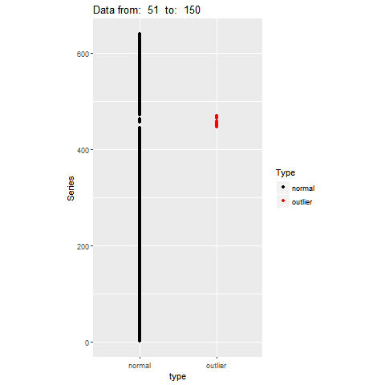
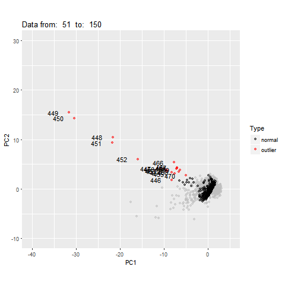
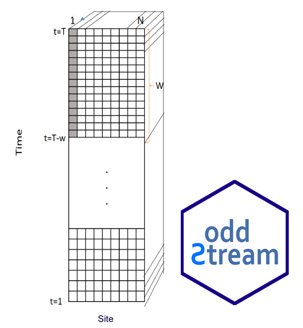

```{r setup, include=FALSE}
library(knitr)
options(htmltools.dir.version = FALSE)
opts_chunk$set(
  warning = FALSE,
  message = FALSE,
  echo = FALSE,
  fig.path = 'figure/',
  cache.path = 'cache/',
  fig.align = 'center',
  fig.show = 'hold',
  cache = FALSE,
  external = TRUE,
  dev = "png",
  fig.height = 6,
  fig.width = 10,
  out.width = "0.8\\textwidth"
)


```

background-image:url('figure/outtype-1.png')
background-position: 60% 80%
background-size: 100%
class: right, top

## Anomaly Detection in Temporal Data


<!---  
 (low battery power, biofouling of the probes, errors in calibration, rust, sensor maintenance activities etc.)

This problem of outlier detection in water-quality data from in situ sensors can be divided into two subtopics according to their focus: (1) identifying errors in the data due to issues unrelated to water events per se, such as technical aberrations, that make the data unreliable and untrustworthy and (2) identifying real events (e.g., rare but sudden spikes in turbidity associated with rare but sudden high-flow events). Both problems are equally important when making natural resource management decisions that affect human welfare and environmental conditions. Problem 1 can also be considered as a data preprocessing phase before addressing
Problem 2.
In this work we focus on Problem 1, that is, detecting unusual measurements caused by technical errors that make data unreliable and untrustworthy and affect performance of any subsequent data analysis under Problem 2. According to Yu (2012), the degree of confidence in the sensor data is one of the main requirements for a properly defined environmental analysis procedure. For instance, researchers and policy makers are unable to use water-quality data containing technical outliers with confidence for decision making and reporting purposes because erroneous conclusions regarding the quality of the water being monitored could ensue, leading, for example, to inappropriate or unnecessary water treatment, land management, or warn- ing alerts to the public (Kotama??ki et al., 2009; Rangeti et al., 2015). Missing values and corrupted data can also have an adverse impact on water-quality model building and calibration processes (Archer et al., 2003). Early detection of these technical outliers will limit the use of corrupted data for subsequent analysis. For instance, it will limit the use of corrupted data in real-time forecasting and online applications such as online drinking water-quality monitoring and early warning systems (Storey et al., 2011), predicting algal bloom outbreaks leading to fish kill events and potential human health impacts, forecasting water level and cur- rents, and so on (Archer et al., 2003; Glasgow et al., 2004; Hill & Minsker, 2006). However, because data arrive near continuously at high speed in large quantities, manual monitoring is highly unlikely to be able to capture all the errors. These issues have therefore increased the importance of developing automated methods for early detection of outliers in water-quality data from in situ sensors (Hill et al., 2009). -->

---

background-image:url('figure/outtype-1b.png')
background-position: 60% 80%
background-size: 100%
class: right, top

## Anomaly Detection in Temporal Data
---
class: middle, center, inverse

# <br/><br/>Why <span style="color:blue">SWEET?</span>


---
class: middle, center, inverse

# <br/><br/>Why in <span style="color:blue">S</span>ection on  <span style="color:blue">W</span>ater,  <span style="color:blue">E</span>nergy and  <span style="color:blue">E</span>nvironmen<span style="color:blue">T</span>?


---
background-image:url('figure/3_water.png')
background-position: 60% 85%
background-size: 110%
class: right, top

# Motivation - <span style="color:red">W</span>ater 


<!--
- flood warning systems
- river network
- algi bloom
- sensor outliers
- Figure 3. A fish kill in August 2003 due to severe hypoxia in Greenwich Bay, near Narragansett Bay, RI.  Photo by Chris Deacutis.[6] 
- water temperature monitoring Network
- This poses a public health threat to surfers, swimmers, and aquatic life, and it can arise from sewer line breaks that occur during storms, leaky septic tanks, or illegal release of waste water into rivers.
-->
---
background-image:url('figure/4_energy.png')
background-position: 60% 85%
background-size: 110%
class: right, top

# Motivation - <span style="color:red">E</span>nergy 

<!--
- solar 
- gas oil pipeline leakages
- electricity
- spot defects in solar panels in solar farms
- Strong winds can damage the panel's system. Consequently, there is an option to add a wind sensor to this system. The sensor provides information about wind speed and is input into Pin8. https://www.fierceelectronics.com/components/solar-tracker-improves-energy-output-solar-panels
- Real-time Alert system and pipeline Leakage detection
Biz4Intellia, an end-to-end IoT solution saves bucks to the companies by providing instant notification of pipeline leakage. By quickly addressing the problem, our solution prevents oil/gas seeping further into the environment where it could have a significant impact on wildlife, plants, and water. The Real-time Alert system detects the leakage and addresses them immediately, which saves money, oil, and the environment. All the information from the sensors is acquired and sent to the cluster cloud. With all the real-time data and geek technology one can predict the 96% accurate data and can send alerts well before time. The moment a leak alert is received, one can take immediate action to ensure that damage is mitigated.

https://www.mdpi.com/1424-8220/19/11/2548/htm
The operation principle of this method is that cable temperature will change when pipeline leakage occurs and hydrocarbon fluid engross into the coating cable. By measuring the temperature variations in fibre optic cable anomalies along the pipeline can be detected [4]. Distributed Optical Fibre Sensor (DOFS) provides environmental measurements based on three classes of scattering, namely Raman, Rayleigh and Brillouin scattering [64]. These classifications are based on the frequency of the optical signals as illustrated in Figure 3. Brillouin scattering can measure both strain and temperature but is very sensitive to strain, while Raman scattering is only sensitive to temperature, with greater ability to accurately measure 


- Energy Outlier Detection in Smart Environments
- Earlier studies have shown that home residents reduce en- ergy expenditure by 5-15% on average just as a response to acquiring and viewing raw usage data (Darby 2006). Tra- ditional power meters provide only basic consumption data such as current power usage and killowatt hour. There is a clear need for improving householders??? working knowledge of their behaviors and energy consumption. Pervasive com- puting techniques can improve the quality of information supplied to users by identifying usage trends and anoma- lies, and providing users with suggestions about how to save energy and conserve natural resources.

Anomaly detection is valuable because the anomaly may indicate an unnecessary use of resources (e.g., an appliance was accidentally left on), an unsafe state, or possibly noise in the dataset which needs to be removed.
-->
---

background-image:url('figure/5_environment.png')
background-position: 60% 85%
background-size: 110%
class: right, top

# Motivation - <span style="color:red">E</span>nvironmen<span style="color:red">T</span> 

<!--
- earthquake
- air pollution
bushfire
-->
---
## Motivation 

- All these applications generate millions or even billions of individual time series simultaneously
--

- Research question: Finding locations of unusual behaviours

---
##  Recap: oddstream 

**Off-line Phase: Building a model of a system's typical behaviour**

.pull-left[
`load(train_data)`
```{r   echo=FALSE, out.width = "80%", fig_align = 'bottom'}

```
]
--

.pull-right[
`tsfeatures <- oddstream::extract_tsfeatures` 
```{r  echo=FALSE, out.width = "40%",}
knitr::include_graphics("figure/8_high_typical.gif")
```
]

--
<br/>
`pc<-oddstream::get_pc_space(tsfeatures)`</br>
`oddstream::plotpc(pc$pcnorm)` </br>
`threshold<-oddstream::set_outlier_threshold(pc$pcnorm)`
```{r  echo=FALSE, out.width = "25%",}
knitr::include_graphics("figure/9_typicalfeature.png")
```
 
 
---
## Recap: oddstream 

**On-line Phase: Testing newly arrived data using the boundary**

`oddstream::find_odd_streams(train_data, test_stream)`
```{r   echo=FALSE, out.width = "40%"}
knitr::include_graphics("figure/10_oddstream_mvtsplot.gif")
```
.pull-left[
```{r  echo=FALSE, out.width = "80%", fig_align = 'top'}

```
]
.pull-right[
```{r  echo=FALSE, out.width = "80%", fig_align = 'top'}

```
]

<!-- Anomaly is defined wrt to historical behaviour

- finding typical data set
-->

---
background-image:url('figure/17_oddstream.png')
background-position: 60% 80%
background-size: 100%
class: left, top

## Spatio-temporal data

```{r   echo=FALSE, out.width = "45%"}

```
---
## Multivariate spatio-temporal data

```{r   echo=FALSE, out.width = "45%"}

```

---
## Multivariate spatio-temporal data

```{r   echo=FALSE, out.width = "45%"}

```


---
## Multivariate spatio-temporal data

```{r   echo=FALSE, out.width = "45%"}

```

---
## Multivariate spatio-temporal data
```{r echo=FALSE, out.width = "100%"}

```
---
class: bottom, center, inverse

# <span style="color:blue">A</span>nomaly Detection in <br/> <span style="color:blue">M</span>ultivariate <span style="color:blue">S</span>patio-temporal data <br/> with <span style="color:blue">K</span>-measurements


```{r   echo=FALSE, out.width = "35%", fig.cap="devtools::install_github(\"pridiltal/mask\")"}
knitr::include_graphics("figure/19_hexstickermask.png")
```


---

background-image:url('figure/20_india.png')
background-position: 60% 80%
background-size: 100%
class: left, top

###  India hourly air pollution data from  244 stations from October 2019 to September 2020

  - PM2.5
  - PM10
  - NO2
  - NH3
  - SO2
  - CO
  - OZONE

# <span style="color:yellow">7 of the world's 10 most polluted cities are in India </span>
*(Source: IQAir AirVisual 2018 World Air Quality Report & Greenpeace)*

<!-- I have been collecting these hourly pollution data for about a year to understand how different Pollutants changes and get affected over the year across different states in India. I have also attached a .hyper (Tableau Data Extract) which can be used for the analysis of this data on Tableau.

https://www.kaggle.com/prateekcoder/ind-hourly-air-pollution-data-oct2019-to-sept2020?select=Air_Pollution_Data_Oct_2019_Sept_2020.hyper


7 out of 10 are from india https://www.weforum.org/agenda/2019/03/7-of-the-world-s-10-most-polluted-cities-are-in-india/-->
---
## MASK Framework 

### Main Contributions

- Propose a framework to detect spatial anomalies in multivariate spatio-temporal data 
- Unsupervised anomaly detection algorithm

--

### What is an anomaly ?

- An anomaly is a spatial point or region that deviates significantly from the global and/or local distribution of a given network


<!--

A representative data set of the system's typical behavior is available to define the model for the typical behavior of the system.
-->
---

## Feature based representation of time series

.pull-left[
- Mean   
- Variance  
- Changing variance in remainder 
- Level shift using rolling window   
- Variance change 
- Strength of linearity 
- Strength of curvature 
- Strength of spikiness 
]
.pull-right[
- Burstiness of time series (Fano Factor)  
- Minimum  
- Maximum  
- The ratio between 50% trimmed mean and the arithmetic mean
- Moment 
- Ratio of means of data that is below and above the global mean  
]

---
## Feature based representation of time series


```{r   echo=FALSE, out.width = "100%", fig_align = 'top'}

```


---
## Feature based representation of time series


```{r   echo=FALSE, out.width = "100%", fig_align = 'bottom'}

```

---

background-image:url('figure/24_U_PCA.png')
background-position: 60% 80%
background-size: 100%
class: left, top

## Naive approach (Unfold PCA)

### Batch-wise unfolding of the three-way matrix into a two-dimensional matrix.


<!--
```{r   echo=FALSE, out.width = "120%", fig_align = 'bottom'}

```


- Consider them as separate column
- increases curse of dimensionality
- do not consider the correlation structure
-->


<!-- This paper explains the multi-way decomposition method PARAFAC and its use in chemometrics. PARAFAC is a generalization of PCA to higher order arrays, but some of the characteristics of the method are quite different from the ordinary two-way case. There is no rotation problem in PARAFAC, and e.g., pure spectra can be recovered from multi-way spectral data. One cannot as in PCA estimate components successively as this will give a model with poorer fit, than if the simultaneous solution is estimated. Finally scaling and centering is not as straightforward in the multi-way case as in the two-way case. An important advantage of using multi-way methods instead of unfolding methods is that the estimated models are very simple in a mathematical sense, and therefore more robust and easier to interpret. All these aspects plus more are explained in this tutorial and an implementation in Matlab code is available, that contains most of the features explained in the text. Three examples show how PARAFAC can be used for specific problems. The applications include subjects as: Analysis of variance by PARAFAC, a five-way application of PARAFAC, PARAFAC with half the elements missing, PARAFAC constrained to positive solutions and PARAFAC for regression as in principal component regression.

https://www.sciencedirect.com/science/article/abs/pii/S0169743997000324-->


---
background-image:url('figure/25_parafac.png')
background-position: 60% 80%
background-size: 100%
class: right, top

## Dimension reduction using Robust PARAFAC


<!-- 
****Parafac Can be seen as an expansion of PCa from two way data to multiway data


In particular, given the true multi-way nature of the data, PARAFAC model turned out to be extremely useful in the study of the dependence of colour variation on pigments, a critical issue for painted surfaces, that was not clear using univariate approach.


N-PLS: N-way Partial Least Squares regression
PARAFAC: Parallel Factor Analysis; a.k.a. CPD: canonical polyadic decomposition
PCA: Principal Component Analysis
PLS: Partial Least Squares regression
https://www.youtube.com/watch?v=_gIb6PzBEc4

https://www.youtube.com/watch?v=vyjUotbPfHY

https://www.youtube.com/watch?v=L8uT6hgMt00
-iiiiiiiiiiiii

- India datasets
- lockdown March 24 
- India covid situation
-->

---

background-image:url('figure/26_parafac.png')
background-position: 60% 80%
background-size: 100%
class: right, top

## Dimension reduction using Robust PARAFAC


---
## Anomalous threshold calculation

### Spacing theorem (Weissman, 1978)

Let $X_{1}, X_{2}, ..., X_{n}$ be a sample from a distribution function $F$ . </br>
Let $X_{1:n} \geq X_{2:n} \geq ... \geq X_{n:n}$ be the order statistics. </br>
The available data are $X_{1:n}, X_{2:n},  ..., X_{k:n}$ for some fixed $k$. </br>
Let $D_{i,n} = X_{i:n} - X_{i+1:n},$ $(i = 1,2,..., k)$ be the spacing between successive order statistics.</br>
If $F$ is in the maximum domain of attraction of the Gumbel distribution, then the spacings $D_{i,n}$ are asymptotically independent and exponentially distributed with mean proportional to $i^{-1}$.

```{r  echo=FALSE, out.width = "55%", fig_align = 'top'}
knitr::include_graphics("figure/29_evt.png")
```

---
background-image:url('figure/27_india.png')
background-position: 50% 80%
background-size: 105%
class: left, top

### India hourly air pollution data from  244 stations from October 2019 to September 2020

---
background-image:url('figure/28_india.png')
background-position: 50% 80%
background-size: 105%
class: left, top

###  India hourly air pollution data from  244 stations from October 2019 to September 2020
---
## Advantages of the  mask framework 

- Detect anomalies in multivariate spatio-temporal data 
--

- Can take the correlation structure of the  variables into account when detecting anomalies
--

- Deal with large amounts of data efficiently 
--

- Deal with time series of different lengths and/or starting points
--

- Anomalous scoring techniques- unsupervised
--

- Anomalous threshold has a probabilistic interpretation
--

- The framework can easily be extended to streaming data such that it can provide near-real-time support


<!-- - Thus, this representation can allow an algorithm to compare time series of different lengths and/or starting points, because it can transform time series of any length or starting point into a vector of features of a fixed size.

Thus, this representation can allow an algorithm to compare time series of different lengths and/or starting points, because it can transform time series of any length or starting point into a vector of features of a fixed size. Recently, researchers such as Wang, Smith, and Hyndman (2006), Fulcher (2012) and Hyndman, Wang, and Laptev (2015) have paid a considerable amount of attention to the feature-based representation of time series, since it helps to reduce the dimension of the original multivariate time series problem via features that encapsulate the dynamic properties of the individual time series efficiently.

Does not require a training set to build the decision model
-->
---
## oddstream vs mask

.pull-left[
```{r   echo=FALSE, out.width = "100%", fig_align = 'top'}

```

- Definition: Recent past distribution of a given system
- Semi-supervised
]
.pull-right[
```{r   echo=FALSE, out.width = "100%", fig_align = 'top'}

```

- Definition: Current global and/or local distribution of a given system
- Unsupervised
]

---
## What next?

- Explore more on feature extraction and feature selection methods to create a better feature space suitable for streaming data context.
--

- Use other dimension reduction techniques for tensor data such as Tucker3 models,  multilinear PLS (N-PLS) to see the effect on the performance of the proposed framework.
--

- Develop effective data visualisation tools for Multivariate spatio-temporal data 
<!--Natural extensions of two-way models-->
---
class: center, bottom, inverse

# Thank you

```{r }
#icon::fontawesome("rocket", style = "solid")
icon::fa("envelope")
``` 
priyangad@uom.lk


```{r}
icon::fa("github")
icon::fa("twitter")

```
pridiltal

```{r}

icon::fa("globe")
```
https://prital.netlify.app/ </br>
(Slides available)
.pull-left[
```{r   echo=FALSE, out.width = "50%", fig.cap="devtools::install_github(\"pridiltal/mask\")"}
knitr::include_graphics("figure/19_hexstickermask.png")
```
]
.pull-right[
```{r   echo=FALSE, out.width = "50%", fig.cap="on CRAN"}
knitr::include_graphics("figure/31_logooddstream.png")
```

]

