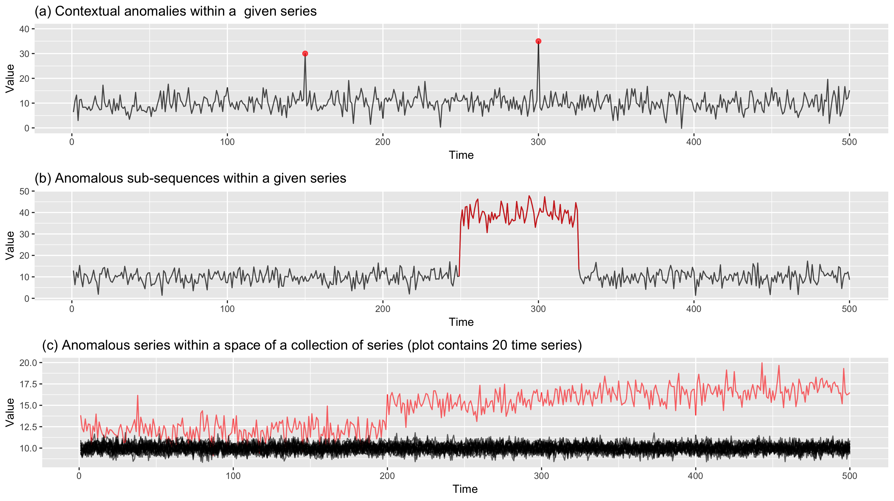

```{r setup, include=FALSE}
library(knitr)
options(htmltools.dir.version = FALSE)
opts_chunk$set(
  warning = FALSE,
  message = FALSE,
  echo = FALSE,
  fig.path = 'figure/',
  cache.path = 'cache/',
  fig.align = 'center',
  fig.show = 'hold',
  cache = TRUE,
  external = TRUE,
  htmltools.dir.version = FALSE
 # dev = "pdf"
 # fig.height = 6,
#  fig.width = 10,
 # out.width = "0.8\\textwidth"
)
read_chunk('src/main.R')
library(tidyverse)
library(gridExtra)
library(ggpubr)
# install.packages("devtools")
# devtools::install_github("pridiltal/oddstream")
library(oddstream)
library(animation)
```


background-image:url('figure/1_power.png')
background-position: 50% 50%
background-size: 125%
class: left, bottom
<SPAN STYLE="font-size:10.0pt"><span style="color: black">Image credit: picxbay</span></span>

---
background-image:url('figure/2_blackout.png')
background-position: 90% 20%
background-size: 110%
class: right, bottom

---
## Tidy forecasting workflow (Hyndman & Athanasopoulos, 2021) 

```{r   echo=FALSE, out.width = "95%", fig_align = "top"}

```
---
##   `r anicon::faa("wrench", animate="tada", colour="orange", grow = 20)`    &nbsp;&nbsp;&nbsp;&nbsp;&nbsp;&nbsp; Tidy Time Series Anomaly Detection

<!-- up, down, left and right-->

```{r   echo=FALSE, out.width = "95%", fig_align = 'top'}

```
---
class: center, top
# <span style="color: orange">outstable</span> 

## <span style="color: orange">TABLE</span> of <span style="color: orange">OUT</span>liers in <span style="color: orange">T</span>ime <span style="color: orange">S</span>eries Data  

```{r   echo=FALSE, out.width = "25%", fig_align = 'top'}

```

### `devtools::install_github("pridiltal/outstable")`
---
class: center, top
# <span style="color: orange">outstable</span>  
## <span style="color: orange">TABLE</span> of <span style="color: orange">OUT</span>liers in <span style="color: orange">T</span>ime <span style="color: orange">S</span>eries Data  
`r anicon::faa("wrench", animate="shake", colour="orange", grow = 20, size =2)`

```{r   echo=FALSE, out.width = "130%", fig_align = 'top'}

```

---

## Outliers in Time Series Data

```{r   echo=FALSE, out.width = "95%", fig_align = 'top'}

```

---
## Outliers in Time Series Data

```{r   echo=FALSE, out.width = "95%", fig_align = 'top'}
knitr::include_graphics("figure/8_outtype_oddstream.png")
```
---

## Outliers in Time Series Data

```{r   echo=FALSE, out.width = "95%", fig_align = 'top'}

```
---
## Outlier Detection in Time Series Data

## Main contributions

- This work develops a framework for detecting outliers in tidy time series data.
--

- The algorithm works with tidy temporal data provided by the `tsibble` package and produces an **`outstable`**, a tsibble with flagged anomalies and their degree of outlierness.
--

- The proposed framework can also provide a cleansed tsibble that closely integrates with the tidy forecasting workflow used in the `tidyverts` toolbox.
--

- Data driven outlier threshold with a valid probabilistic interpretation
--

## What is an outlier ?
--

- We define an outlier as an observation that is very unlikely given the forecast distribution.
--

- Outlier is a rare observation which has a very low chance of occurrence with respect to the **typical behaviour** of the time series.


---
```{r   echo=FALSE, out.width = "65%", fig_align = 'top'}

```

---

```{r   echo=FALSE, out.width = "66%", fig_align = 'top'}

```

--
## Forecast combinations


- Use several different methods on the same time series, and average the resulting forecasts (Hyndman & Athanasopoulos, 2021) 
--

- Dramatic performance improvements by simply averaging the forecasts (Clemen, 1989)
--

- Combining forecasts often leads to **better forecast accuracy** (Bates & Granger, 1969)


<!--- Use several different methods on the same time series, and to average the resulting forecasts (Hyndman & Athanasopoulos, 2021). Nearly 50 years ago, John Bates and Clive Granger wrote a famous paper (Bates & Granger, 1969), showing that combining forecasts often leads to better forecast accuracy. Twenty years later, Clemen (1989) wrote

"The results have been virtually unanimous: combining multiple forecasts leads to increased forecast accuracy. In many cases one can make dramatic performance improvements by simply averaging the forecasts."

- It has been well-known since at least 1969, when Bates and Granger wrote their famous paper on "The Combination of Forecasts", that combining forecasts often leads to better forecast accuracy.

https://robjhyndman.com/hyndsight/forecast-combinations/
https://otexts.com/fpp2/combinations.html

- One forecast is based on variables or information that the other forecast has considered
- The forecast makes a different assumption about the form of the relationship between the variables

-->
---

# Outstable 

```{r original, fig.width=13, fig.height=7, eval = TRUE}
library(tscompdata)
library(tidyverse)
library(fpp3)
library(fasster)
# load data from tscompdata package
data <- gefcom2012_load[[1]] %>%
    as_tsibble() %>%
    filter(index>= "2007-01-01") %>%
    index_by(
      time = ~ lubridate::round_date(., "hour") )

# Remove duplicates and create a tsibble
data <- data %>%
    as_tibble() %>%
    select(time, value) %>%
    filter(!are_duplicated(., index=time)) %>%
    as_tsibble(index = time)
p <- data %>% autoplot(value) +
  theme(axis.text=element_text(size=14),
        axis.title=element_text(size=16,face="bold"))
    #ggtitle("Original data without outliers")

print(p)

```

```{r  original2, out.width="90%", eval = FALSE}

```

---

# outstable

```{r outliers, fig.width=13, fig.height=7}
set.seed(123)
inject_out <- sample(1:10200,20)
# Inject Outliers
  data[inject_out, "value"] <-
    data[inject_out, "value"] *3
  data<- data %>%
   mutate(type = ifelse(1:nrow(.) %in% inject_out,
            "outlier", "typical" ))


# Build train set to check the performance
train <- data %>%
    filter(time<= "2008-03-01") %>%

tsibble::fill_gaps() %>%
   tidyr::fill(value, .direction = "down")
outdata<- data %>% filter(type=="outlier")
 trainplot <- train %>%autoplot(value)
 trainplot <- trainplot +
   geom_point(data = outdata,
              aes(x=time, y=value),
              colour = "red", size =3) +
   #ggtitle("Training data with outliers")+
   theme(text=element_text(size=14),
         axis.text=element_text(size=14),
         axis.title=element_text(size=16,face="bold"))
 print(trainplot)

```

```{r  outlier2,  out.width="90%", eval = FALSE}

```


---

## Outstable: Outlier Threshold Calculation

```{r combfor, fig.width=15, fig.height=7, dependson="outliers", eval = FALSE}
# fit different  models
frq <- frequency(data)
mod <-train %>%
fabletools::model(
  #ets = fable::ETS(value), 
  arima = fable::ARIMA(value),
  snaive = fable::SNAIVE(value), 
  croston= fable::CROSTON(value), 
  ave= fable::MEAN(value),
  naive= fable::NAIVE(value),
  neural= fable::NNETAR(value),
  lm=fable::TSLM(value ~ trend()+season()),
  theta = fable::THETA(value),
  fasster = FASSTER(
     value ~ trend(1) + fourier(frq)),
  cmbn_model = combination_model(  fable::CROSTON(value),fable::MEAN(value),fable::THETA(value), fable::SNAIVE(value), fable::NAIVE(value),  fable::TSLM(value ~ trend()+season()), fasster::FASSTER(value ~ trend(1) + fourier(frq)), fable::NNETAR(value), fable::ARIMA(value) )
      )

 # Plot fitted values
 m <- fabletools::augment(mod) %>%
   dplyr::select(time, .model,
                 .fitted, value) %>%
   tidyr::pivot_wider(
     names_from = .model,
     values_from = .fitted) %>%
   tidyr::pivot_longer(
     cols = value:cmbn_model,
     names_to = "model") 
 
write.csv(m, file=here::here("ISF2021","ISF2021-talk", "fig", "fitted.csv"))


neworder <- c("value","ave","lm",
              "neural", "arima",
              "naive", "snaive",
              "croston", "theta",
              "fasster", "cmbn_model")
  
 
m <- m %>% 
  mutate(model =
        factor(model,
        levels=neworder))
p <- m %>% ggplot(aes(time, value, color= model)) +
  geom_line(size = 1) +
  #geom_point(color="steelblue") + 
  labs(y = "value", x = "time") + 
  facet_wrap(~ model) +
  theme(text=element_text(size=16),
        axis.text=element_text(size=14),
        axis.title=element_text(size=16,
                              face="bold"),
        axis.text.x = element_text(angle = 90), legend.position = "none") +
  scale_colour_viridis_d(option = "plasma", end = 0.8)

print(p)


```

```{r  com2, fig.width=13, fig.height=8}

```

---


## Outstable - Visualize residuals with true outlier

```{r res, fig.width=15, fig.height=7, dependson="combfor", eval = FALSE}

res <- augment(mod) %>%
     dplyr::select(time, .model, 
                   .resid, value) 

write.csv(res, file=here::here("ISF2021","ISF2021-talk", "fig", "res.csv"))
# filter residuals to find outliers

res <- read.csv(file=here::here("ISF2021","ISF2021-talk", "fig", "res.csv"))
 out <- res %>%
   as_tibble() %>% 
   filter(.model == "cmbn_model") 
 
 # Visualize residuals with true_outlier
  true_outlier <- left_join(out, train, by = "time")
  
  resplot <- true_outlier %>%
     as_tsibble(index= time) %>%
     autoplot(.resid)
  resid_out_data <- true_outlier %>%
    filter(type=="outlier")
   
  #resplot <- resplot +
  #  geom_point(data = resid_out_data,  
  #             aes(x=time, y=.resid),
  #             colour = "red") +
  #    ggtitle("Residual plot of combination forecast")
  # print(resplot)
 
 # violin plot with dot plot to see the distribution of outliers.  

  #cutoff <- quantile(true_outlier$.resid,na.rm = TRUE,probs=c(.005,.995))
 
cols <- c("outlier" = "red", "typical" = "black") 
 # density plot

p<- true_outlier %>%
  drop_na()%>%
   ggplot(aes(x = .resid)) +
   geom_density(aes(fill = type), alpha = 0.4)+
  scale_fill_manual(values = cols)+
   theme(text=element_text(size=16),
        axis.text=element_text(size=14),
        axis.title=element_text(size=16,
                              face="bold"),
        legend.position = "bottom")


 #p<- true_outlier %>%
   #ggplot(aes(x = "", y = .resid)) + 
   #geom_boxplot(outlier.shape = NA) +
   #geom_jitter(width = 0.2, alpha=0.7, size =3, aes( colour = type)) +
   #scale_color_manual(values = cols)+
  # geom_violin(alpha = 0, colour = "darkblue")+
  #lvplot::geom_lv(colour = "black", alpha = 0) +
  # geom_hline(yintercept = cutoff[1], color = "blue") +
  # geom_hline(yintercept = cutoff[2], color = "red") +
  #  theme(text=element_text(size=16),
  #      axis.text=element_text(size=14),
  #      axis.title=element_text(size=16,
  #                            face="bold"),
  #      legend.position = "none")+
  # labs(y = "Residuals", x ="")+
  # coord_flip()+
  # ggtitle("Residuals with true outliers")

 print(p)
 

```

```{r  resviolin, out.width="80%", out.height="60%"}

```

---

## Anomalous threshold calculation 

- Estimate the probability density function of the residual series $\longrightarrow$ Kernel density estimation.
--

- Draw a large number N of extremes $(arg min_{x\in X}[f(x)])$ from **the high density region** of the  estimated probability density function.
--

- Define a $\Psi$-transform space, using the $\Psi$-transformation defined by (Clifton et al., 2011)

$$\Psi[{f_{2}}(\mathbf{x})]=\;\begin{cases}(-2ln({f}(\mathbf{x}))-2ln(2\pi))^{1/2},& {f}(\mathbf{x}) < (2\pi)^{-1}\\
        0,              & {f}(\mathbf{x}) \ge (2\pi)^{-1}.\end{cases}$$
        
--
- $\Psi$-transform maps the density values back into space into which a Gumbel distribution can be fitted.
--

- Fit a Gumbel distribution to the resulting $\Psi[{f}(\mathbf{x})]$ values. The Gumbel parameter values are obtained via maximum likelihood estimation.
--

- Determine the anomalous threshold using the corresponding univariate CDF, $F^{e}$ in the transformed $\Psi$-space. 
--

- Density based, data driven anomalous threshold  $\longrightarrow$ extreme value theory

---
## `outstable:detect_outliers`

```{r}
library(tscompdata)
library(tidyverse)
library(fpp3)
library(fasster)
# load data from tscompdata package
data <- gefcom2012_load[[1]] %>%
  as_tsibble() %>%
  filter(index>= "2007-01-01") %>%
  index_by(
    time = ~ lubridate::round_date(., "hour") ) 
# Remove duplicates and create a tsibble
data <- data %>%
  as_tibble() %>%
  select(time, value) %>%
  filter(!are_duplicated(., index=time)) %>%
  as_tsibble(index = time) %>%
  tsibble::fill_gaps()  %>%
  tidyr::fill(value, .direction = "down")

set.seed(123)
inject_out <- sample(1:10200,20)
# Inject Outliers
data[inject_out, "value"] <-
  data[inject_out, "value"] *3

```

.pull-left[

```{r echo=TRUE, eval=FALSE}
# devtools::install_github(pridiltal/outstable)
library(outstable) #<<

```

].pull-right[
```{r}
# devtools::install_github(pridiltal/outstable)
library(outstable)
data1 <- data
```


]

---

## `outstable:detect_outliers`

.pull-left[

```{r}
data <- data1
```

```{r echo=TRUE, eval=FALSE}
# devtools::install_github(pridiltal/outstable)
library(outstable) 
data %>% #<<
  tsibble::as_tsibble(index = time) #<<

```

].pull-right[
```{r}
# devtools::install_github(pridiltal/outstable)
library(outstable)
data %>% 
  tsibble::as_tsibble(index = time) 
```


]

---

## `outstable:detect_outliers`

.pull-left[

```{r}
data <- data1
```
```{r echo=TRUE, eval=FALSE}
# devtools::install_github(pridiltal/outstable)
library(outstable) 
data %>% 
  tsibble::as_tsibble(index = time) %>%
   outstable::detect_outliers( #<<
      variable = "value", #<<
      cmbn_model = c("lm", "theta","fasster"), #<<
      p_rate = 0.01) #<<

```

].pull-right[

```{r}
# devtools::install_github(pridiltal/outstable)
library(outstable) 
data %>% 
  tsibble::as_tsibble(index = time) %>%
   outstable::detect_outliers( #<<
      variable = "value", #<<
      cmbn_model = c("lm", "theta","fasster"), #<<
      p_rate = 0.01)
```


]

---
##  `outstable::cleanse_data()`

.pull-left[

```{r}
data <- data1
```

```{r echo=TRUE, eval=FALSE}
# devtools::install_github(pridiltal/outstable)
library(outstable) 
data %>% 
  tsibble::as_tsibble(index = time) %>%
   outstable::detect_outliers( 
      variable = "value", 
      cmbn_model = c("lm", "theta","fasster"), 
      p_rate = 0.01)  %>%
   outstable::cleanse_data( #<<
    variable = "value", #<<
    impute = "linear") #<<

```

].pull-right[
```{r}
# devtools::install_github(pridiltal/outstable)
library(outstable) 
data %>% 
  tsibble::as_tsibble(index = time) %>%
   outstable::detect_outliers( 
      variable = "value",
      cmbn_model = c("lm", "theta","fasster"),
      p_rate = 0.01) %>%
   outstable::cleanse_data(
    variable = "value", impute = "linear")
```


]


---

## tidyverts: Tidy tools for time series

.pull-left[

```{r}
data <- data1
```

```{r echo=TRUE, eval=FALSE}
# devtools::install_github(pridiltal/outstable)
library(outstable) 
data %>% 
  tsibble::as_tsibble(index = time) %>%
   outstable::detect_outliers( 
     variable = "value", 
     cmbn_model = c("lm", "theta","fasster"), 
     p_rate = 0.01)  %>%
   outstable::cleanse_data( 
     variable = "value",
     impute = "linear") %>%
  fabletools::autoplot(.altered)  #<<


```

].pull-right[
```{r altered, fig.height=4}
data %>% 
  tsibble::as_tsibble(index = time) %>%
   outstable::detect_outliers( 
     variable = "value", 
     cmbn_model = c("lm", "theta","fasster"), 
     p_rate = 0.01)  %>%
   outstable::cleanse_data( 
     variable = "value",
     impute = "linear") %>%
  fabletools::autoplot(.altered)  #<
```

]


---

## tidyverts: Tidy tools for time series

.pull-left[

```{r}
data <- data1
```

```{r echo=TRUE, eval=FALSE}
# devtools::install_github(pridiltal/outstable)
library(outstable) 
data %>% 
  tsibble::as_tsibble(index = time) %>%
   outstable::detect_outliers( 
     variable = "value", 
     cmbn_model = c("lm", "theta","fasster"), 
     p_rate = 0.01)  %>%
   outstable::cleanse_data( 
     variable = "value",
     impute = "linear") %>%
  fabletools::autoplot(.altered)  #<<


```

].pull-right[
```{r altered2, fig.height=4}
data %>% 
  tsibble::as_tsibble(index = time) %>%
   outstable::detect_outliers( 
     variable = "value", 
     cmbn_model = c("lm", "theta","fasster"), 
     p_rate = 0.01)  %>%
   outstable::cleanse_data( 
     variable = "value",
     impute = "linear") %>%
  fabletools::autoplot(.altered)  +
  ggtitle("Cleansed series")#<
```


```{r original3,fig.height=3}
data <- data1
data %>% 
  tsibble::as_tsibble(index = time) %>%
  fabletools::autoplot(value) +
  ggtitle("Original series")

```
]


---
```{r   echo=FALSE, out.width = "100%", fig_align = 'top'}

```

---


## Load forecasting comparison

.pull-left[
```{r}
GEF <- read.csv(file=here::here("ISF2021","ISF2021-talk", "fig", "GEF.csv"))


GEF1 <- GEF %>%
  select("series", "model", "Injected", "I_outstable", "I_timetk" ) %>%
  arrange(model) %>%
  mutate(method = paste(series, model, sep="_") ) %>%
  dplyr::select(-c(series, model)) 

rank <-t(apply(GEF1[,-4], 1, rank)) 

rank <- rank %>% as_data_frame() %>%
  mutate(m_series = GEF1$method ) 

rank <- rank %>%
  pivot_longer(Injected:I_timetk)

p<-ggplot(rank, aes(x= name, y= m_series)) +
    geom_tile(aes(fill = value), color = "white") +
    scale_fill_viridis_c(option = "magma", direction =-1)+
    labs(x = "", y = "Time series and Models", fill = "Rank") +
    theme(axis.text.y = element_blank(), text=element_text(size=14), axis.text=element_text(size=14)) +
    ggtitle("Forecast accuracy with artificially injected outliers")
print(p)

```

].pull-right[
```{r}
GEF <- read.csv(file=here::here("ISF2021","ISF2021-talk", "fig", "GEF.csv"))


GEF1 <- GEF %>%
  select("series", "model", "Original", "O_outstable", "O_timetk" ) %>%
  arrange(model) %>%
  mutate(method = paste(series, model, sep="_") ) %>%
  dplyr::select(-c(series, model)) 

rank <-t(apply(GEF1[,-4], 1, rank)) 

rank <- rank %>% as_data_frame() %>%
  mutate(m_series = GEF1$method ) 

rank <- rank %>%
  pivot_longer(Original:O_timetk)

p <- ggplot(rank, aes(x= name, y= m_series)) +
    geom_tile(aes(fill = value), color = "white") +
    scale_fill_viridis_c(option = "magma", direction =-1)+
    labs(x = "", y = "Time Series and Models", fill = "Rank") +
    theme(axis.text.y = element_blank(), text=element_text(size=14), axis.text=element_text(size=14)) +
    ggtitle("Forecast accuracy with original data")
print(p)
```


]


---
# What next?

- Combinations forecast with **robust methods** for time series
--

- Incorporating weights when combining the forecasts 
--

- Extend the algorithm to work with Multivariate time series and High-Dimensional Tensor Time Series
--

- Controlling **both** false  positive and false negative rate
--

- Do more experiments on density estimation methods to get a better tail estimation.
---
class: center, middle, inverse

# Thank You


### `devtools::install_github("pridiltal/outstable")`

```{r   echo=FALSE, out.width = "15%", fig_align = 'top'}

```

Slides available at: prital.netlify.app  `r anicon::faa("wrench", animate="passing", colour="orange", grow = 20)`

```{r}
icon::fa("envelope")
``` 
priyangad@uom.lk

```{r}
icon::fa("github")
```
pridiltal


```{r}
icon::fa("twitter")
``` 
@pridiltal


<br/>

<sub><sup>Slides created via the R package xaringan</sup></sub>

---
## CRAN Task View: Anomaly Detection with R

```{r   echo=FALSE, out.width = "100%", fig_align = 'top'}

```


