class: center, inverse


```{r setup, include=FALSE}
library(knitr)
options(htmltools.dir.version = FALSE)
opts_chunk$set(
  warning = FALSE,
  message = FALSE,
  echo = FALSE,
  cache.path = 'cache/',
  fig.align = 'center',
  cache = TRUE
)

library(tidyverse)
library(patchwork)

```

```{r xaringan-themer, include=FALSE, warning=FALSE}
library(xaringanthemer)
style_mono_accent(
   base_color = "#002c54",
    title_slide_background_image = "fig/title.jpeg",
   title_slide_background_color = "#084011",
  inverse_background_color = "#02054a", #"#002c54"
  header_font_google = google_font("Josefin Sans"),
  text_font_google   = google_font("Montserrat", "500", "500i"),
  code_font_google   = google_font("Fira Mono"),
  title_slide_text_color = "#000000",
  inverse_header_color = "#ffffff",
  header_background_text_color = "#ffea00",
  inverse_text_color = "#ffffff",
  base_font_size = "20px",
  text_font_size = "1.3rem",
  header_h1_font_size = "3rem",
  header_h2_font_size = "2rem",
  header_h3_font_size = "2rem",
  )
```

## Hello from the team!

```{r   out.width = "80%", echo = FALSE, fig.cap='', fig.align='center'}

```

---
class: inverse, middle, center

<!--Anomaly detection algorithms are highly influenced by the way we define an anomaly.-->


# <span style="color:#ffcc00;font-weight:bold">What</span> is an anomaly?

<!--High dimentio al context: This deviation can be defined in terms of either distance, density 

time series context: historical data"-->

---
class: inverse, middle, center

<!--Anomaly detection algorithms are highly influenced by the way we define an anomaly.-->


# <span style="color:#ffcc00;font-weight:bold">Statistical anomaly (outlier, novelty)</span> is an observation that deviates markedly from other members of the dataset. 

<!--High dimentio al context: This deviation can be defined in terms of either distance, density 

time series context: historical data"-->

---
class: middle, center

.pull-left[
#### Water quality breaches associated with real events

```{r   out.width = "87%", echo = FALSE, fig.cap='', fig.align='center'}
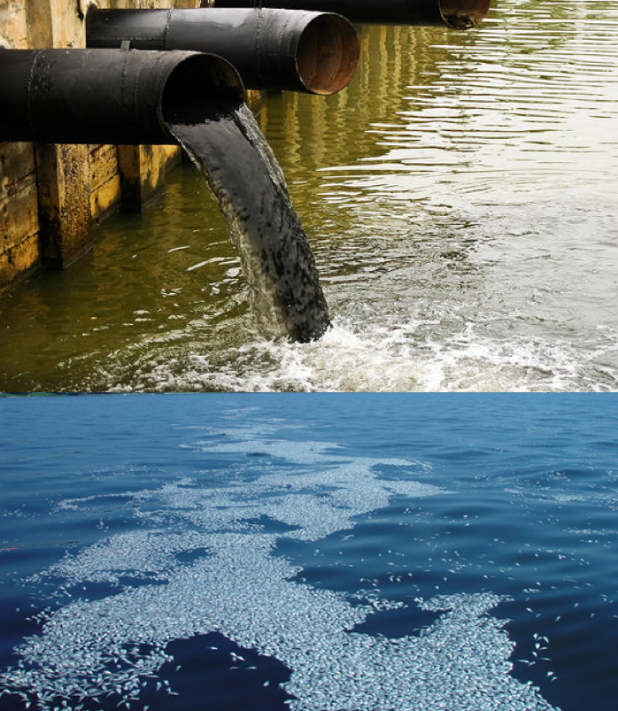
```

]

---
class: middle, center

.pull-left[
#### Water quality breaches associated with real events

```{r   out.width = "87%", echo = FALSE, fig.cap='', fig.align='center'}

```

].pull-right[
#### Technical issues in the sensor equipment

```{r   out.width = "90%", echo = FALSE, fig.cap='', fig.align='center'}
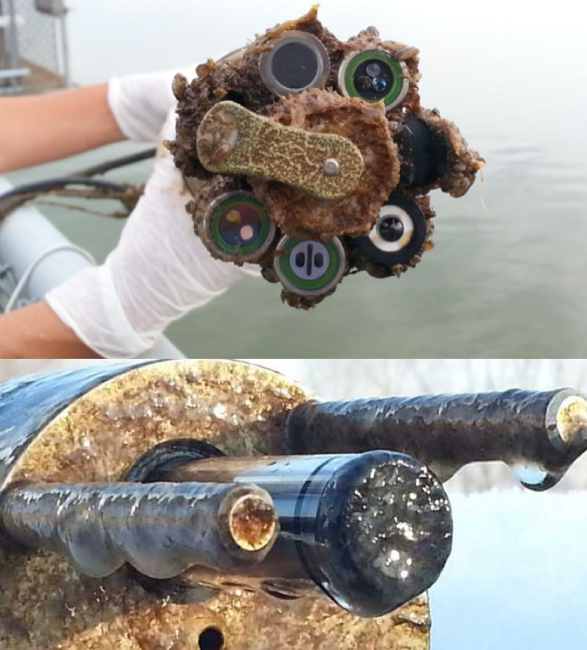
```
]

---

## Motivation

```{r   out.width = "90%", echo = FALSE, fig.cap='', fig.align='center'}
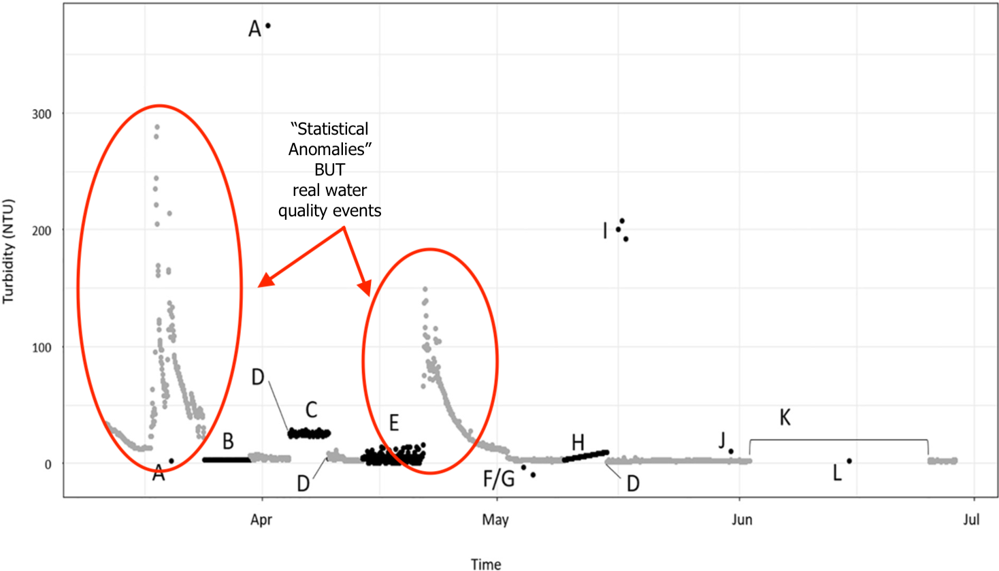
```

---
## Motivation

```{r   out.width = "90%", echo = FALSE, fig.cap='', fig.align='center'}
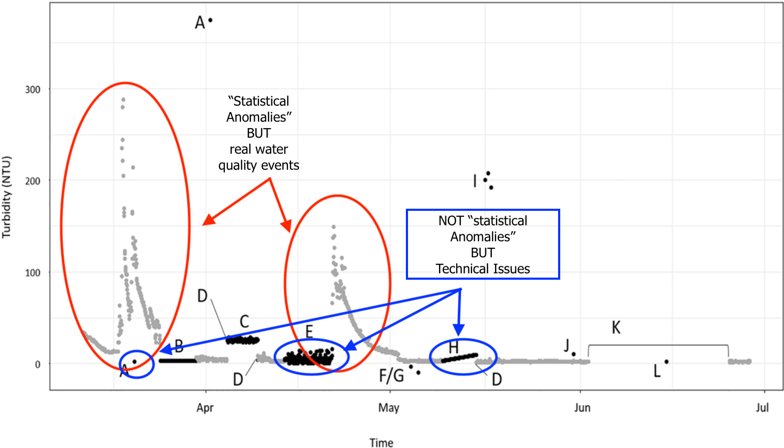
```


<!--To identify these anomalies, we need a statistical procedure to distinguish an anomaly due to a technical error from other anomalies, and from regular data-->

<!-- <span style="color:black; font-weight:bold"> Water quality breaches associated with real events</span>

### Features of nature-based anomaly types

- Double peaks in turbidity: peaks which are abrupt and clear out of the typical range. If two (or potentially more) peaks are observed in a short time window, may lead to suspect real event (contamination, dredging, etc).

<!--Double peaks in turbidity: peaks which are abrupt and clear out of the typical range. Would be classified as sensor-based error A-type if it was single, but the fact that two (or potentially more) peaks are observed in a short time window (say less than one hour), may lead to suspect real event (contamination, dredging, etc)

Dredging is the act of removing silt and other material from the bottom of bodies of water. 

-  Massive input of SPM load, possibly starting by a strong peak. This is the typical signature of a flood event

but there is no direct relationship between the discharge and the incoming SPM load (history effect, hysteresis, etc).

- Very large resuspension event. These turbidity pulses of few hours can be related to the resuspension of recently deposited sediment, or interaction with the tide.

- Non-flushing periods. In low discharge and low tidal range conditions, the salty marine waters are not expelled out of the estuary. The salinity remains high for days, which can have consequences on the local ecosystems and the aquifer.
.-->

<!--The term "salinity" refers to the concentrations of salts in water or soils. Salinity can take three forms, classified by their causes: primary salinity (also called natural salinity); secondary salinity (also called dryland salinity), and tertiary salinity (also called irrigation salinity).-->

<!--the tidal mouth of a large river, where the tide meets the stream.-->

<!--
## <span style="color:black; font-weight:bold"> Technical issues in the sensor equipment</span>


## Technical issues in the sensor equipment

- Low battery power

- Biofouling of the probes

- Errors in calibration

- Rust

- Sensor maintenance activities 

- Sensor breakdowns -->

<!--- Anomalies in water quality data due to technical errors from in situ sensors can reduce data quality and have a direct impact on inference drawn from subsequent data analysis.-->

<!--- Technical issues in the sensor equipment (low battery power, biofouling of the probes, errors in calibration, rust, sensor maintenance activities etc.)-->

---
## Study area and water-quality data

<!--
- In this application, we consider Pringle Creek (Figure 8), one of the NEON (National Ecological Observatory Network) aquatic sites located in Wise County, Texas, USA and managed by the U.S Forest Services-->

- Pringle Creek, NEON (National Ecological Observatory Network) aquatic sites located in Wise County, Texas, USA
- NEON usually has two sensor locations on any river in the network where water quality is measured using in-situ sensors.
- [https://data.neonscience.org/data-products](https://data.neonscience.org/data-products)

<!--
-  In Pringle Creek, these locations are situated about 200 m apart where a small tributary entering to the main creek between the two sensors.-->


```{r   out.width = "80%", echo = FALSE, fig.cap='', fig.align='center'}
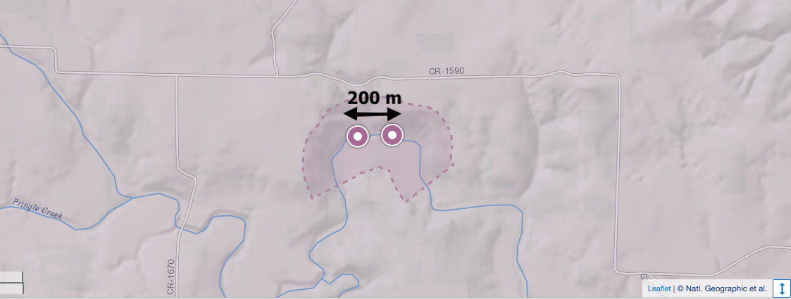
```

<!--At this time the sensors still record measurements at both upstream and downstream locations, but we do not include these summer data in our analysis due to the disconnectivity.-->

---

class: inverse, middle, center

# In this work we define an anomaly as an observation that has an unexpectedly <span style="color: #ffcc00; font-weight:bold">low conditional probability density</span>.

<!--conditioning means incorporating new information

form th upstream behavioir we expect something, what we observe in the downstream is very different from what we expected then it become an anomaly. -->

---
## What is "conditioning"?

```{r   out.width = "70%", echo = FALSE, fig.cap='', fig.align='center'}

```

---

## What is "conditioning"?

```{r   out.width = "70%", echo = FALSE, fig.cap='', fig.align='center'}
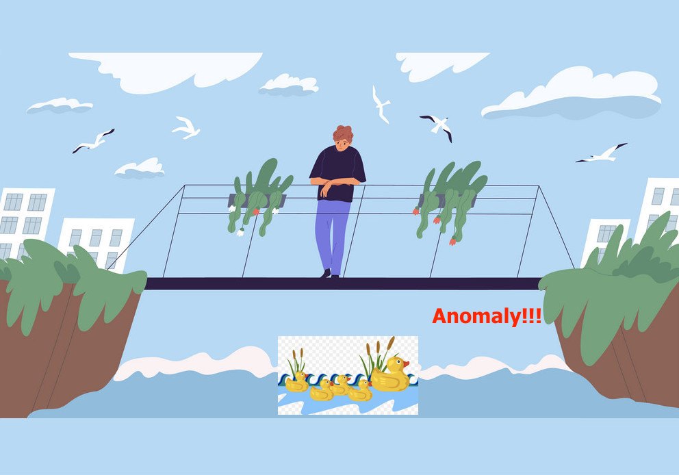
```

---
## What is "conditioning"?

```{r   out.width = "70%", echo = FALSE, fig.cap='', fig.align='center'}
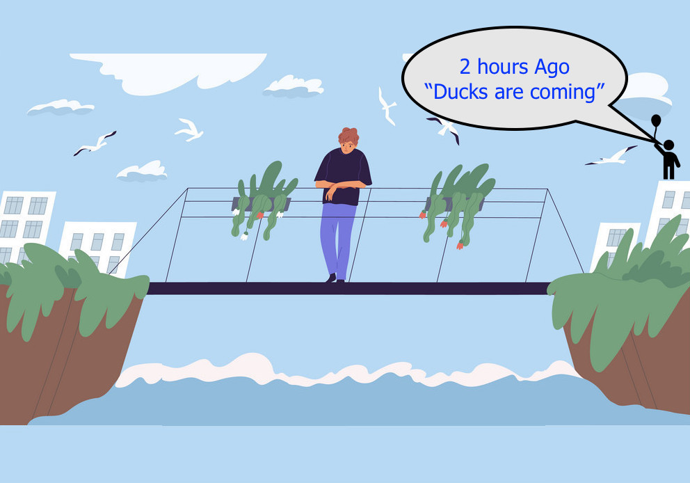
```

---
## What is "conditioning"?

```{r   out.width = "70%", echo = FALSE, fig.cap='', fig.align='center'}
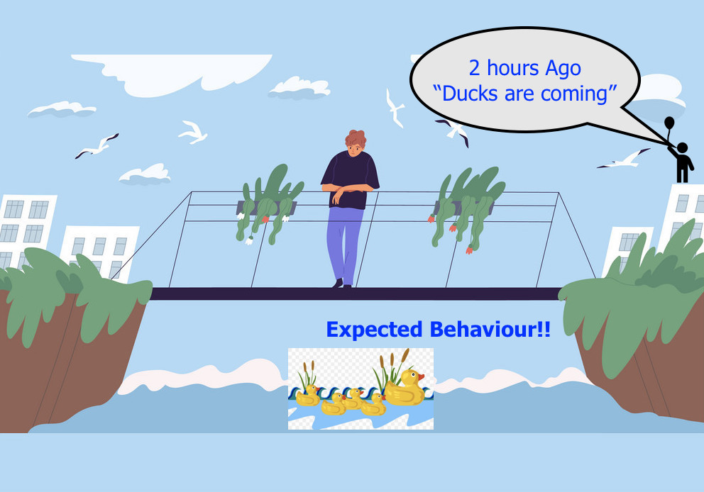
```


<!--Conditioning means updating probabilities to incorporate new information-->
---
## What is "conditioning"?

```{r   out.width = "70%", echo = FALSE, fig.cap='', fig.align='center'}
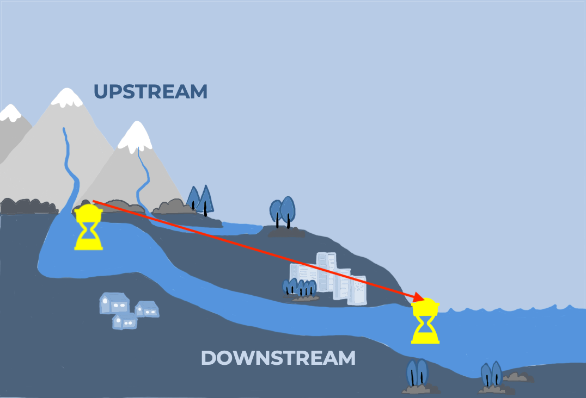
```


---

## What is "conditioning"?

```{r   out.width = "70%", echo = FALSE, fig.cap='', fig.align='center'}
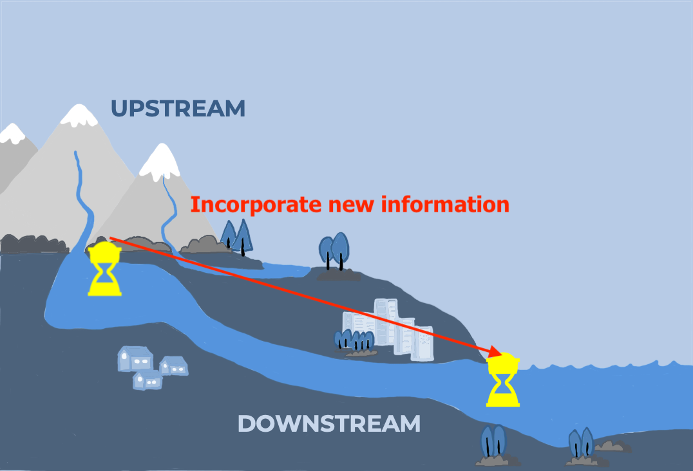
```


---

class: inverse, center, middle

# Different types of <span style="color:#ffcc00; font-weight:bold">"conditioning"</span> (New information)

---

**Only one sensor**

.pull-left[

lagged (past) downstream observations

```{r   out.width = "100%", echo = FALSE, fig.cap='', fig.align='center'}
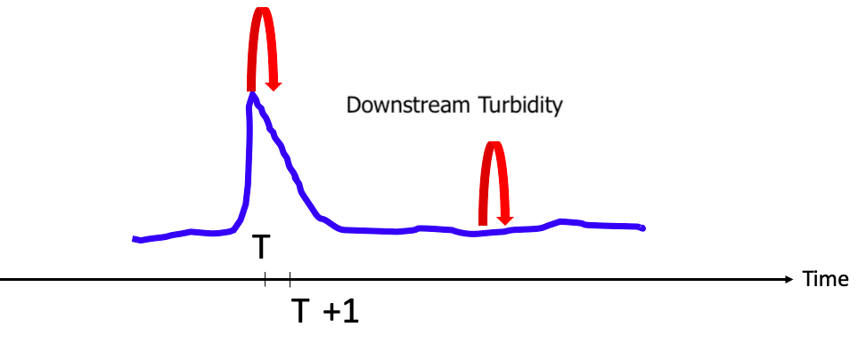
```

].pull-right[

Contemporaneous (simultaneous) downstream observations

```{r   out.width = "80%", echo = FALSE, fig.cap='', fig.align='center'}
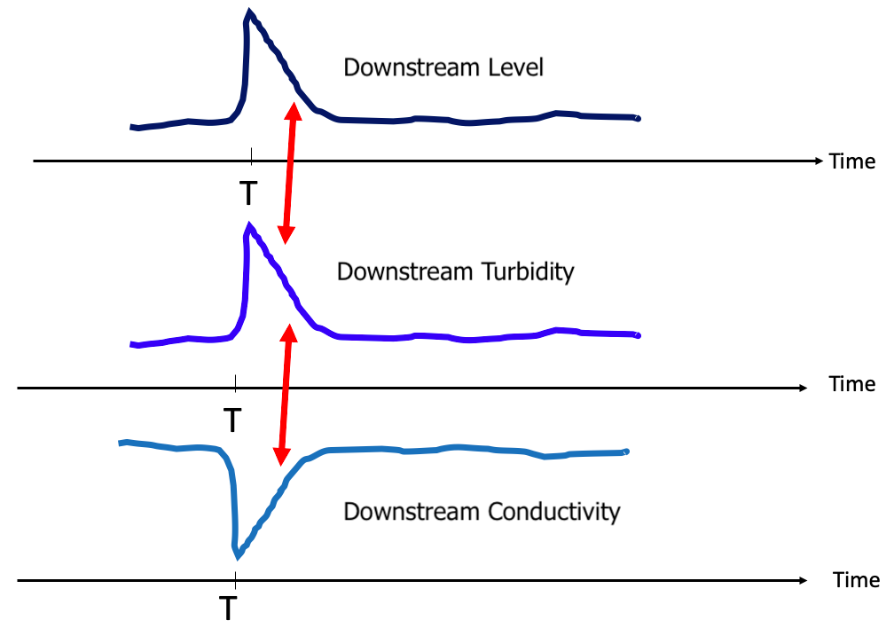
```


]
---
**Only one sensor**

.pull-left[

lagged (past) downstream observations

```{r   out.width = "100%", echo = FALSE, fig.cap='', fig.align='center'}

```

```{r   out.width = "30%", echo = FALSE, fig.cap='', fig.align='center'}
knitr::include_graphics("fig/21_oddwater_logo.png")

```
<h1 style="font-size: 1rem">devtools::install_github("pridiltal/oddwater")</h1>

].pull-right[

Contemporaneous (simultaneous) downstream observations

```{r   out.width = "80%", echo = FALSE, fig.cap='', fig.align='center'}

```


<h1 style="font-size: 1rem">Talagala, Priyanga Dilini, et al. "A Feature-Based Procedure for Detecting Technical Outliers in Water-Quality Data From In Situ Sensors." Water Resources Research 55.11 (2019): 8547-8568.</h1>

]


---

## Two sensors in close proximity with connected flow


```{r   out.width = "90%", echo = FALSE, fig.cap='', fig.align='center'}
knitr::include_graphics("fig/20_idea_a.png")
```

---

## Two sensors in close proximity with connected flow

```{r   out.width = "100%", echo = FALSE, fig.cap='', fig.align='center'}
knitr::include_graphics("fig/20_idea_b.png")
```
---
## Two sensors in close proximity with connected flow

```{r   out.width = "100%", echo = FALSE, fig.cap='', fig.align='center'}
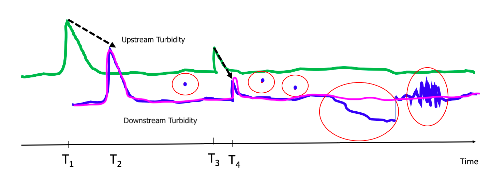
```
---

## Two sensors in close proximity with connected flow

```{r   out.width = "100%", echo = FALSE, fig.cap='', fig.align='center'}
knitr::include_graphics("fig/20_idea_d.png")
```

<!-- - All In One Solution !!-->

- We combine <span style="color: red; font-weight:bold"> all these conditioning (new information)</span> to differentiate  "technical issues" from "real events".


<!--
- Both High priority anomalies and Gradual sensor drift, low variability including persistent values, high variability, other untrustworthy observations-->


---
class: inverse, center, middle

## Our conditional cross-correlation based algorithm (conduits based approach)

```{r   out.width = "30%", echo = FALSE, fig.cap='', fig.align='center'}
knitr::include_graphics("fig/logo.png")
```

<span style="color: green; font-weight:bold">devtools::install_github("PuwasalaG/conduits")</span>
---
####  Pringle Creek data from NEON

```{r   out.width = "60%", echo = FALSE, fig.cap='', fig.align='center'}
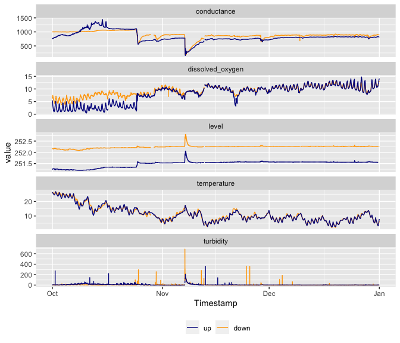
```

---

.pull-left[
## Lag time estimation
- Assume the lag time between two sensor locations depends on the upstream river behavior

- Use conditional cross-correlations to estimate the lag time

- let $x_t$ : Turbidity upstream, $y_t$ : Turbidity downstream and $z_t$ : {level upstream, temperature upstream}

$x^*_t = \frac{x_t - \text{E}[x_t|\mathbf{z}_t]}{\sqrt{\text{V}[x_t|\mathbf{z}_t]}}$ and $y^*_t = \frac{y_t - \text{E}[y_t|\mathbf{z}_t]}{\sqrt{\text{V}[y_t|\mathbf{z}_t]}}$

].pull-right[

```{r eval = FALSE, echo=TRUE}
library(conduits)

fit_mean_y <- data %>%
  conditional_mean(turbidity_downstream ~
          s(level_upstream, k = 5) +
          s(temperature_upstream, k = 5))

fit_var_y <- data %>%
  conditional_var(turbidity_downstream ~
          s(level_upstream, k = 4) +
          s(temperature_upstream, k = 4),
                  family = "Gamma",
                  fit_mean_y )

fit_mean_x <- data %>%
  conditional_mean(turbidity_upstream ~
          s(level_upstream, k = 5) +
          s(temperature_upstream, k = 5))

fit_var_x <- data %>%
  conditional_var(turbidity_upstream ~
          s(level_upstream, k = 4) +
          s(temperature_upstream, k = 4),
                  family = "Gamma",
                  fit_mean_x)

```
]
---
.pull-left[

## Conditional cross-correlations

$$r_k(\mathbf{z}_t) = \text{E}[x_t^*y^*_{t+k}|\mathbf{z}_t] \quad \text{for} \quad k = 1,2,...$$

- To estimate $r_k(\mathbf{z}_t)$ we fit the following GAMs

- Estimating time delay

$$\hat{d}_{t}(\mathbf{z}_t) = \underset{k}{\operatorname{argmax}}\quad \hat{r}_{k}(\mathbf{z}_t)$$
].pull-right[

```{r eval=FALSE, echo=TRUE}

fit_c_ccf <- data %>%
  conditional_ccf(
    formula = I(turbidity_upstream*turbidity_downstream) ~
      splines::ns(level_upstream, df = 3) +
      splines::ns(temperature_upstream, df = 3),
    lag_max = 10,
    fit_mean_x, fit_var_x, fit_mean_y, fit_var_y,
    df_correlation = c(3,3))

new_data <- fit_c_ccf %>% estimate_dt()
```

```{r   out.width = "100%", echo = FALSE, fig.cap='', fig.align='center'}

knitr::include_graphics("fig/23_An2.png")
```

]
---

### Outlier detection based on Conditional cross-correlation and Extreme value theory


$$\text{turbidity_down}_t = \phi_0 + \sum_{i=1}^pg_i(z_{i,t_l}) + \sum_{j=1}^qh_j(\text{turbidity_down}_{t-j}) + \varepsilon_t$$
.pull-left[
- If $z_i$ is a contemporaneous variables measured at downstream sensor, then $t_l = t$.

- If it is a lag downstream variable at lag l, then $t_l = t-l$.

- If $z_i$ is a predictor from the upstream sensor, then $t_l = t-dt$ where $dt$ is the estimated time delay.

].pull-right[


```{r   out.width = "100%", echo = FALSE, fig.cap='', fig.align='center'}

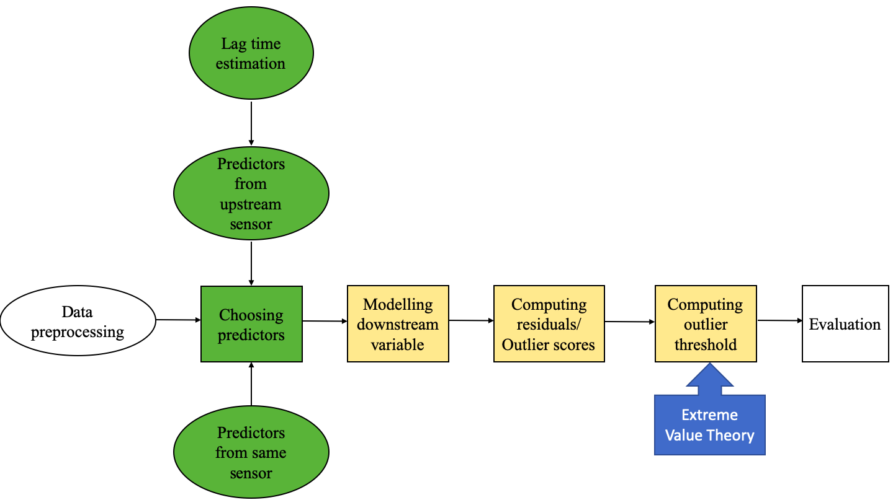
```

]
---

### Outlier detection based on Conditional cross-correlation and Extreme value theory

```{r   out.width = "55%", echo = FALSE, fig.cap='', fig.align='center'}

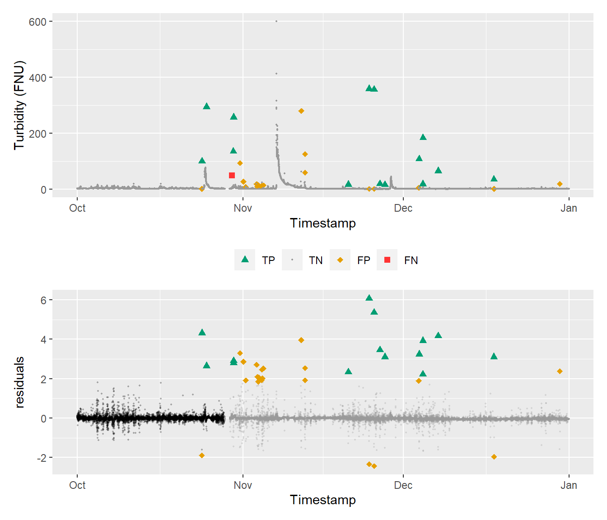
```
---
class: center, middle, inverse

# Thank You

Slides available at: prital.netlify.app  `r anicon::faa("wrench", animate="passing", colour="orange", grow = 20)`

```{r}
icon::fa("envelope")
``` 
priyangad@uom.lk

```{r}
icon::fa("github")
```
pridiltal


```{r}
icon::fa("twitter")
``` 
@pridiltal


#### Acknowledgement

<font size="5">Australian Research Council (ARC) Linkage project (grant number: LP180101151) "Revolutionising high resolution water-quality monitoring in the information age".</font>


