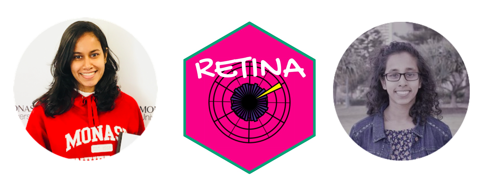

class:  top, center
```{r setup, include=FALSE}
library(knitr)
options(htmltools.dir.version = FALSE)
opts_chunk$set(
  warning = FALSE,
  message = FALSE,
  echo = FALSE,
  cache.path = 'cache/',
  fig.align = 'center',
  cache = TRUE
)

library(tidyverse)
library (gtrendsR)
library(RColorBrewer)
library(ggpubr)
library(viridis)
library(fpp3)
library(countrycode)
library(coronavirus)
library(patchwork)

```

```{r xaringan-themer, include=FALSE, warning=FALSE}
library(xaringanthemer)
style_mono_accent(
   base_color = "#002c54",
   title_slide_background_color = "#084011",
  inverse_background_color = "#0a0c45", #"#002c54"
  header_font_google = google_font("Josefin Sans"),
  text_font_google   = google_font("Montserrat", "300", "300i"),
  code_font_google   = google_font("Fira Mono"),
  title_slide_text_color = "#ffffff",
  inverse_header_color = "#f2b416",
  header_background_text_color = "#ffea00",
   text_font_size = "1.4rem",
  inverse_text_color = "#ffea00"
  )
```


```{r   out.width = "80%", echo = FALSE, fig.cap=''}


```


.pull-left[

Priyanga Dilini Talagala

OWSD Early Career Fellow, 2020

```{r}

icon::fa("globe")
```
prital.netlify.app

```{r}
icon::fa("github")
icon::fa("twitter")

```
pridiltal

<!--PhD in Statistics, Monash University,
Australia

Senior Lecturer </br> Department of Computational Mathematics, University of Moratuwa, Sri Lanka-->
].pull-right[
Thiyanga S. Talagala

OWSD member

```{r}
icon::fa("globe")
```
thiyanga.netlify.app

```{r}
icon::fa("github")
icon::fa("twitter")

```
thiyangt

<!--PhD in Statistics, Monash University,
Australia

Senior Lecturer </br> Department of Statistics, University of Sri Jayewardenepura, Sri Lanka-->

]

---

.pull-left[
### Global tracking of COVID-19 caused school closures and re-openings
 
```{r fig.height=7, fig.width=12}
world_impact <- read.csv(here::here("2021_OWSD_General_Assembly","2021_OWSD_talk", "data", "covid_impact_education_full.csv"))
wimpact <- world_impact %>%
  mutate(Date = as.Date(Date, "%d/%m/%Y"),
         Status = as.factor(Status)) 

wimpact <- wimpact %>% select(-ISO) %>%
  group_by(Date, Status) %>%
  summarize(Count = n())%>%
  as_tsibble(index = Date, key = Status) 

p <- wimpact %>% autoplot(Count) +
  geom_line(size=2) +
  xlab ("Time") +
  # viridis::scale_colour_viridis(discrete = TRUE)+
  scale_color_brewer(palette="Dark2")+
  ylab("Number of Countries")+
    theme_bw() + 
  theme( text = element_text(size = 28), legend.position = "bottom")+
     guides(colour = guide_legend(nrow = 2, title="Status"))

print(p)

```

].pull-right[
```{r fig.height=10, fig.width=8}
## ---- covid_impact_continent
## COVID-19 Impact on Education - continent wise 
## Data source: https://en.unesco.org/covid19/educationresponse
## Data download: 16-08-2021
world_impact <- read.csv(here::here("2021_OWSD_General_Assembly","2021_OWSD_talk", "data", "covid_impact_education_full.csv"))
wimpact <- world_impact %>%
  mutate(Date = as.Date(Date, "%d/%m/%Y"),
         Status = as.factor(Status)) 

wimpact$Continent <- countrycode(sourcevar = wimpact[, "ISO"],
                                 origin = "iso3c",
                                 destination = "continent")

wimpact <- wimpact %>% select(-ISO) %>%
  group_by(Date, Status, Continent) %>%
  summarize(Count = n())

wimpact1<- wimpact%>%pivot_wider(names_from = Continent, values_from = Count )

wimpact1$Asia <- (wimpact1$Asia - min(wimpact1$Asia, na.rm = TRUE))/(max(wimpact1$Asia, na.rm = TRUE) - min(wimpact1$Asia, na.rm = TRUE))

wimpact1$Africa <- (wimpact1$Africa - min(wimpact1$Africa, na.rm = TRUE))/(max(wimpact1$Africa, na.rm = TRUE) - min(wimpact1$Africa, na.rm = TRUE))

wimpact1$Africa <- (wimpact1$Americas - min(wimpact1$Americas, na.rm = TRUE))/(max(wimpact1$Americas, na.rm = TRUE) - min(wimpact1$Americas, na.rm = TRUE))

wimpact1$Europe <- (wimpact1$Europe - min(wimpact1$Europe, na.rm = TRUE))/(max(wimpact1$Europe, na.rm = TRUE) - min(wimpact1$Europe, na.rm = TRUE))

wimpact1$Oceania <- (wimpact1$Oceania - min(wimpact1$Oceania, na.rm = TRUE))/(max(wimpact1$Oceania, na.rm = TRUE) - min(wimpact1$Oceania, na.rm = TRUE))


wimpact2<- wimpact1 %>% pivot_longer(
  cols = Asia:Oceania,
  names_to = c("Continent"),
  values_to = "count"
)

p <- wimpact %>%
  ggplot(aes(x = Date, y = Count, color = Status)) +
  geom_line(size = 2) +
  facet_grid(vars(Continent), scales = "free_y") +   # only assigns the row variable
  xlab("Time)") +
  scale_color_brewer(palette="Dark2")+
  #viridis::scale_colour_viridis(discrete = TRUE, begin = 0, end = 1)+
  theme_bw() + 
  theme( text = element_text(size = 18), legend.position = "bottom")+
     guides(colour = guide_legend(nrow = 2))+
  ylab("Number of Countries")

print(p)
```

]
---

background-image:url('fig/chalkboard.png')
background-position: 50% 50%
background-size: cover
class: center, top

# <span style="color:black">From chalk-talk to <span style="color:blue"> virtual walk</span>


---
background-image:url('fig/UNESCO.png')
background-position: 50% 50%
background-size: cover
class: center, top

#### </br></br>Link: https://en.unesco.org/covid19/educationresponse/solutions


---
### Google trends footprint analysis of distance learning solutions

```{r fig.height=7, fig.width=15}
## Covid search
data_covid <- read.csv( here::here(
 "2021_OWSD_General_Assembly","2021_OWSD_talk",  "data",
  "covid_search_world.csv"))
hits1<- ifelse(data_covid$hits ==  "<1", 0, data_covid$hits)
data_covid$hits <- as.numeric(hits1)

keyword_ord<- data_covid %>% 
  group_by(keyword) %>%
  summarise(total_hits = sum(hits, na.rm = TRUE)) %>%
  arrange(total_hits) %>% select(keyword) %>% as_vector()

dataW <- data_covid %>%
  select(date, keyword, hits) %>%
  mutate(keyword = factor(keyword, levels = keyword_ord))
dataW$date = as.Date(dataW$date, "%Y-%m-%d")

p1<- dataW %>%  ggplot(aes(x=date, y=hits, colour = keyword))+
  geom_line(size=2) + 
  #scale_color_viridis_d(direction = -1, end=0.8) +
  scale_color_brewer(palette="Dark2")+
  #theme_bw()+
  theme(legend.position = "bottom",
        text = element_text(size = 16), legend.text = element_text(size = 16))


## covid google trends - ditance education
data_world <- read.csv( here::here(
 "2021_OWSD_General_Assembly","2021_OWSD_talk","data", 
  "education_search_world.csv"))

# hits is a character variable. Convert hits into a numeric variable
hits1<- ifelse(data_world$hits ==  "<1", 0, data_world$hits)
data_world$hits <- as.numeric(hits1)

keyword_ord<- data_world %>% 
  group_by(keyword) %>%
  summarise(total_hits = sum(hits, na.rm = TRUE)) %>%
  arrange(total_hits) %>% select(keyword) %>% as_vector()

dataW <- data_world %>%
  select(date, keyword, hits) %>%
  mutate(keyword = factor(keyword, levels = keyword_ord))
dataW$date = as.Date(dataW$date, "%Y-%m-%d")

p2<- dataW%>% ggplot(aes(x=date, y=hits, colour = keyword))+
  geom_line(size=2) +
  #scale_color_manual(values = c("red", viridis::viridis(6)))
  #scale_color_viridis_d(direction = -1, end=0.8) +
  scale_color_brewer(palette="Dark2")+
  theme(legend.position = "bottom",
        text = element_text(size = 16), legend.text = element_text(size = 16)) 

p1<- p1+  labs(subtitle = "(a) COVID-19 related terms")

p2 <- p2 + labs(subtitle = "(b) Distance education related terms")
p1/p2 


```
---


```{r Digital_lms_analysists, fig.height = 4, fig.width = 12}

fontsize = 19
## ---- Digital_lms_analysis
keywords= c("CenturyTech", "ClassDojo", "Edmodo", "Edraak",
            "EkStep", "Google Classroom", "Moodle", "Nafham",
            "Paper Airplanes", "Schoology", "Seesaw", "Skooler")
#data_world <- purrr::map_df(keywords, get_info_world)

data_world <- read.csv( here::here("2021_OWSD_General_Assembly","2021_OWSD_talk", "data", "Digital_lms_world.csv"))

hits1<- ifelse(data_world$hits ==  "<1", 0, data_world$hits)
data_world$hits <- as.numeric(hits1)

keyword_ord<- data_world %>% 
 group_by(keyword) %>%
  summarise(total_hits = sum(hits, na.rm = TRUE)) %>%
 arrange(total_hits) %>% select(keyword) %>% as_vector()

dataW <- data_world %>%
  select(date, keyword, hits) %>%
  mutate(keyword = factor(keyword, levels = keyword_ord))
dataW$date = as.Date(dataW$date, "%Y-%m-%d")
  

p1 <- dataW %>%
  as_tsibble(index= date, key = keyword) %>%
  autoplot(hits, size= 2) +
  theme(legend.position = "bottom",  text = element_text(size = fontsize), legend.title = element_blank(), legend.text = element_text(size = fontsize) )+
  scale_colour_viridis_d(guide = "colourbar", direction = -1) + 
   labs(subtitle = "(a) Digital learning management systems
")

## ---- mobile_phones_apps_analysis
keywords= c("Cell-Ed", "Eneza Education", "Funzi", "KaiOS", "Ubongo", 
            "Ustad Mobile")
data_world <- read.csv( here::here("2021_OWSD_General_Assembly","2021_OWSD_talk", "data", "mobile_phones_apps_world.csv"))


keyword_ord<- data_world %>% 
  group_by(keyword) %>%
  summarise(total_hits = sum(hits, na.rm = TRUE)) %>%
  arrange(total_hits) %>% select(keyword) %>% as_vector()

dataW <- data_world %>%
  select(date, keyword, hits) %>%
  mutate(keyword = factor(keyword, levels = keyword_ord))
dataW$date = as.Date(dataW$date, "%Y-%m-%d")

p2<- dataW %>% as_tibble() %>%
  distinct(date, keyword, .keep_all = TRUE) %>%
as_tsibble(index= date, key = keyword) %>% autoplot(hits, size= 2) +
  theme(legend.position = "bottom",  text = element_text(size = fontsize), legend.title = element_blank(), legend.text = element_text(size = fontsize))+
  scale_colour_viridis_d(guide = "colourbar", direction = -1) + 
   labs(subtitle ="(b) Systems built for use on basic mobile phones
")

## ---- offline_functionality_analysis
keywords <-  c("Kolibri", "Rumie", "Ustad Mobile")
data_world <- read.csv( here::here("2021_OWSD_General_Assembly","2021_OWSD_talk",  "data", "offline_functionality_world.csv"))
hits1<- ifelse(
  data_world$hits ==  "<1", 0, data_world$hits)
data_world$hits <- as.numeric(hits1)
keyword_ord<- data_world %>% 
  group_by(keyword) %>%
  summarise(total_hits = sum(hits, na.rm = TRUE)) %>%
  arrange(total_hits) %>% select(keyword) %>% as_vector()

dataW <- data_world %>%
  select(date, keyword, hits) %>%
  mutate(keyword = factor(keyword, levels = keyword_ord))
dataW$date = as.Date(dataW$date, "%Y-%m-%d")


p3<- dataW %>% as_tibble() %>%
  distinct(date, keyword, .keep_all = TRUE) %>%
as_tsibble(index= date, key = keyword) %>% autoplot(hits, size= 2) +
  theme(legend.position = "bottom",  text = element_text(size = fontsize), legend.title = element_blank(), legend.text = element_text(size = fontsize))+
  scale_colour_viridis_d(guide = "colourbar", direction = -1) + 
   labs(subtitle ="(c) Systems with strong offline functionality")


## ---- mooc_analysis
keywords= c("Alison", "Canvas", "Coursera", "European Schoolnet Academy", 
            "EdX", "iCourse", "Future Learn", "Icourses", "TED-Ed Earth School",
            "Udemy", "XuetangX")
data_world <- read.csv( here::here("2021_OWSD_General_Assembly","2021_OWSD_talk",  "data", "mooc_world.csv"))

hits1<- ifelse(data_world$hits ==  "<1", 0, data_world$hits)
data_world$hits <- as.numeric(hits1)

keyword_ord<- data_world %>% 
  group_by(keyword) %>%
  summarise(total_hits = sum(hits, na.rm = TRUE)) %>%
  arrange(total_hits) %>% select(keyword) %>% as_vector()

dataW <- data_world %>%
  select(date, keyword, hits) %>%
  mutate(keyword = factor(keyword, levels = keyword_ord))
dataW$date = as.Date(dataW$date, "%Y-%m-%d")
p4 <- dataW %>% as_tibble() %>%
  distinct(date, keyword, .keep_all = TRUE) %>%
as_tsibble(index= date, key = keyword) %>% autoplot(hits, size= 2) +
  theme(legend.position = "bottom",  text = element_text(size = fontsize), legend.title = element_blank(), legend.text = element_text(size = fontsize))+
  scale_colour_viridis_d(guide = "colourbar", direction = -1) + 
  labs(subtitle ="(d) Massive Open Online Course (MOOC) Platforms")


## ---- Self_directed_learning_analysis
keywords= c("ABRA", "British Council", "Byju’s", "Code It", 
            "Code.org", "Code Week", "Discovery Education", "Duolingo",
            "Edraak", "Facebook Get Digital", "Feed the Monster",
            "History of Africa", "Geekie", "Khan Academy",
            "KitKit School", "LabXchange", "Madrasa",
            "Mindspark", "Mosoteach", "Music Crab", "OneCourse",
            "Polyup", "Quizlet", "SDG Academy Library", "Siyavula",
            "Smart History", "youtube")
data_world <- read.csv( here::here("2021_OWSD_General_Assembly","2021_OWSD_talk",  "data", "Self_directed_learning_world.csv"))

hits1<- ifelse(data_world$hits ==  "<1", 0, data_world$hits)
data_world$hits <- as.numeric(hits1)

keyword_ord<- data_world %>% 
  group_by(keyword) %>%
  summarise(total_hits = sum(hits, na.rm = TRUE)) %>%
  arrange(total_hits) %>% select(keyword) %>% as_vector()

dataW <- data_world %>%
  select(date, keyword, hits) %>%
  mutate(keyword = factor(keyword, levels = keyword_ord))
dataW$date = as.Date(dataW$date, "%Y-%m-%d")
p5 <-  dataW %>% as_tibble() %>%
  distinct(date, keyword, .keep_all = TRUE) %>%
as_tsibble(index= date, key = keyword) %>% autoplot(hits, size= 2) +
  theme(legend.position = "bottom" ,  text = element_text(size = fontsize), legend.title = element_blank(), legend.text = element_text(size = fontsize))+
scale_colour_viridis_d(guide = "colourbar", direction = -1) + 
    labs(subtitle ="(e) Self-directed learning content")

## ---- Mobile_reading_analysis
keywords= c("African Storybook", "Global Digital Library", "Reads", 
            "Room to Read", "StoryWeaver", "Worldreader")

data_world <- read.csv( here::here("2021_OWSD_General_Assembly","2021_OWSD_talk", "data", "Mobile_reading_world.csv"))

hits1<- ifelse(data_world$hits ==  "<1", 0, data_world$hits)
data_world$hits <- as.numeric(hits1)

keyword_ord<- data_world %>% 
  group_by(keyword) %>%
  summarise(total_hits = sum(hits, na.rm = TRUE)) %>%
  arrange(total_hits) %>% select(keyword) %>% as_vector()

dataW <- data_world %>%
  select(date, keyword, hits) %>%
  mutate(keyword = factor(keyword, levels = keyword_ord))
dataW$date = as.Date(dataW$date, "%Y-%m-%d")
p6 <-  dataW %>% as_tibble() %>%
  distinct(date, keyword, .keep_all = TRUE) %>%
as_tsibble(index= date, key = keyword) %>% autoplot(hits, size= 2) +
  theme(legend.position = "bottom",  text = element_text(size = fontsize), legend.title = element_blank(), legend.text = element_text(size = fontsize))+
  scale_colour_viridis_d(guide = "colourbar", direction = -1) + 
    labs(subtitle ="(f) Mobile reading applications")


## ---- Collaboration_platforms_eduonly_analysis

data_world <- read.csv( here::here("2021_OWSD_General_Assembly","2021_OWSD_talk", "data", "edu_only_Collaboration_platforms_world.csv"))

keyword_ord<- data_world %>% 
  group_by(keyword) %>%
  summarise(total_hits = sum(hits, na.rm = TRUE)) %>%
  arrange(total_hits) %>% select(keyword) %>% as_vector()

dataW <- data_world %>%
  select(date, keyword, hits) %>%
  mutate(keyword = factor(keyword, levels = keyword_ord))
dataW$date = as.Date(dataW$date, "%Y-%m-%d")
p7 <-  dataW %>% as_tibble() %>%
  distinct(date, keyword, .keep_all = TRUE) %>%
as_tsibble(index= date, key = keyword) %>% autoplot(hits, size= 2) +
  theme(legend.position = "bottom",  text = element_text(size = fontsize), legend.title = element_blank(), legend.text = element_text(size = fontsize))+
  scale_colour_viridis_d(guide = "colourbar", direction = -1) + 
    labs(subtitle ="(g) Collaboration platforms that support live-video communication")


## ---- Tools_for_teachers_analysis

data_world <- read.csv( here::here("2021_OWSD_General_Assembly","2021_OWSD_talk",  "data", "Tools_for_teachers_world.csv"))
hits1<- ifelse(data_world$hits ==  "<1", 0, data_world$hits)
data_world$hits <- as.numeric(hits1)

keyword_ord<- data_world %>% 
  group_by(keyword) %>%
  summarise(total_hits = sum(hits, na.rm = TRUE)) %>%
  arrange(total_hits) %>% select(keyword) %>% as_vector()

dataW <- data_world %>%
  select(date, keyword, hits) %>%
  mutate(keyword = factor(keyword, levels = keyword_ord))
dataW$date = as.Date(dataW$date, "%Y-%m-%d")
p8 <-  dataW %>% as_tibble() %>%
  distinct(date, keyword, .keep_all = TRUE) %>%
as_tsibble(index= date, key = keyword) %>% autoplot(hits, size= 2) +
 theme(legend.position = "bottom",  text = element_text(size = fontsize), legend.title = element_blank(), legend.text = element_text(size = fontsize))+
  scale_colour_viridis_d(guide = "colourbar", direction = -1) + 
   labs(subtitle ="(h) Tools for teachers to create of digital learning content")

## ---- External_repositories_DL_analysis
keywords= c("Brookings", "Common Sense Education", "Commonweatlh of Learning",
            "Education Nation", "EdSurge", "Global Business Coalition for Education",
            "Keep Learning Going", "Koulu.me", "Organisation internationale de la Francophonie",
            "UNEVOC Resources", "UNHCR")

data_world <- read.csv( here::here("2021_OWSD_General_Assembly","2021_OWSD_talk", "data", "External_repositories_DL_world.csv"))

keyword_ord<- data_world %>% 
  group_by(keyword) %>%
  summarise(total_hits = sum(hits, na.rm = TRUE)) %>%
  arrange(total_hits) %>% select(keyword) %>% as_vector()

dataW <- data_world %>%
  select(date, keyword, hits) %>%
  mutate(keyword = factor(keyword, levels = keyword_ord))
dataW$date = as.Date(dataW$date, "%Y-%m-%d")
p9 <-  dataW %>% as_tibble() %>%
  distinct(date, keyword, .keep_all = TRUE) %>%
as_tsibble(index= date, key = keyword) %>% autoplot(hits, size= 2) +
  theme(legend.position = "bottom",  text = element_text(size = fontsize), legend.title = element_blank(), legend.text = element_text(size = 12))+
  scale_colour_viridis_d(guide = "colourbar", direction = -1) + 
    labs(subtitle ="(i) External repositories of distance learning solutions")


## ---- Online_proctoring_analysis
keywords= c("Mettl", "Examus", "ProctorU", "Examity", "Verificient",
            "AIProctor","ExamSoft", "Proview", "Conduct Exam",
            "ProctorExam", "PSI Bridge", "Pearson VUE", 
            "MeritTrac", "Honorlock", "Proctortrack", "Proctorio",
            "Talview")

data_world <- read.csv( here::here("2021_OWSD_General_Assembly","2021_OWSD_talk", "data", "Online_proctoring_world.csv"))

keyword_ord<- data_world %>% 
  group_by(keyword) %>%
  summarise(total_hits = sum(hits, na.rm = TRUE)) %>%
  arrange(total_hits) %>% select(keyword) %>% as_vector()

dataW <- data_world %>%
  select(date, keyword, hits) %>%
  mutate(keyword = factor(keyword, levels = keyword_ord))
dataW$date = as.Date(dataW$date, "%Y-%m-%d")
p10 <-  dataW %>% as_tibble() %>%
  distinct(date, keyword, .keep_all = TRUE) %>%
as_tsibble(index= date, key = keyword) %>% autoplot(hits, size= 2) +
   theme(legend.position = "bottom",  text = element_text(size = fontsize), legend.title = element_blank(), legend.text = element_text(size = fontsize))+
  scale_colour_viridis_d(guide = "colourbar", direction = -1) + 
    labs(subtitle ="(j) Tools for online proctoring")
```


background-image:url('fig/googletrend1.png')
background-position: 50% 50%
background-size: 80%
class: center, top

---

background-image:url('fig/UNgoal4.png')
background-position: 50% 50%
background-size: cover
class: center, top
<!--

 inclusive and quality education enables upward socioeconomic mobility and is a key to escaping poverty. 
 
  which has a direct impact on the Sustainable Development Goals (ODS) of the UN, 

 inclusive and quality  education is essential to sustainable development and a key UN sustainable development goal-->