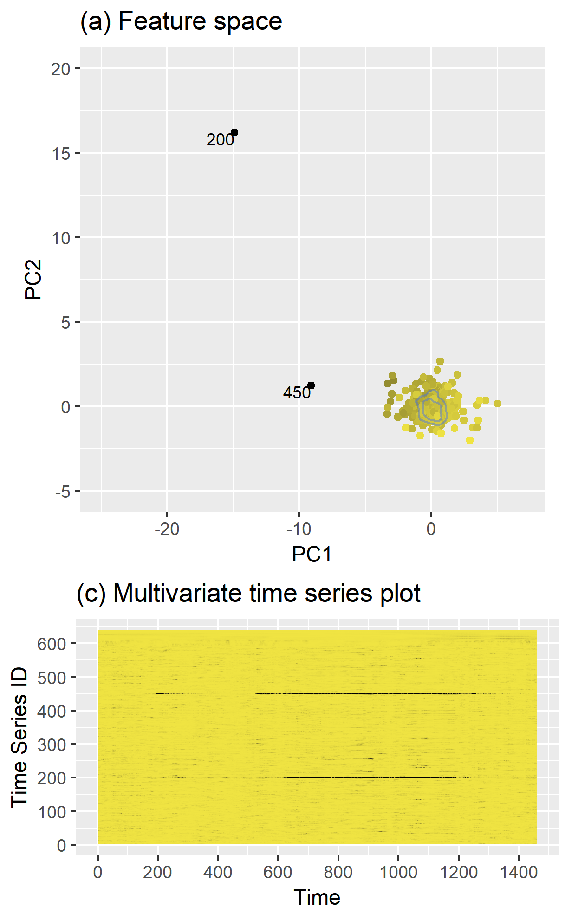
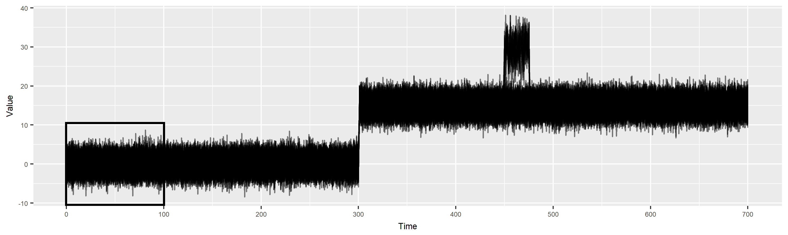
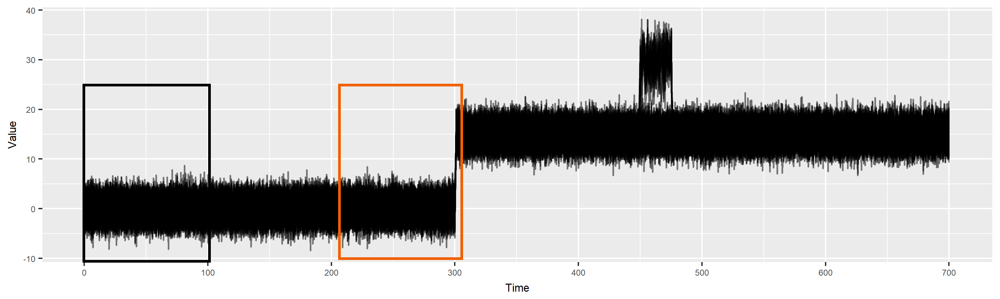

```{r setup, include=FALSE}
library(knitr)
options(htmltools.dir.version = FALSE)
opts_chunk$set(
  warning = FALSE,
  message = FALSE,
  echo = FALSE,
  fig.path = 'figure/',
  cache.path = 'cache/',
  fig.align = 'center',
  fig.show = 'hold',
  cache = FALSE,
  external = TRUE,
  dev = "pdf",
  fig.height = 6,
  fig.width = 10,
  out.width = "0.8\\textwidth"
)
read_chunk('src/main.R')
library(tidyverse)
library(gridExtra)
library(ggpubr)
# install.packages("devtools")
# devtools::install_github("pridiltal/oddstream")
library(oddstream)
library(animation)
library(icon)
```

class: center, middle, inverse

# Anomaly Detection in  Streaming Time Series Data

## Priyanga Dilini Talagala

04-12-2020


```{r}
icon::fa("envelope")
``` 
priyangad@uom.lk

```{r}
icon::fa("github")
icon::fa("twitter")

```
pridiltal

```{r}

icon::fa("globe")
```
prital.netlify.app </br>
(Slides and papers available)

<br/><br/>The slides are powered by `xaringan` R package

---
class: center, middle

# Hello from the team!


```{r  out.width = "100%", echo=FALSE}

```

---

.pull-left[

```{r  out.width = "40%", echo=FALSE}
knitr::include_graphics("fig/JCGS_logo.png")
```

Priyanga Dilini Talagala, Rob J Hyndman, Kate Smith-Miles, (2020) **Anomaly detection in high-dimensional data**. Journal of Computational & Graphical Statistics, *to appear*

<br/>
```{r  out.width = "45%", echo=FALSE, fig.cap="on CRAN"}
knitr::include_graphics("fig/stray-logo.png")
```
]
.pull-right[
```{r  out.width = "40%", echo=FALSE}
knitr::include_graphics("fig/JCGS_logo.png")
```

Priyanga Dilini Talagala, Rob J Hyndman, Kate Smith-Miles, Sevvandi Kandanaarachchi and Mario A Munoz (2020) **Anomaly detection in streaming nonstationary temporal data**. Journal of Computational & Graphical Statistics, 20(1), 13-27.

```{r  out.width = "45%", echo=FALSE, fig.cap="on CRAN"}

```
]

---
## Anomaly detection

[CRAN Task View: Anomaly Detection with R](https://github.com/pridiltal/ctv-AnomalyDetection)
--


### Anomaly detection in temporal data

```{r echo=FALSE, out.width = "100%"}
knitr::include_graphics("fig/outtype.png")
```


---
background-image:url('fig/outtype2.png')
background-position: 70% 70%
background-size: 100%
class: left, top, clear

## Anomalous series in temporal data
---
background-image:url('fig/outtype3.png')
background-position: 70% 70%
background-size: 100%
class: left, top, clear

## Anomalous series in temporal data
---
background-image:url('fig/2_application.png')
background-position: 70% 70%
background-size: 100%
class: left, top, clear

### Anomalous series within a space of a collection of series
---
class: center, middle

<p><font size=12> <span style="color:blue"> stray (S</span>earch and <span style="color:blue">TR</span>ace <span style="color:blue">A</span>nomal<span style="color:blue">Y<span>)
</font size=12></p>


```{r  out.width = "30%", echo=FALSE, fig.cap= "on CRAN" }
knitr::include_graphics("fig/stray-logo.png")
```

`devtools::install_github("pridiltal/stray")` 

---

## Anomaly detection in high dimensional Data

### Main contributions
- Propose a framework to detect anomalies in high dimensional data. Our proposed algorithm addresses the limitations of HDoutliers algorithm (Wilkinson, 2018).
--


### What is an anomaly ?
- We define an anomaly as an observation that deviates markedly from the majority with a large distance gap.
--


### Main assumptions
- There is a large distance between typical data and the anomalies in comparison to the distance among typical data.

---

## stray

```{r  echo=FALSE, out.width = "50%", fig_align = 'top'}
knitr::include_graphics("fig/stray_plot1.png")
```
-  Normalize the columns of the data. (median and IQR)
-  This prevents variables with large variances having disproportional influence on Euclidean distances.
---

## Why not "nearest neighbour" distances? 
```{r  echo=FALSE, out.width = "50%", fig_align = 'top'}
knitr::include_graphics("fig/stray_plot2.png")
```

- Calculate the nearest neighbour distance 
---
## stray
```{r  echo=FALSE, out.width = "50%", fig_align = 'top'}
knitr::include_graphics("fig/stray_plot5.png")
```


- Select the <span style="color:red"> k nearest neighbour </span> distance with the <span style="color:red"> maximum gap </span>
---
## Calculate anomalous threshold

- Use extreme value theory (EVT) to calculate a data driven outlier threshold.
--

- Let **n** be the size of the dataset
--

- Sort the resulting **n** outlier scores 
--

- Consider the half of the outlier scores  with the smallest values as typical
--

- Search for any significant large gap in the upper tail (Bottom up searching algorithm proposed by Schwarz, 2008)


---
## Spacing theorem (Weissman, 1978)

Let $X_{1}, X_{2}, ..., X_{n}$ be a sample from a distribution function $F$ . </br>
Let $X_{1:n} \geq X_{2:n} \geq ... \geq X_{n:n}$ be the order statistics. </br>
The available data are $X_{1:n}, X_{2:n},  ..., X_{k:n}$ for some fixed $k$. </br>
Let $D_{i,n} = X_{i:n} - X_{i+1:n},$ $(i = 1,2,..., k)$ be the spacing between successive order statistics.</br>
If $F$ is in the maximum domain of attraction of the Gumbel distribution, then the spacings $D_{i,n}$ are asymptotically independent and exponentially distributed with mean proportional to $i^{-1}$.

```{r  echo=FALSE, out.width = "55%", fig_align = 'top'}
knitr::include_graphics("fig/P2_plot17.png")
```

---

## stray
```{r  echo=FALSE, out.width = "50%", fig_align = 'top'}
knitr::include_graphics("fig/stray_plot6.png")
```

`outliers <- find_HDoutliers(data)` <br/>
`display_HDoutliers(data, outliers)`
---
## Advantages of the proposed algorithm

- Detect clusters of outlying points
--

- Applied to both uni- and multi- dimensional data
--

- Handle large datasets due to the use of approximate KNN searching algorithm
--

- Does not require a training set to build the decision model
--

- Deal with multimodal typical classes
--

- Outlier threshold has a probabilistic interpretation
---
background-image:url('fig/2_application.png')
background-position: 70% 70%
background-size: 100%
class: right, top, clear

### Anomalous series within a space of a collection of series
---
## Feature based representation of time series
.pull-left[
- Mean   
- Variance  
- Changing variance in remainder 
- Level shift using rolling window   
- Variance change  
- Strength of linearity 
- Strength of curvature  
 ]

.pull-right[
- Strength of spikiness  
- Burstiness of time series (Fano Factor)  
- Minimum  
- Maximum  
- The ratio between 50% trimmed mean and the arithmetic mean
- Moment 
- Ratio of means of data that is below and above the global mean  

]
---
## Approach 1: Using stray
- use a moving window to deal with streaming data
- Extract time series features from window
- Apply stray algorithm to identify anomalous series

.pull-left[

```{r   echo=FALSE, out.width = "100%"}
knitr::include_graphics("fig/P2_plot22.png")
```

]
.pull-right[
```{r   echo=FALSE, out.width = "60%"}
knitr::include_graphics("fig/stray.gif")
```
]

`tsfeatures <- oddstream::extract_tsfeatures(ts_data)` <br/>
`outliers <- stray::find_HDoutliers(tsfeatures)` <br/>
`stray::display_HDoutliers(tsfeatures, outliers)`


---
class:: center, clear
.pull-left[
 
```{r   echo=FALSE, out.width = "100%"}

```
]
--
.pull-right[

```{r   echo=FALSE, out.width = "100%"}

```
]

---
class: center, clear

<p><font size=12> <span style="color:blue">oddstream </br> (O</span>utlier <span style="color:blue">D</span>etection in <span style="color:blue">D</span>ata  <span style="color:blue">STREAM</span>s)
</font size=12></p> 


```{r  out.width = "30%", echo=FALSE}
knitr::include_graphics("fig/oddstream_logo.png")
```

`devtools::install_github("pridiltal/oddstream")` 

---
## Dimension reduction for time series 

.pull-left[
`load(train_data)`
```{r   echo=FALSE, out.width = "80%", fig_align = 'bottom'}
knitr::include_graphics("fig/4_typical.png")
```
]
--
.pull-right[
`tsfeatures <- oddstream::extract_tsfeatures` </br>
`(train_data)`
```{r  echo=FALSE, out.width = "50%",}
knitr::include_graphics("fig/5_high_typical.gif")
```
]

--
</br>
`pc<- oddstream::get_pc_space(tsfeatures)`</br>
`oddstream::plotpc(pc$pcnorm)` 
```{r  echo=FALSE, out.width = "35%",}
knitr::include_graphics("fig/6_typicalfeature.png")
```
---
## Anomalous threshold calculation 

- Estimate the probability density function of the 2D PC space $\longrightarrow$ Kernel density estimation
--

- Draw a large number N of extremes $(arg min_{x\in X}[f_{2}(x)])$ from the estimated probability density function
--

- Define a $\Psi$-transform space, using the $\Psi$-transformation defined by (Clifton et al., 2011)

```{r   echo=FALSE, out.width = "50%"}

```

- $\Psi$-transform maps the density values back into space into which a Gumbel distribution can be fitted.
--

- Anomalous threshold calculation $\longrightarrow$ extreme value theory


---
class: center, top, clear
`oddstream::find_odd_streams(train_data, test_stream)`
```{r   echo=FALSE, out.width = "50%"}
knitr::include_graphics("fig/18_oddstream_mvtsplot.gif")
```
.pull-left[
```{r  echo=FALSE, out.width = "90%", fig_align = 'top'}
knitr::include_graphics("fig/16_oddstream_out_loc.gif")
```
]
.pull-right[
```{r  echo=FALSE, out.width = "90%", fig_align = 'top'}
knitr::include_graphics("fig/17_oddstream_pcplot.gif")
```
]
---
class:  top
### Feature Based Representation of Time series
    
.pull-left[


```{r   echo=FALSE, out.width = "100%", fig_align = 'bottom'}

```


]
.pull-right[
```{r  echo=FALSE, out.width = "100%",}

```
]

---
class:  center, middle, inverse


# Anomaly Detection with <br/>  <span style="color:#cc5900"> Non-stationarity </span>


---
#### Anomaly detection with non-stationarity

```{r  echo=FALSE, out.width = "70%", fig_align = 'top'}
knitr::include_graphics("fig/19_nonstationaritytypes.png")
```
---

### Anomaly detection with non-stationarity

```{r  echo=FALSE, out.width = "100%", fig_align = 'top'}

```

```{r  echo=FALSE, out.width = "35%", fig_align = 'top'}
knitr::include_graphics("fig/21_noCD1.png")
```
---
### Anomaly detection with non-stationarity

```{r  echo=FALSE, out.width = "100%", fig_align = 'top'}
knitr::include_graphics("fig/20_suddenplot3.png")
```

```{r  echo=FALSE, out.width = "35%", fig_align = 'top'}
knitr::include_graphics("fig/21_noCD2.png")
```

---

### Anomaly detection with non-stationarity

```{r  echo=FALSE, out.width = "100%", fig_align = 'top'}

```

```{r  echo=FALSE, out.width = "35%", fig_align = 'top'}
knitr::include_graphics("fig/21_noCD3.png")
```

---
### Anomaly detection with non-stationarity

```{r  echo=FALSE, out.width = "100%", fig_align = 'top'}

```

```{r  echo=FALSE, out.width = "100%", fig_align = 'top'}
knitr::include_graphics("fig/22_conceptdrift_pval.png")
```

- $H_{0} : f_{t_{0}} = f_{t_{t}}$


- squared discrepancy measure $T = \int[f_{t_{0}}(x) - f_{t_{t}}(x)]^{2}dx$ (Anderson et al., 1994)

---
### Anomaly detection with non-stationarity

```{r  echo=FALSE, out.width = "100%", fig_align = 'top'}

```


---
class: clear, middle, center
.pull-left[
### stray
 
```{r   echo=FALSE, out.width = "75%"}

```

- Definition: distance 
- no training set 
]
.pull-right[
### oddstream

```{r   echo=FALSE, out.width = "75%"}

```

- Definition: density
- need a training set
]
---
### What Next?

- Explore more on feature extraction and feature selection methods to create a better feature space suitable for streaming data context.
--

- Use other dimension reduction techniques such as multidimensional scaling analysis, random projection to see the effect on the performance of the proposed framework.
--

- Do more experiments on density estimation methods to get a better tail estimation.
--

- Extend the algorithm to work with Multidimensional Multivariate Data Streams. 

---

.pull-left[

```{r  out.width = "40%", echo=FALSE}
knitr::include_graphics("fig/JCGS_logo.png")
```

Priyanga Dilini Talagala, Rob J Hyndman, Kate Smith-Miles, (2020) **Anomaly detection in high-dimensional data**. Journal of Computational & Graphical Statistics, *to appear*

<br/>
```{r  out.width = "45%", echo=FALSE, fig.cap="on CRAN"}
knitr::include_graphics("fig/stray-logo.png")
```
]
.pull-right[
```{r  out.width = "40%", echo=FALSE}
knitr::include_graphics("fig/JCGS_logo.png")
```

Priyanga Dilini Talagala, Rob J Hyndman, Kate Smith-Miles, Sevvandi Kandanaarachchi and Mario A Munoz (2020) **Anomaly detection in streaming nonstationary temporal data**. Journal of Computational & Graphical Statistics, 20(1), 13-27.

```{r  out.width = "45%", echo=FALSE, fig.cap="on CRAN"}

```
]
---
class: center, middle

# Thank You

.pull-left[
```{r  out.width = "45%", echo=FALSE}

```
]
.pull-right[
```{r  out.width = "45%", echo=FALSE}
knitr::include_graphics("fig/stray-logo.png")
```
]

```{r}
icon::fa("envelope")
``` 
priyangad@uom.lk

```{r}
icon::fa("github")
icon::fa("twitter")

```
pridiltal

```{r}

icon::fa("globe")
```
prital.netlify.app </br>
(Slides and papers available)

<br/><br/>The slides are powered by `xaringan` R package  