```{r setup, include=FALSE}
library(knitr)
options(htmltools.dir.version = FALSE)
opts_chunk$set(
  warning = FALSE,
  message = FALSE,
  echo = FALSE,
  fig.path = 'figure/',
  cache.path = 'cache/',
  fig.align = 'center',
  fig.show = 'hold',
  cache = FALSE,
  external = TRUE,
  dev = "pdf",
  fig.height = 6,
  fig.width = 10,
  out.width = "0.8\\textwidth"
)
read_chunk('src/main.R')
```

```{r load}
```

### Anomaly Detection 

```{r VisualiseAnomaly, warning=FALSE, message=FALSE}
```
```{r mvtsplot, out.width = "90%",  fig.align = 'bottom'}
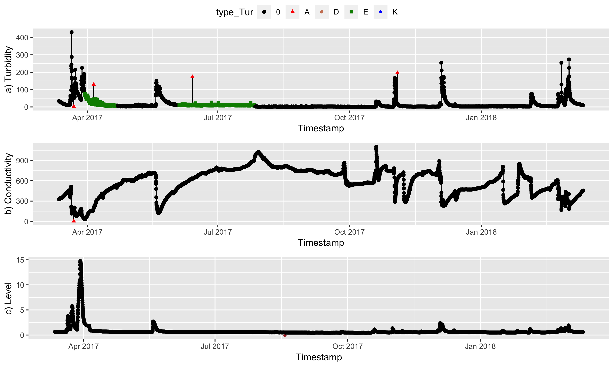
```

<span style="color:blue">**Anomaly Definition:**</span> Unusual behaviours due to technical issues with the sensor equipment.
<br/><br/>  Outlier Detection,  Variability Detection, Drift Detection, Rule based approaches

---
### Outlier Detection
```{r filter_outliers_from_anormalies}
```
```{r VisualiseOutlier, warning=FALSE, message=FALSE}
```
```{r  echo=FALSE, out.width = "90%", fig.align = 'up'}
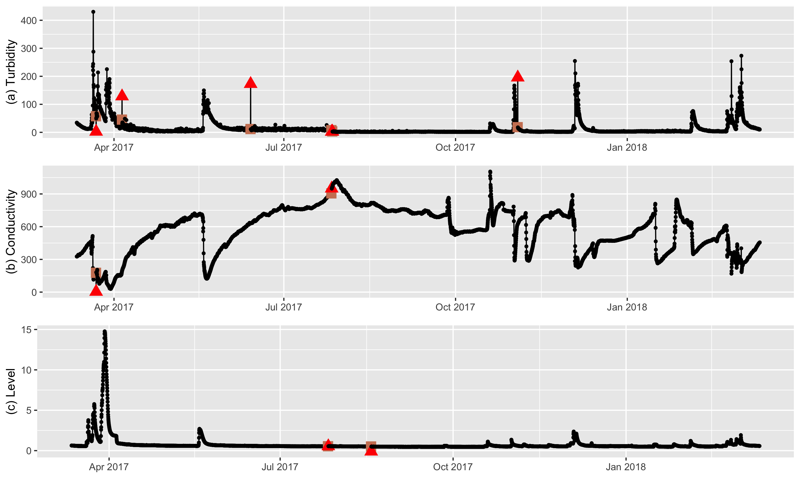
```

<span style="color:blue">**Outlier Definition:**</span> A point which is significantly different (with respect to distance or density) from the majority of a given data space 
<br/> <br/>  <span style="color:red">Outlier Detection </span>, Variability Detection, Drift Detection, <span style="color:red">Rule based approaches </span>

---
```{r filter_outliers_from_anormalies}
```
```{r VisualiseOutlier, warning=FALSE, message=FALSE}
```
```{r  echo=FALSE, out.width = "75%", fig.align = 'up', fig.align='center'}

```

<span style="color:blue">**Our focus:**</span>
<br/> Large sudden spikes(A), Sudden Shifts (D), Clusters of Spikes (I), Small Sudden spikes (J)
<br/> <br/>  Out-of-sensor-range values (G), Missing values (K), Impossible values (F) - <span style="color:gray">Rule based Approaches </span>

<span style="color:blue">**Further Work:** </span>
<br/>  Low variability(B), High Variability (E), Constant offset (C), Drift (H)
---

```{r Visualise_outlier_pairs_original_data, warning=FALSE, message=FALSE}
```

```{r Visualisepairs, echo=FALSE, out.width = "100%",  fig.cap="Bivariate relationships between original variables"}
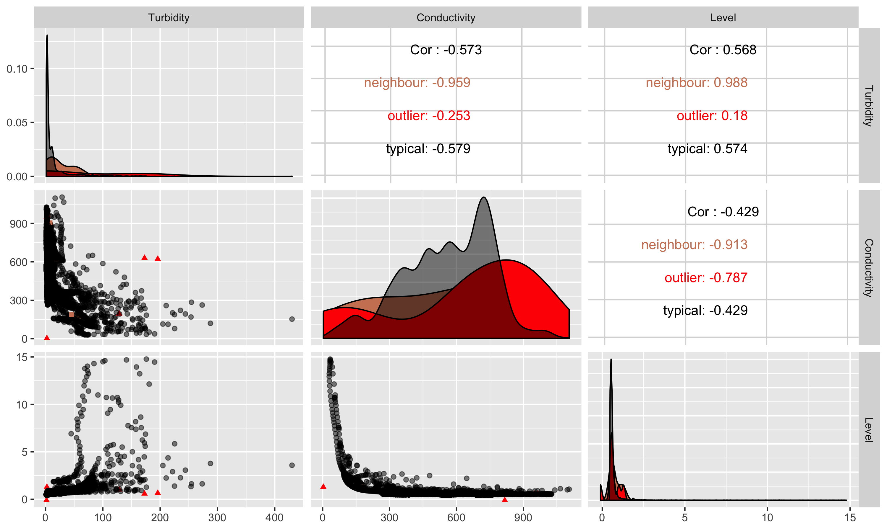
```
---

```{r transform_sandy, warning=FALSE, message=FALSE}
```
```{r transformType, warning=FALSE, message=FALSE}
```

```{r transformTypePng, dependson= 'transformType', fig.cap= "(a) Original series, (b) Log transformation, (c) First difference, (d) First derivative, (e) Rate of change. (f) One sided derivative", out.width='100%'}
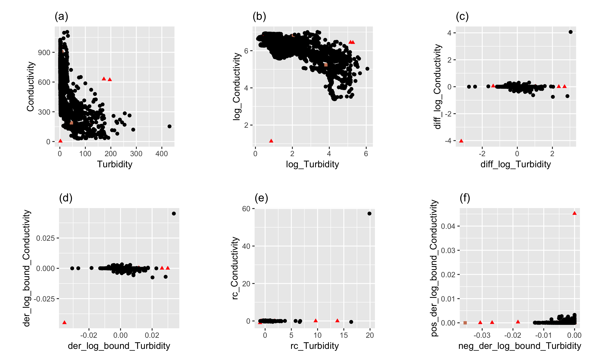
```


---

```{r trans_demo_TCL, warning=FALSE, message=FALSE}
```

```{r timegapSandy, warning=FALSE, message=FALSE}
```
```{r timegapSandypng, echo=FALSE, out.height = "20%" , out.width = "80%" }
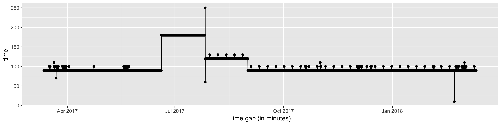
```

--

```{r transDemoTCLpng, echo=FALSE,  dependson= 'trans_demo_TCL', out.width='80%', fig.cap="Transformed series (one sided derivatives)"}
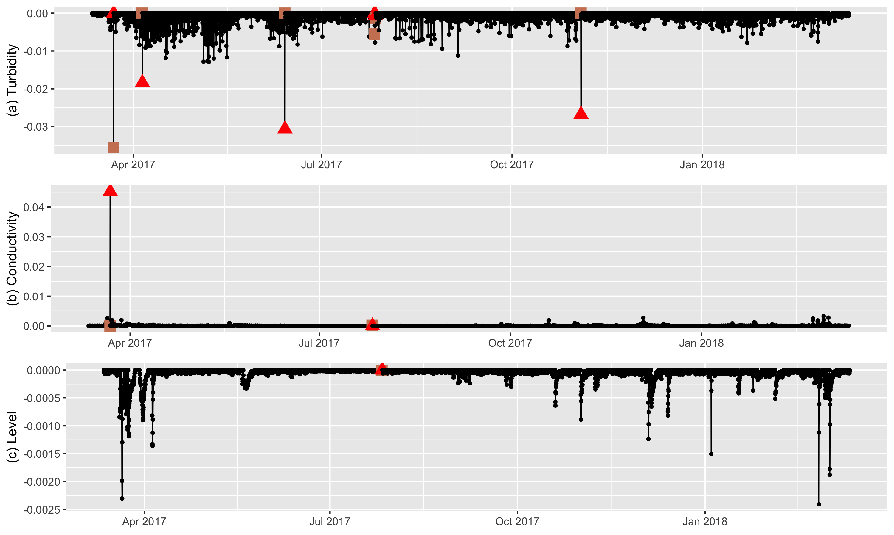
```

---

```{r Visualisepairs2, echo=FALSE, out.width = "100%" , fig.cap="Bivariate Relationships between original variables"}

```

---
```{r Visualise_outlier_pairs_trans_data, warning=FALSE, message=FALSE}
```

```{r VisualiseOutlierPairsTransDataPng, echo=FALSE, dependson='Visualise_outlier_pairs_trans_data', out.width = "100%",fig.cap="Bivariate relationships between transfomred series (one sided derivative)"}
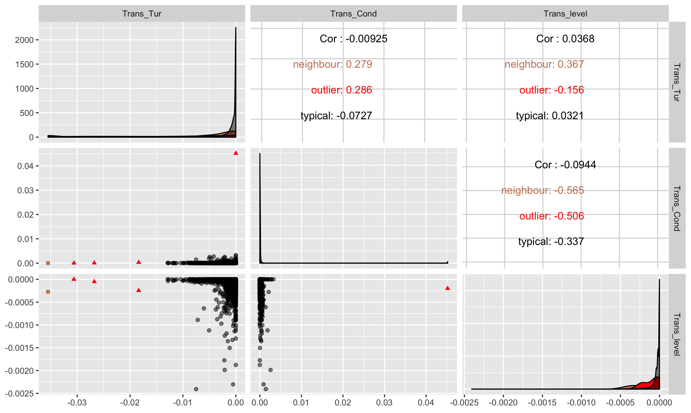
```

---

### Distance and density based anomaly detection methods
```{r plot_score_function, warning=FALSE, message=FALSE, dependson='performance_plot'}
```


```{r one_sided_derivative_TCL_sandy_demopng, dependson='one_sided_derivative_TCL_sandy', out.width="70%", echo=FALSE}
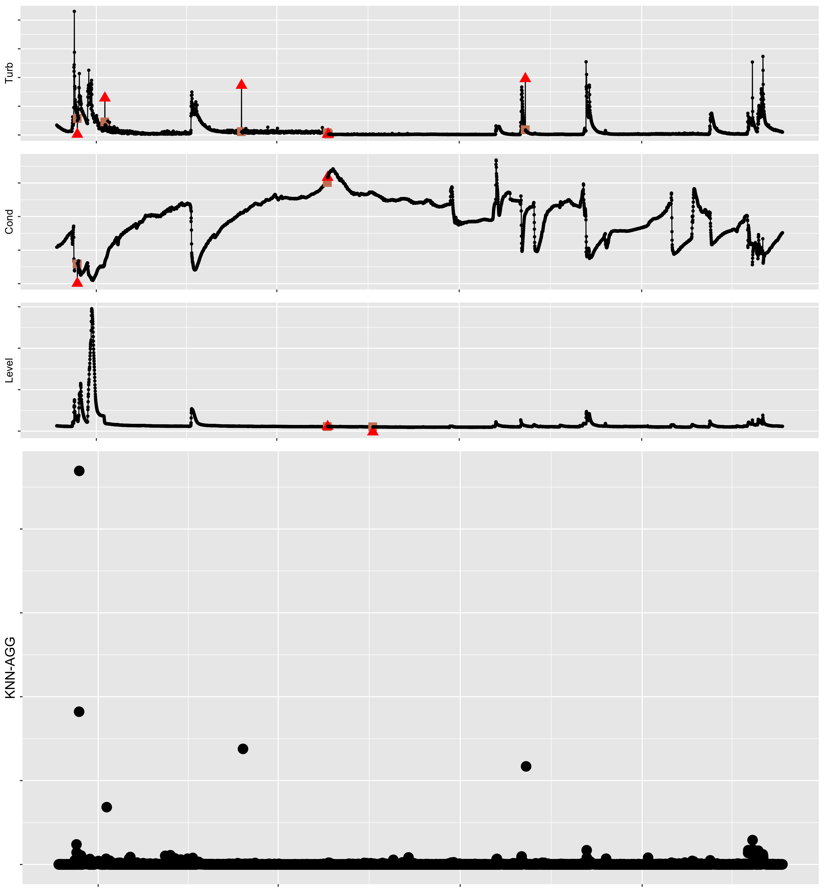
```

---

### Distance and density based anomaly detection methods

```{r one_sided_derivative_TCL_sandy_scorepng, dependson='one_sided_derivative_TCL_sandy', out.width="70%", echo=FALSE}
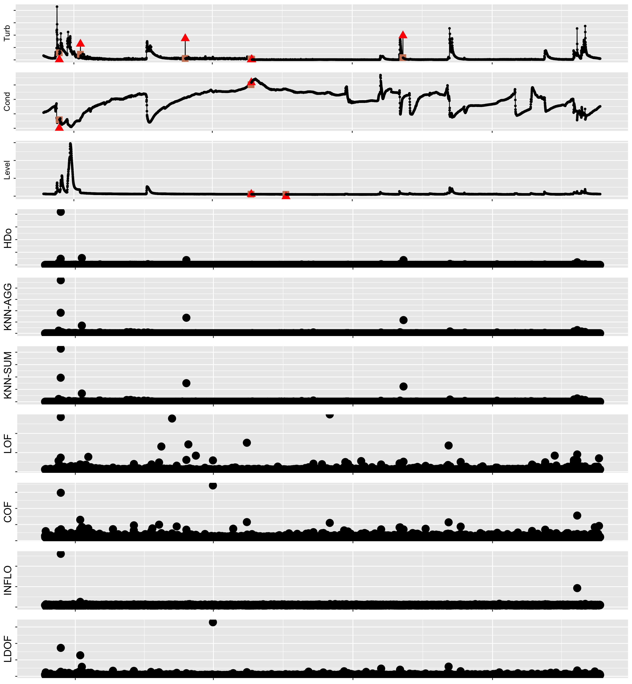
```

---
### Distance and density based anomaly detection methods

```{r one_sided_derivative_TCL_sandy_anom1png, dependson='one_sided_derivative_TCL_sandy', out.width="70%", echo=FALSE}
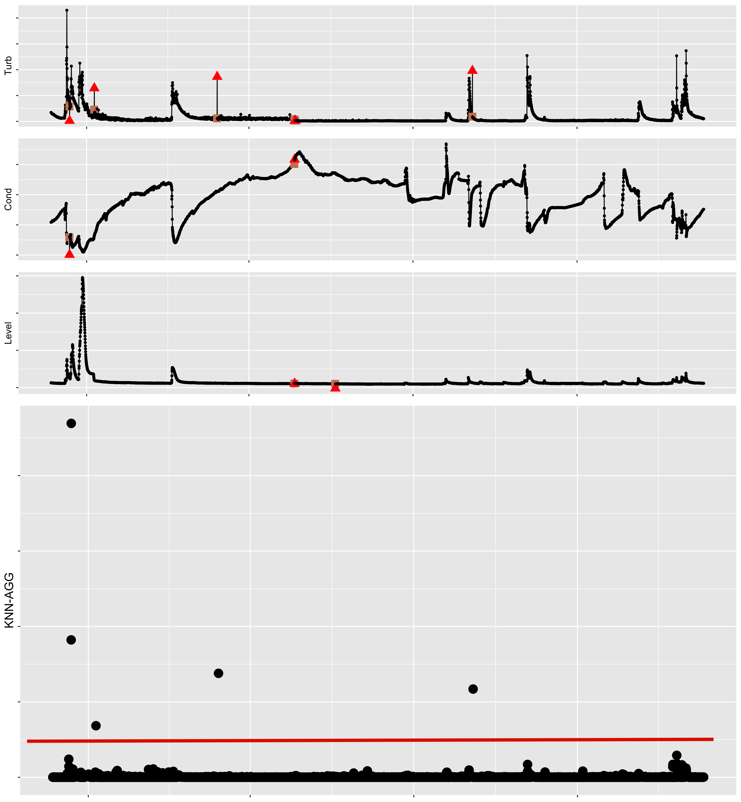
```

---

### Distance and density based anomaly detection methods

```{r one_sided_derivative_TCL_sandy_anom2png, dependson='one_sided_derivative_TCL_sandy', out.width="70%", echo=FALSE}
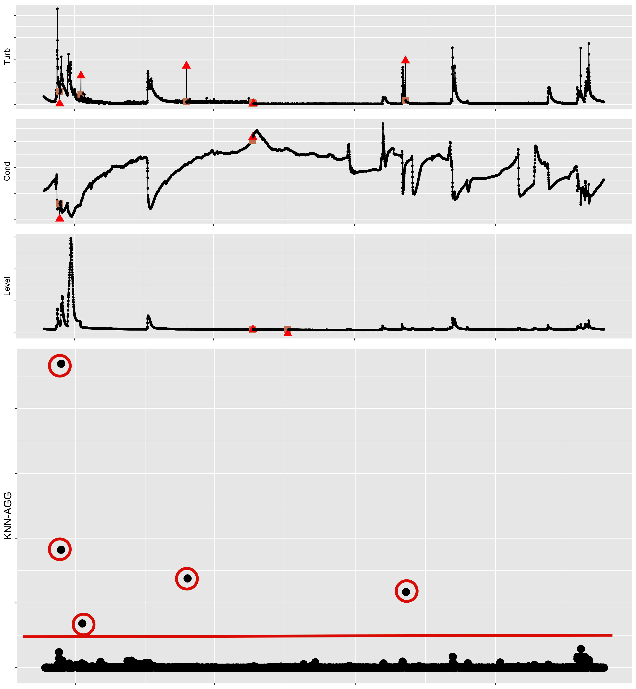
```

---
## Outlier Threshold Calculation


**Theorem**  (Weissman's Spacing Theorem). (Weissman (1978), Theorem 3) (Burridge and Taylor (2006),Proposition 1)

*Let* $D_{i,n} = X_{i:n}-X_{i+1:n}$ *be the spacings between successive order statistics. Then, provided* $F$ *is in the maximum domain of attraction of the Gumbel distribution, and for a suitable sequence of constants*, $a_n$, *the objects,* $\left\{a_{n}^{-1}D_{i,n}, i=1, \dots,K \right\}$, *converge in distribution under the null hypothesis of no outliers to a vector of* $K$ *independent exponential variates with means proportional to* $i^{-1}$.


```{r Weissman, out.width="70%", echo=FALSE}
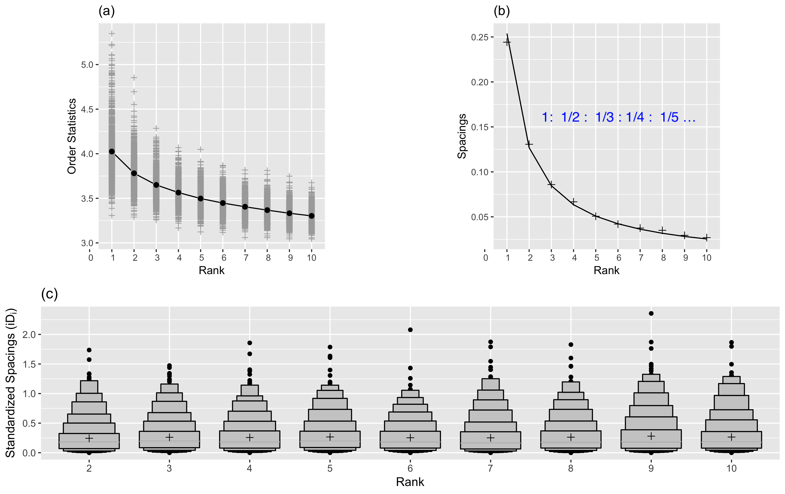
```

---

### Distance and density based anomaly detection methods

```{r one_sided_derivative_TCL_sandy, warning=FALSE, message=FALSE, dependson='performance_plot'}
```
```{r one_sided_derivative_TCL_sandypng, dependson='one_sided_derivative_TCL_sandy', out.width="70%", echo=FALSE}
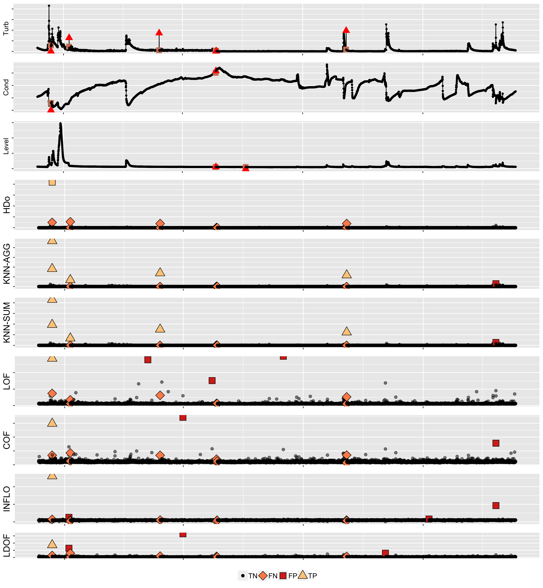
```

---

## Main Contributions

- Propose an **unsupervised** framework that provides early detection of technical outliers in water-quality data from *in-situ* sensors.
- Introduce an R package, `oddwater`, that implements the proposed framework and related functions.

```{r echo=TRUE, eval=FALSE}
# install.packages("devtools")
devtools::install_github("pridiltal/oddwater")
```
- `oddwater` package also provides a shiny app to explore data. 


```{r eval = FALSE, echo=TRUE}
## Launch Shiny application
oddwater::explore_data()
```

---

## Advantages of the proposed framework

1. (1) Takes the correlation structure of the water-quality variables into account when detecting anomalies. 

2. (2) Can be applied to both univariate and multivariate problems.

3. (3) Unsupervised, data-driven approaches and therefore do not require training data sets for the model building process, and can be extended easily to other time series from other sites. 

4. (4) The anomalous thresholds have a probabilistic interpretation. 
5. (5) The framework can easily be extended to streaming data such that it can provide near-real-time support. 

6. (6) The proposed framework also has the ability to deal with irregular time series.

## Further Work

- To explore the ability of other transformations to capture other anomaly types such as **high and low variability** and **drift**.

---
## Key References

- *Talagala, P. D., Hyndman, R., Leigh, C., Mengersen, K., Smith-Miles, K. (For review). A feature-based unsupervised approach for outlier detection in water quality data from in situ sensors. Water Resources Research.*

