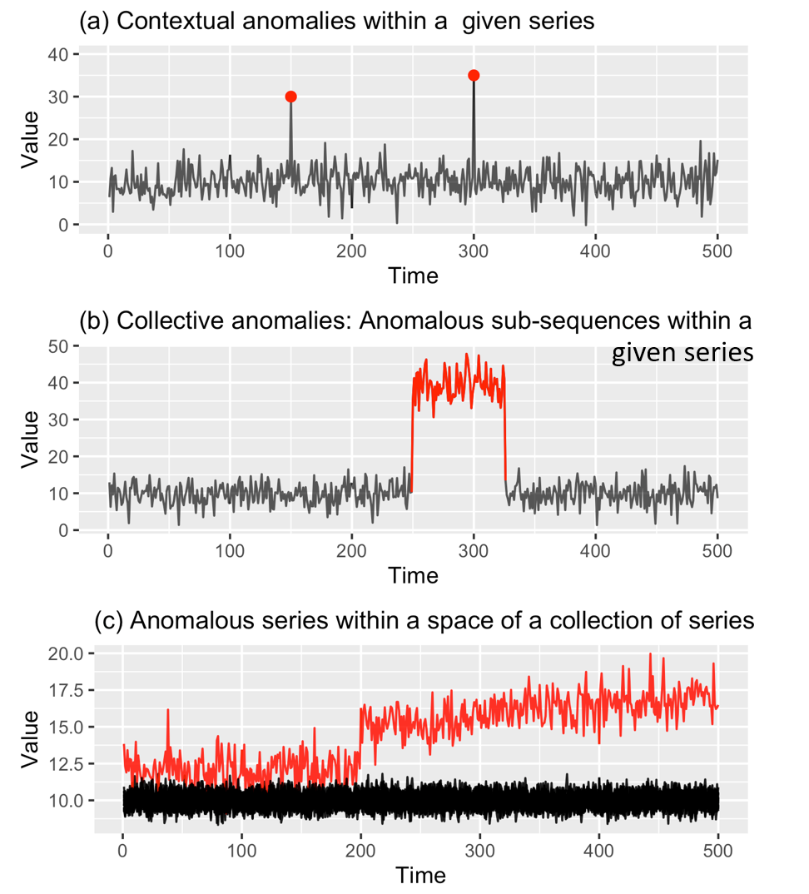
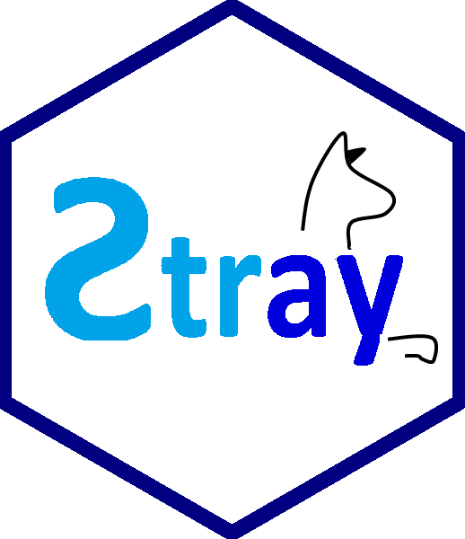
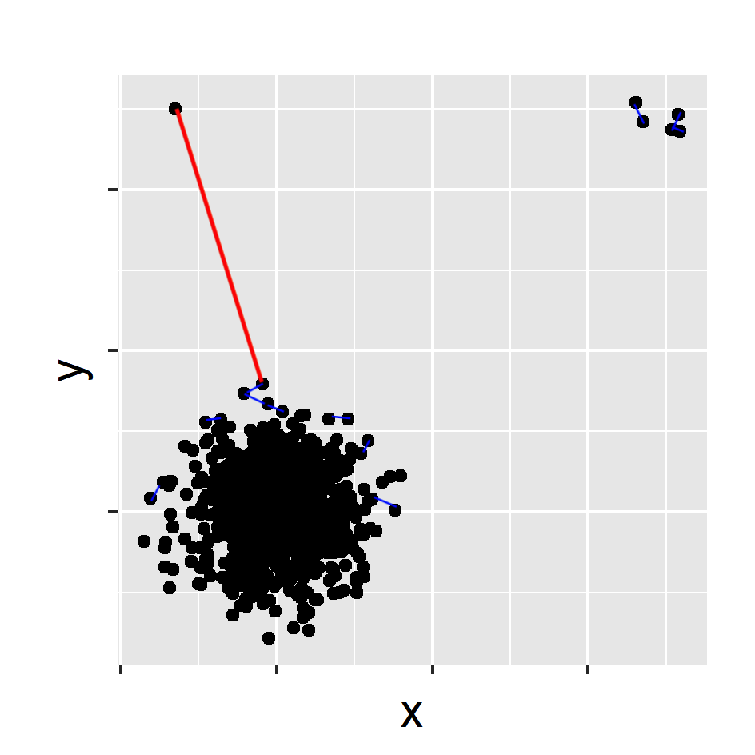
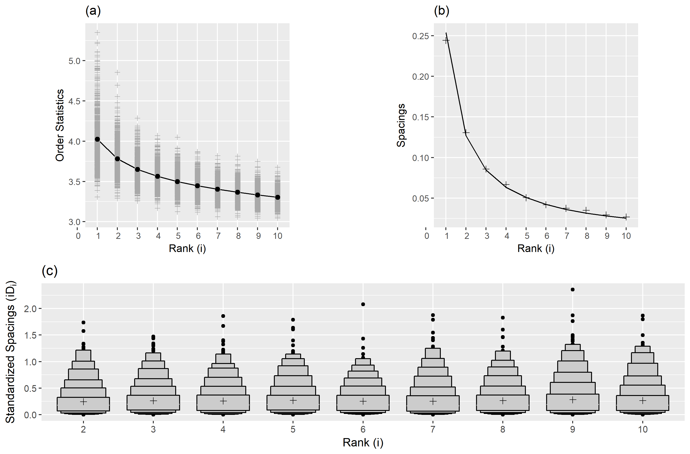
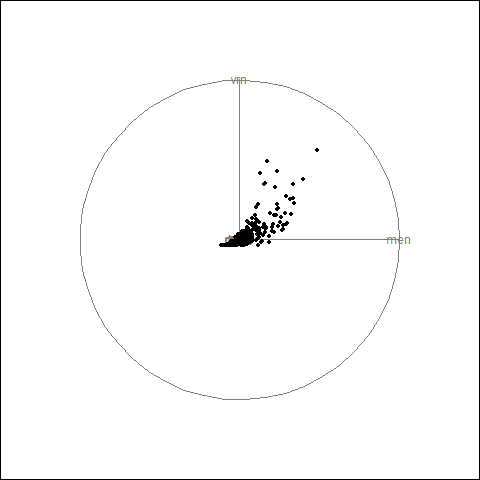
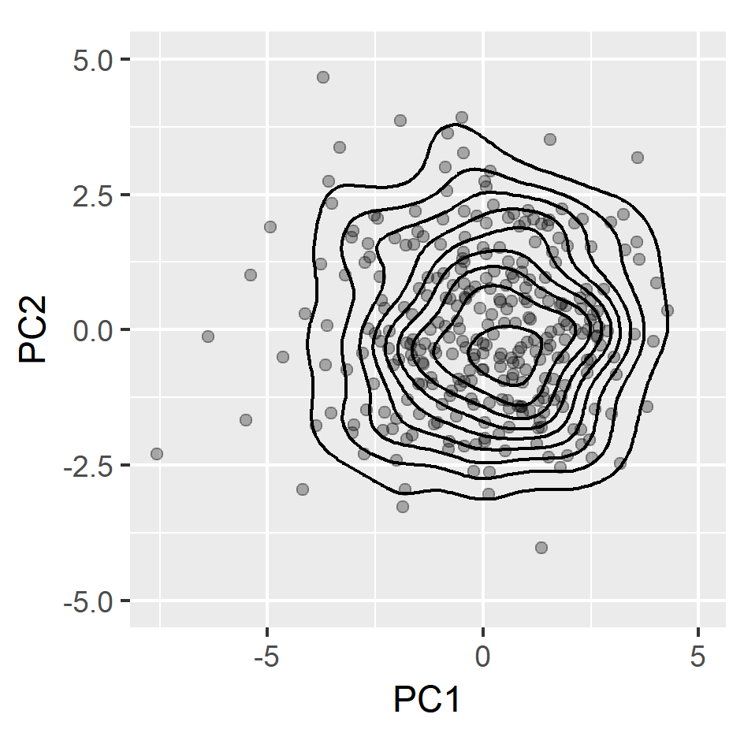
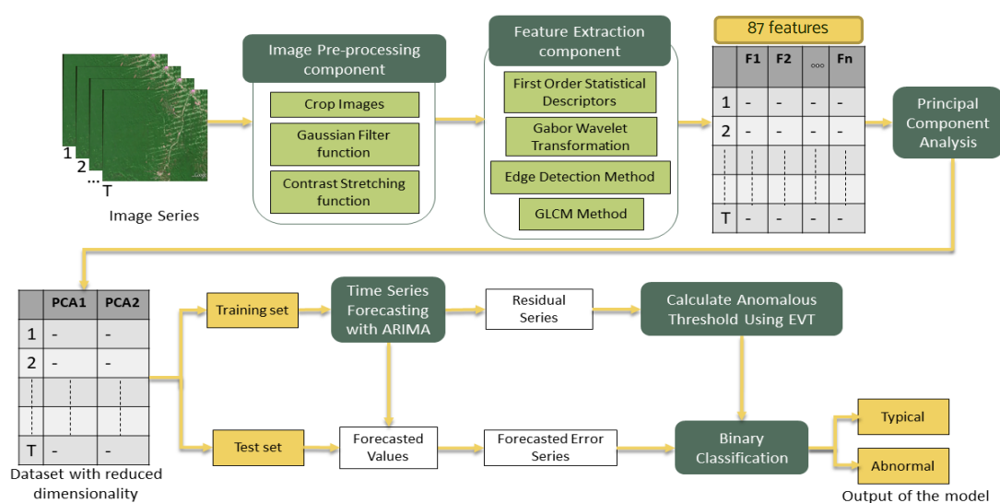

```{r setup, include=FALSE}
options(htmltools.dir.version = FALSE)
knitr::opts_chunk$set(
  fig.width=9, fig.height=3.5, fig.retina=3,
  out.width = "100%",
  cache = FALSE,
  echo = FALSE,
  message = FALSE, 
  warning = FALSE,
  hiline = TRUE
)
```

```{r xaringan-themer, include=FALSE, warning=FALSE}
library(xaringanthemer)
style_mono_accent(
   base_color = "#002c54",
    title_slide_background_image = "fig/title.jpeg",
   title_slide_background_color = "#002c54",
  inverse_background_color = "#02054a", #"#002c54"
  header_font_google = google_font("Josefin Sans"),
  text_font_google   = google_font("Montserrat", "500", "500i"),
  code_font_google   = google_font("Fira Mono"),
  title_slide_text_color = "#ffea00",
  inverse_header_color = "#ffffff",
  header_background_text_color = "#ffea00",
  inverse_text_color = "#ffffff",
  base_font_size = "20px",
  text_font_size = "1.3rem",
  header_h1_font_size = "3rem",
  header_h2_font_size = "2rem",
  header_h3_font_size = "2rem",
  )
```

### Acknowledgement

```{r   out.width = "80%", echo = FALSE, fig.cap='', fig.align='center'}

```

---
class: center, middle

## Anomaly detection

[CRAN Task View: Anomaly Detection with R](https://github.com/pridiltal/ctv-AnomalyDetection)

---
class: center, middle
.pull-left[ 
### High Dimensional data 

```{r echo=FALSE, out.width = "90%"}
knitr::include_graphics("fig/2_outtypea.png")
```
]
--
.pull-right[
### Temporal data

```{r echo=FALSE, out.width = "90%"}

```
]

---
background-image:url('fig/3_outtype2.png')
background-position: 80% 50%
background-size: 75%
class: left, top, clear

## Anomalies in temporal data
---
background-image:url('fig/4_outtype2.png')
background-position: 80% 50%
background-size: 75%
class: left, top, clear

## Anomalies in temporal data
---
background-image:url('fig/5_applications.png')
background-position: 70% 70%
background-size: 100%
class: left, top, clear

## Anomalous series within a space of a collection of series
---
- Approaches to solving the problem of anomaly detection for temporal data :
--
.pull-left[
### Batch scenario 
- whole set of data is available
- complete events <br/><br/><br/>

```{r mvtsplot, out.width = "100%",  fig.align = 'bottom',echo=FALSE}

```
]
--
.pull-right[
### Data stream scenario
- continuous, unbounded, flow at high speed, high volume
- incomplete events
```{r  echo=FALSE, out.width = "100%", fig.align = 'up'}
knitr::include_graphics("fig/7_stream.gif")
```
]
---
class: center, middle

<p><font size=12> <span style="color:blue"> stray (S</span>earch and <span style="color:blue">TR</span>ace <span style="color:blue">A</span>nomal<span style="color:blue">Y<span>)
</font size=12></p>


```{r  out.width = "30%", echo=FALSE, fig.cap= "on CRAN" }

```

`devtools::install_github("pridiltal/stray")` 

---
## Stray algorithm in Python

Recently, Kate Buchhorn has ported stray algorithms to Python and made them available in sktime:

```{r  out.width = "80%", echo=FALSE , fig.align='center'}

```
---
## Anomaly detection in high dimensional Data

### Main contributions
- Propose a framework to detect anomalies in high dimensional data. Our proposed algorithm addresses the limitations of HDoutliers algorithm (Wilkinson, 2018).
--


### What is an anomaly ?
- We define an anomaly as an observation that deviates markedly from the majority with a large distance gap.
--


### Main assumptions
- There is a large distance between typical data and the anomalies in comparison to the distance among typical data.

---

## stray

```{r  echo=FALSE, out.width = "50%", fig_align = 'top'}
knitr::include_graphics("fig/9_stray_plot1.png")
```
-  Normalize the columns of the data. (median and IQR)
-  This prevents variables with large variances having disproportional influence on Euclidean distances.
---

## Why not "nearest neighbour" distances? 
```{r  echo=FALSE, out.width = "50%", fig_align = 'top'}

```

- Calculate the nearest neighbour distance 
---
## stray
```{r  echo=FALSE, out.width = "50%", fig_align = 'top'}

```


- Select the <span style="color:red"> k nearest neighbour </span> distance with the <span style="color:red"> maximum gap </span>
---
## Calculate anomalous threshold

- Use extreme value theory (EVT) to calculate a data driven outlier threshold.
--

- Let **n** be the size of the dataset
--

- Sort the resulting **n** outlier scores 
--

- Consider the half of the outlier scores  with the smallest values as typical
--

- Search for any significant large gap in the upper tail (Bottom up searching algorithm proposed by Schwarz, 2008)


---
## Spacing theorem (Weissman, 1978)

.pull-left[
Let $X_{1}, X_{2}, ..., X_{n}$ be a sample from a distribution function $F$ . </br>
Let $X_{1:n} \geq X_{2:n} \geq ... \geq X_{n:n}$ be the order statistics. </br>
The available data are $X_{1:n}, X_{2:n},  ..., X_{k:n}$ for some fixed $k$. </br>
Let $D_{i,n} = X_{i:n} - X_{i+1:n},$ $(i = 1,2,..., k)$ be the spacing between successive order statistics.</br>
If $F$ is in the maximum domain of attraction of the Gumbel distribution, then the spacings $D_{i,n}$ are asymptotically independent and exponentially distributed with mean proportional to $i^{-1}$.
].pull-right[
```{r  echo=FALSE, out.width = "100%", fig_align = 'top'}

```
]

---

## stray
```{r  echo=FALSE, out.width = "50%", fig_align = 'top'}
knitr::include_graphics("fig/11_stray_plot6.png")
```

`outliers <- find_HDoutliers(data)` <br/>
`display_HDoutliers(data, outliers)`
---
## Advantages of the proposed algorithm

- Detect clusters of outlying points
--

- Applied to both uni- and multi- dimensional data
--

- Handle large datasets due to the use of approximate KNN searching algorithm
--

- Does not require a training set to build the decision model
--

- Deal with multimodal typical classes
--

- Outlier threshold has a probabilistic interpretation
---
## Feature based representation of time series
.pull-left[
- Mean   
- Variance  
- Changing variance in remainder 
- Level shift using rolling window   
- Variance change  
- Strength of linearity 
- Strength of curvature  
 ]

.pull-right[
- Strength of spikiness  
- Burstiness of time series (Fano Factor)  
- Minimum  
- Maximum  
- The ratio between 50% trimmed mean and the arithmetic mean
- Moment 
- Ratio of means of data that is below and above the global mean  

]
---
### Approach 1: Using stray
- use a moving window to deal with streaming data
- Extract time series features from window
- Apply stray algorithm to identify anomalous series

.pull-left[

```{r   echo=FALSE, out.width = "80%"}
knitr::include_graphics("fig/12_strayts.png")
```

]
.pull-right[
```{r   echo=FALSE, out.width = "50%"}
knitr::include_graphics("fig/13_stray.gif")
```
]

`tsfeatures <- oddstream::extract_tsfeatures(ts_data)` <br/>
`outliers <- stray::find_HDoutliers(tsfeatures)` <br/>
`stray::display_HDoutliers(tsfeatures, outliers)`


---
class:: center, clear
.pull-left[
 
```{r   echo=FALSE, out.width = "75%"}
knitr::include_graphics("fig/14_P2_plot21a.png")
```
]
--
.pull-right[

```{r   echo=FALSE, out.width = "75%"}
knitr::include_graphics("fig/14_P2_plot21b.png")
```
]

---
class: center, clear

<p><font size=12> <span style="color:blue">oddstream </br> (O</span>utlier <span style="color:blue">D</span>etection in <span style="color:blue">D</span>ata  <span style="color:blue">STREAM</span>s)
</font size=12></p> 


```{r  out.width = "30%", echo=FALSE}
knitr::include_graphics("fig/15_oddstream_logo.png")
```

`devtools::install_github("pridiltal/oddstream")` 

---
## Dimension reduction for time series 

.pull-left[
`load(train_data)`
```{r   echo=FALSE, out.width = "100%", fig_align = 'bottom'}
knitr::include_graphics("fig/16_typical.png")
```
]
--
.pull-right[
`tsfeatures <- oddstream::extract_tsfeatures`</br>`(train_data)`

```{r  echo=FALSE, out.width = "60%",}

```
]

---

.pull-left[
`tsfeatures <- oddstream::extract_tsfeatures`</br>`(train_data)`

```{r  echo=FALSE, out.width = "70%",}

```
]
--
.pull-right[
`pc<- oddstream::get_pc_space(tsfeatures)`</br>
`oddstream::plotpc(pc$pcnorm)` 
```{r  echo=FALSE, out.width = "90%",}
knitr::include_graphics("fig/18_typicalfeature.png")

```
]
---
## Anomalous threshold calculation 

- Estimate the probability density function of the 2D PC space $\longrightarrow$ Kernel density estimation
--

- Draw a large number N of extremes $(arg min_{x\in X}[f_{2}(x)])$ from the estimated probability density function
--

- Define a $\Psi$-transform space, using the $\Psi$-transformation defined by (Clifton et al., 2011)

```{r   echo=FALSE, out.width = "50%"}
knitr::include_graphics("fig/19_psitrans.png")
```

- $\Psi$-transform maps the density values back into space into which a Gumbel distribution can be fitted.
--

- Anomalous threshold calculation $\longrightarrow$ extreme value theory


---
class: center, top, clear
`oddstream::find_odd_streams(train_data, test_stream)`
```{r   echo=FALSE, out.width = "40%"}
knitr::include_graphics("fig/19_oddstream_mvtsplot.gif")
```
.pull-left[
```{r  echo=FALSE, out.width = "60%", fig_align = 'top'}
knitr::include_graphics("fig/20_oddstream_out_loc.gif")
```
]
.pull-right[
```{r  echo=FALSE, out.width = "60%", fig_align = 'top'}
knitr::include_graphics("fig/21_oddstream_pcplot.gif")
```
]
---
class:  top
### Feature Based Representation of Time series
    
.pull-left[


```{r   echo=FALSE, out.width = "100%", fig_align = 'bottom'}

```


]
.pull-right[
```{r  echo=FALSE, out.width = "75%",}
knitr::include_graphics("fig/22_tsfeatures.png")
```
]

---
class:  center, middle, inverse


# Anomaly Detection with <br/>  <span style="color:#ffff05"> Non-stationarity </span>


---
class:  center, middle

#### Anomaly detection with non-stationarity

```{r  echo=FALSE, out.width = "50%", fig_align = 'top'}

```
---
class:  center, middle
### Anomaly detection with non-stationarity

```{r  echo=FALSE, out.width = "70%", fig_align = 'top'}
knitr::include_graphics("fig/24_suddenplot2.png")
```

```{r  echo=FALSE, out.width = "25%", fig_align = 'top'}

```
---

class:  center, middle
### Anomaly detection with non-stationarity

```{r  echo=FALSE, out.width = "70%", fig_align = 'top'}

```

```{r  echo=FALSE, out.width = "25%", fig_align = 'top'}
knitr::include_graphics("fig/27_noCD2.png")
```

---

class:  center, middle

### Anomaly detection with non-stationarity

```{r  echo=FALSE, out.width = "70%", fig_align = 'top'}
knitr::include_graphics("fig/28_suddenplot4.png")
```

```{r  echo=FALSE, out.width = "25%", fig_align = 'top'}

```

---

class:  center, middle
### Anomaly detection with non-stationarity

```{r  echo=FALSE, out.width = "80%", fig_align = 'top'}
knitr::include_graphics("fig/30_suddenplot2.png")
```

```{r  echo=FALSE, out.width = "80%", fig_align = 'top'}

```

- $H_{0} : f_{t_{0}} = f_{t_{t}}$


- squared discrepancy measure $T = \int[f_{t_{0}}(x) - f_{t_{t}}(x)]^{2}dx$ (Anderson et al., 1994)

---

class:  center, middle
### Anomaly detection with non-stationarity

```{r  echo=FALSE, out.width = "70%", fig_align = 'top'}
knitr::include_graphics("fig/32_sudden_out.png")
```


---
class: clear, middle, center
.pull-left[
### stray
 
```{r   echo=FALSE, out.width = "65%"}
knitr::include_graphics("fig/33_P2_plot21a.png")
```

- Definition: distance 
- no training set 
]
.pull-right[
### oddstream

```{r   echo=FALSE, out.width = "65%"}
knitr::include_graphics("fig/34_P2_plot21b.png")
```

- Definition: density
- need a training set
]

---
class: clear, middle
.pull-left[

```{r  out.width = "20%", echo=FALSE}

```

Priyanga Dilini Talagala, Rob J Hyndman, Kate Smith-Miles, (2020) **Anomaly detection in high-dimensional data**. Journal of Computational & Graphical Statistics, *to appear*

```{r  out.width = "25%", echo=FALSE, fig.cap="on CRAN"}

```
]
.pull-right[
```{r  out.width = "20%", echo=FALSE}

```

Priyanga Dilini Talagala, Rob J Hyndman, Kate Smith-Miles, Sevvandi Kandanaarachchi and Mario A Munoz (2020) **Anomaly detection in streaming nonstationary temporal data**. Journal of Computational & Graphical Statistics, 20(1), 13-27.

```{r  out.width = "25%", echo=FALSE, fig.cap="on CRAN"}
knitr::include_graphics("fig/36_oddstream1.png")
```
]
---
class: center, middle, inverse

# <span style="color:#ffff05"> Anomaly Detection in Image Time Series (ITS)  </span>


---
## Image Time Series (ITS) 


-  A stack of images or a videos -  Image Time Series (ITS) 

- An ITS is basically a set of images of the same scene, ordered chronologically.

- It can be encoded as a data-cube, two spatial and one temporal dimensions. 

- The acquisition of an ITS can be done with one or multiple sensors to obtain a larger data series with a high temporal frequency.

- The produced $2D+t$ data carry rich spatial and temporal information that must be taken into account to understand particular phenomena not being observable from a single image of the sequence.


<!--
Chelali, M., Kurtz, C., Puissant, A., & Vincent, N. (2021). Deep-STaR: Classification of image time series based on spatio-temporal representations. Computer Vision and Image Understanding, 208, 103221.
-->
---
## Satellite Image Time Series (SITS)

- A Satellite Image Time Series (SITS) is a set of satellite images taken from the same scene at different times

.pull-left[

```{r   echo=FALSE, out.width = "75%"}
knitr::include_graphics("fig/37_deforestation.gif")
```
].pull-right[
```{r   echo=FALSE, out.width = "75%"}
knitr::include_graphics("fig/38_volcano.gif")
```

]
---

## Approach 1: Traditional Machine Learning Approach

```{r   echo=FALSE, out.width = "90%"}

```
---

## Approach 2: Deep Learning Approach

```{r   echo=FALSE, out.width = "90%"}

```
---
### Fisher-Tippett theorem, limit laws for maxima

```{r   echo=FALSE, out.width = "60%", fig.align='center'}

```

- Asymptotic distribution of extreme order statistics
- The maximum (minima) of a sample of iid random variables after proper renormalization can only converge in distribution to one of 3 possible distributions, the Gumbel distribution, the Fréchet distribution, or the Weibull distribution.

---
## Binary Classification using EVT based Threshold

```{r   echo=FALSE, out.width = "100%"}
knitr::include_graphics("fig/41_threshold.png")
```
---
## EVT based Anomaly Threshold Calculation

```{r   echo=FALSE, out.width = "100%"}

```
---
## Binary Classification using EVT based Threshold

```{r   echo=FALSE, out.width = "100%"}
knitr::include_graphics("fig/41_threshold.png")
```

---

### What Next?

- Explore more on feature extraction and feature selection methods to create a better feature space suitable for streaming data context.
--

- Use other dimension reduction techniques such as multidimensional scaling analysis, random projection to see the effect on the performance of the proposed framework.
--

- Do more experiments on density estimation methods to get a better tail estimation.
--

- Implement a suitable explainable model for anomaly detection in image streams.
--

- Extend the algorithm to work with Multidimensional Multivariate Data streams

---
class: center, middle

# Thank You

```{r}
icon::fa("envelope")
``` 
priyangad@uom.lk

```{r}
icon::fa("github")
icon::fa("twitter")

```
pridiltal

```{r}

icon::fa("globe")
```
prital.netlify.app </br>
(Slides and papers available)

<br/><br/>The slides are powered by `xaringan` R package  

This work was supported in part by RETINA research lab funded by the OWSD, a program unit of United Nations Educational, Scientific and Cultural Organization (UNESCO).

