```{r setup, include=FALSE}
library(knitr)
options(htmltools.dir.version = FALSE)
opts_chunk$set(
  warning = FALSE,
  message = FALSE,
  echo = FALSE,
  cache.path = 'cache/',
  fig.align = 'center',
  cache = FALSE
)
library(anicon)

```
```{r xaringan-themer, include=FALSE, warning=FALSE}
library(xaringanthemer)
style_mono_accent(
   base_color = "#0b3e73",
   title_slide_background_color = "#01264d",
  inverse_background_color = "#0b3e73",
  header_font_google = google_font("Josefin Sans"),
  #text_font_google   = google_font("Montserrat", "300", "300i"),
  code_font_google   = google_font("Fira Mono"),
  title_slide_text_color = "#05f5ad",
  inverse_header_color = "#05f5ad",
  inverse_text_color = "#05f5ad",
   header_background_text_color = "#ffea00",
   text_font_size = "1.3rem",
   text_font_url = "#ffea00",
    text_bold_font_weight = "bold",
  header_font_url = "#ffea00",
  inverse_link_color = "#7eb6ed",
  text_font_base = "sans-serif",
   text_font_weight = xaringanthemer_font_default("text_font_weight")
  )
```


class: inverse, middle, center

- This introductory workshop is organized as a pre-workshop for the 8th International Conference on Information Technology Research at the Faculty of Information Technology, University of Moratuwa, Sri Lanka


Conference details: https://icitr.uom.lk/

- This special workshop is tailored for undergraduate students, offering a unique opportunity to delve into the process of sharing research findings through conference papers. 
---

class: inverse, middle, center

## The Process of Scholarly Communication

The scholarly communication is the process of sharing, disseminating and
publishing research findings of academics and researchers so that the generated
academic contents are made available to the global academic communities (Das, 2015)

---

### Research Lifecycle diagram

Source: JISC, United Kingdom, www.jisc.ac.uk/whatwedo/campaigns/res3/jischelp.aspx

```{r   out.width = "35%", echo = FALSE, fig.cap='', fig.align='center'}
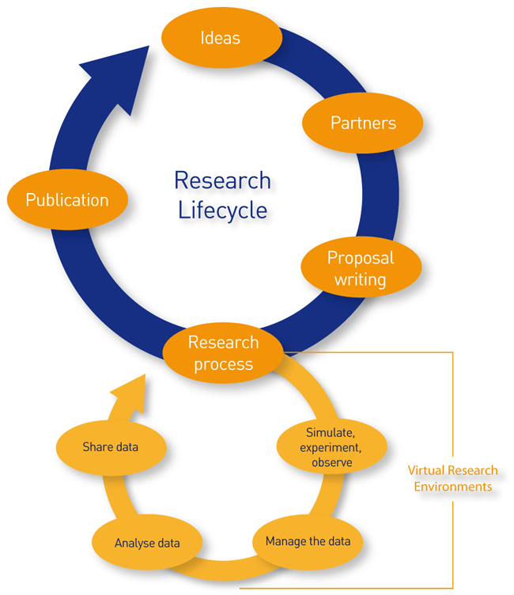
```


<!-- 

- The scholarly communication is only a small component of a larger Research
Lifecycle.


-->
---
class:  middle

Sylvia Plath -  University of Cambridge

```{r   out.width = "100%", echo = FALSE, fig.cap='', fig.align='center'}
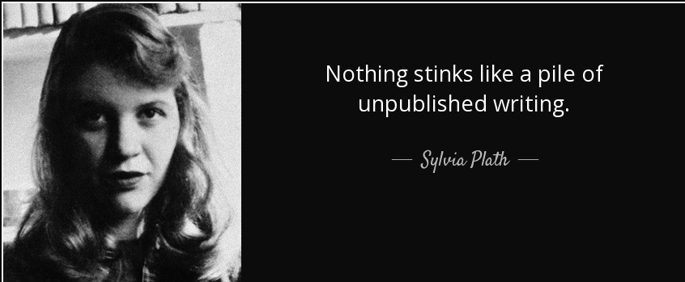
```

---
class: middle

Prof.Junot Díaz- Massachusetts Institute of Technology (MIT)

```{r   out.width = "100%", echo = FALSE, fig.cap='', fig.align='center'}
knitr::include_graphics("fig/5_quotes.jpg")
```


---

## Different Channels of Scholarly Communications

- **Academic Journals** -  Specialized publication that features original research articles, subject to peer review
--

- **Conference Proceedings** - an interactive mode to get feedback on presented research papers
--

- **Research Monographs** - frequently take the form of authored books where each chapter is a kind of research paper depicting certain amount of results of a research work
--

- **Research Reports** - formal mode of research communication to record and disseminate research results to funding agencies and other stakeholders involved in the research process.
--

- **Working Papers** - preliminary versions of research papers, often shared to receive feedback and insights during ongoing research.
--

- **Theses and Dissertation** -  formal mode of academic research communication
to record and disseminate research results of doctoral, master’s,and undergraduate level
research studies, undertaken by enrolled students in higher educational
institutions and universities.
--

- **Patents/ Standards** - mechanism for protecting intellectual property rights arising from scientific projects or scientific discoveries
---


.pull-left[
## Journal Article

- **Focus**: Journal articles delve into detailed research and thorough analysis of a specific subject within a particular field.

- **Review Process**: These articles undergo a comprehensive peer-review process to verify research validity, quality, and significance.

- **Publication Timeline**: Due to the meticulous peer-review process, journal articles have a longer publication timeline, ensuring high-quality content.


].pull-right[

## Conference Article

- **Focus**: Conference articles aim for concise communication of specific findings, developments, or ideas to a specialized audience. Conferences often incorporate presentation sessions, panel discussions, and constructive feedback exchanges.

- **Review Process**: While some conference articles do undergo peer review, the process is often less rigorous compared to journal articles.

- **Publication Timeline**: Conference articles have a quicker publication timeline,  facilitates prompt sharing of research.


]
---
.pull-left[
## Journal Article

- **Length and Depth**: Journal articles are typically more extensive and detailed, providing an in-depth exploration of the topic.

- **Number of Pages**: The length of journal articles can vary widely, often spanning multiple pages.

- **Review Process Length**: The peer-review process for journal articles can extend over several weeks to months.

- **Intended Audience**: Targeting a broad academic and professional readership, they contribute to the overall knowledge base in the specific field.


].pull-right[

## Conference Article


- **Length and Depth**: Conference articles are more succinct due to the need for presentation within a limited time frame.

- **Number of Pages**: These articles are typically shorter in length compared to journal articles.

- **Review Process Length**: Peer review for conference articles might occur within a shorter timeframe, often aligning with the conference schedule.

- **Intended Audience**: Primarily aimed at fellow researchers attending the conference, they stimulate discussions and feedback within a focused community. 
]

---
class: inverse, middle, center

## Publishing in Conferences
---

## Publishing in Conferences

-  The publications out of the academic conferences, seminars, symposiums, workshops, congresses and similar academic events are commonly known as conference proceedings

--

- Authors often submit papers based on **ongoing research** during these events.

--

- Submitted papers usually undergo peer review by organizers.

--


- After review and revisions, presented papers are published as conference proceedings.

--

- Conference proceedings can be published before (pre-conference) or after (post-conference) the event.

--

- **Pre-conference proceedings** allow authors to improve papers based on reviewers' feedback.

--

- **Post-conference proceedings** offer the chance to enhance papers using feedback from participants, discussants, observers, and session chairs.


<!--

Academic conferences serve as major platforms for scientific discussions.-->


---

## Conference Proceedings and Publishing

- **Collaboration with Publishing Companies**: Conference organizers often collaborate with publishing companies to produce printed or online conference proceedings.

--

- **Edited Book Format**: Conference proceedings may take the form of an edited book, which is distributed by publishers.

--

- **ISBN/ISSN Identification**: An ISBN or ISSN number is assigned to the edited book for unique identification of the title.

--

- **Online Platform**: For online conference proceedings, organizers create a dedicated website.

--

- **Abstracts and Full Text**: Each conference paper on the website may have separate abstracts or full-text contents.

--

- **Access Modes**: Web-based conference proceedings can be accessed either through open access, allowing free access to all, or through toll-access, limited to subscribers.

---

.pull-left[

- Abstracts of the Proceedings of ICITR 2022 (free access): https://icitr-staging.web.app/past-abstracts

```{r   out.width = "60%", echo = FALSE, fig.cap='', fig.align='center'}
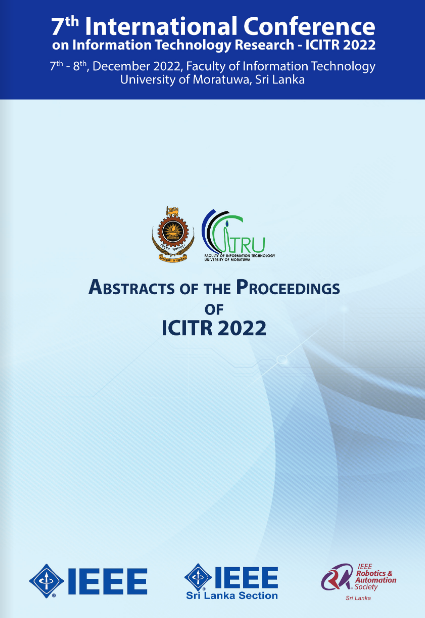
```


].pull-right[

- Proceedings of ICITR 2022 (toll-access):

https://www.proceedings.com/67051.html 


```{r   out.width = "70%", echo = FALSE, fig.cap='', fig.align='center'}
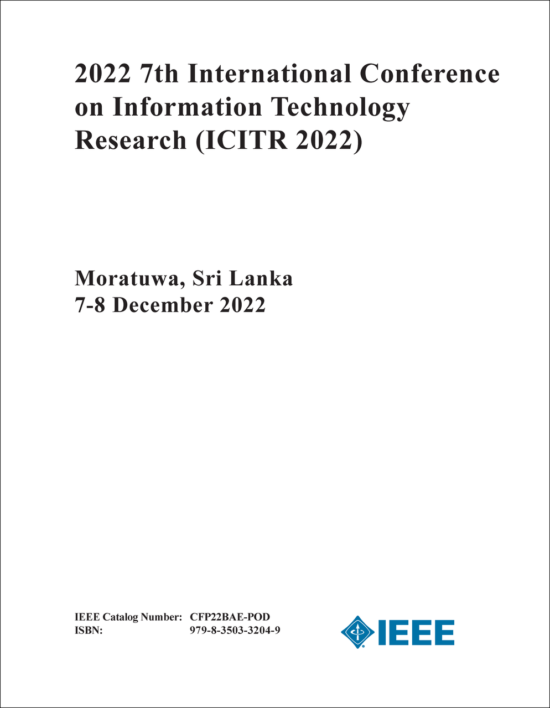
```

]
---
## Some of the popular conference proceedings series


- Proceedings.com providing extensive catalogue of international conference proceedings available through books trade channels - https://www.proceedings.com/

-  ACM International Conference Proceeding Series published by Association for Computing Machinery (ACM) -  https://dl.acm.org/icps

- IEEE Conference Proceedings published by Institute of Electrical and
Electronics Engineers (IEEE) - https://www.ieee.org/conferences/xplore-conference-proceedings.html.

- American Chemical Society (ACS) Conference Series - http://pubs.acs.org/series/symposium

- Procedia - Elsevier's online collection of high quality conference proceedings - https://www.elsevier.com/books-and-journals/procedia
---

class: inverse, middle, center

.pull-left[

```{r   out.width = "80%", echo = FALSE, fig.cap='', fig.align='center'}
knitr::include_graphics("fig/8_chef.jpg")
```
].pull-right[

# Creating a conference article is similar to crafting a culinary masterpiece!!
]
---

class:  middle, center

# Structuring Your Conference Article
```{r   out.width = "100%", echo = FALSE, fig.cap='', fig.align='center'}
knitr::include_graphics("fig/10_recipe.jpg")
```

---

### Review Conference Website

- Visit the conference website to understand its theme, scope, and focus.
- Familiarize yourself with important dates, submission guidelines, and formatting requirements.

```{r   out.width = "100%", echo = FALSE, fig.cap='', fig.align='center'}
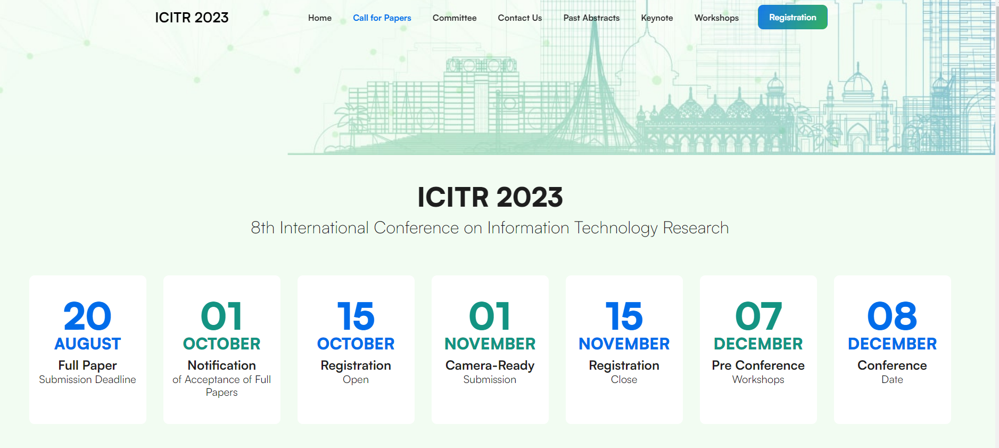
```

---
.pull-left[
### Understand Conference Focus

- Ensure that your research aligns with the conference's theme and objectives.
- Tailor your research question and contribution to fit within the conference's scope.
].pull-right[

```{r   out.width = "90%", echo = FALSE, fig.cap='', fig.align='center'}
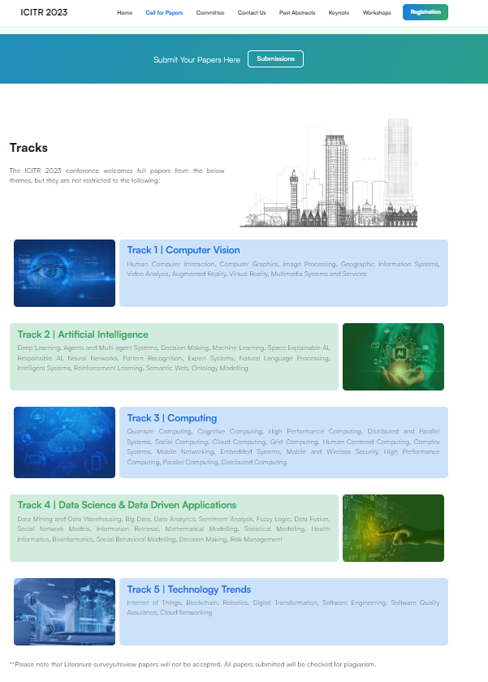
```
]

---

### Read Guidelines

- Carefully read the conference's call for papers or submission guidelines.
- Note any specific requirements for formatting, citation style, and document structure.
- Take note of the maximum page limit for your article.

```{r   out.width = "70%", echo = FALSE, fig.cap='', fig.align='center'}
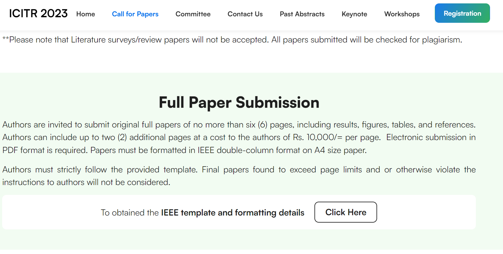
```


ICITR 2023 Conference Website: https://icitr-staging.web.app/


<!-- As you begin to write your paper, one of the first things you need to be aware of is the structure that is expected in your paper as per the instructions for authors given by your target journal

he expected structure can vary from one journal to another even within the same subject area.

. That said, most research papers in scientific fields follow a typical structure. The main components of this structure are given below:-->

---
## Typical research article structure

  - Title
  - Authors
  - Abstract
  - **Introduction**
  - **Methods**
  - **Results**
  - **Discussion** (sometimes followed by a Conclusion section)
  - Acknowledgements
  - References
  - Appendices (occasionally)
  
--

- IMRD or IMRaD: the items from Introduction to Discussion form the body of a research paper.
- The Results and Discussion sections are not always separate; they may be combined and appear as one section in some papers.
---

## Structuring Your Conference Article


- Each section in IMRAD is basically an answer to a question

--

  - **Introduction**: What is the research problem or question?

  - **Methods**: What did you do to find the answer?

  - **Results**: What did you find?

  - **Discussion**: What do your findings mean?

source:  AuthorAID 'Research and Proposal Writing in the Sciences'
---

## Title of a paper

- On academic databases or search engines, the title of a research article is frequently the first thing that people see.

--

- Potential readers may not read the paper if the title is vague or uninteresting.

---

## Abstract

- The abstract is typically the first part of a research paper.

--

- It comes right after the title and list of authors.

--

- Researchers often read the abstract to decide if they want to read the whole paper.

--

- Peer reviewers form their initial impression of the paper from its abstract.

--

- The length of an abstract varies depending on the conference. Look for this information in the instructions for authors for your desired conference.

--

-  It can be organized in a mini-IMRAD structure without references (but there are certain exceptions to this rule).

--

- After you have completed the body of the work, carefully revise the abstract. Check that the content matches what is in the body of the paper.

---
### The hourglass model of a research paper


```{r   out.width = "60%", echo = FALSE, fig.cap='', fig.align='center'}
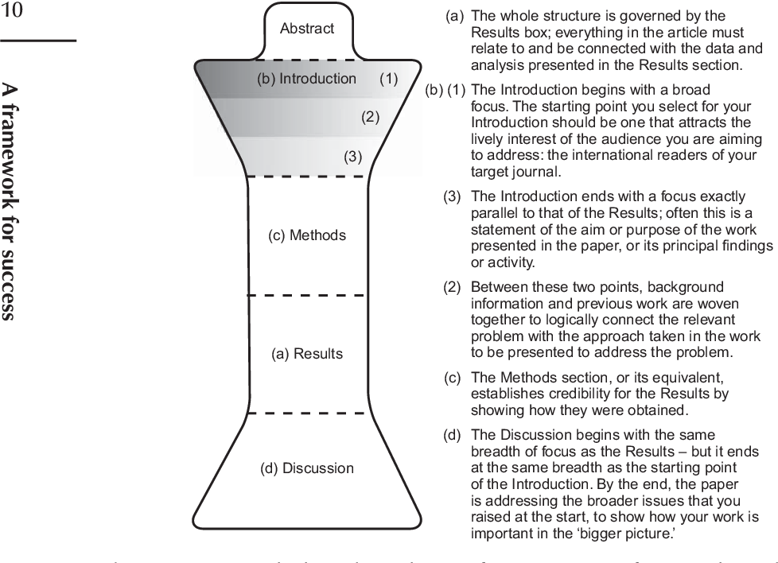
```

Source: Cargill, M., & O'Connor, P. (2021). Writing scientific research articles: Strategy and steps. John Wiley & Sons.
<!-- Of course, not all scientific research articles follow the simple structure given in-->

---

```{r   out.width = "40%", echo = FALSE, fig.cap='', fig.align='center'}
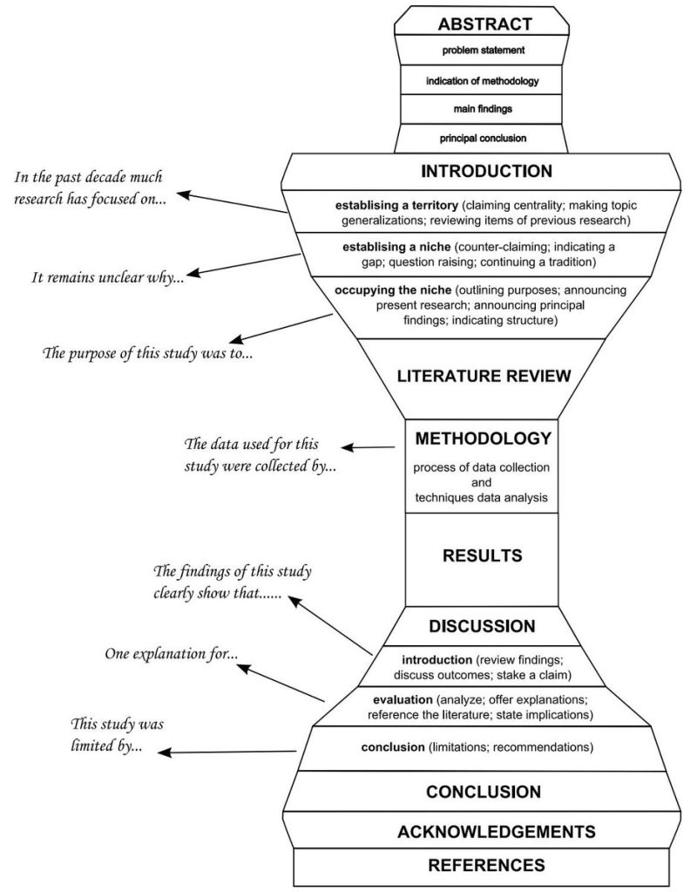
```

source:  https://bluesyemre.com/2022/05/09/a-beginners-guide-on-how-to-write-a-journal-article-for-publication/

---


```{r   out.width = "90%", echo = FALSE, fig.cap='', fig.align='center'}

```

source:  https://bluesyemre.com/2022/05/09/a-beginners-guide-on-how-to-write-a-journal-article-for-publication/

---
## Introduction

.pull-left[
- The Introduction section is compared to a funnel.

- It starts with broad general information.

- Gradually, the focus narrows down.

- The information becomes more specific as the section progresses.
].pull-right[


```{r   out.width = "90%", echo = FALSE, fig.cap='', fig.align='center'}
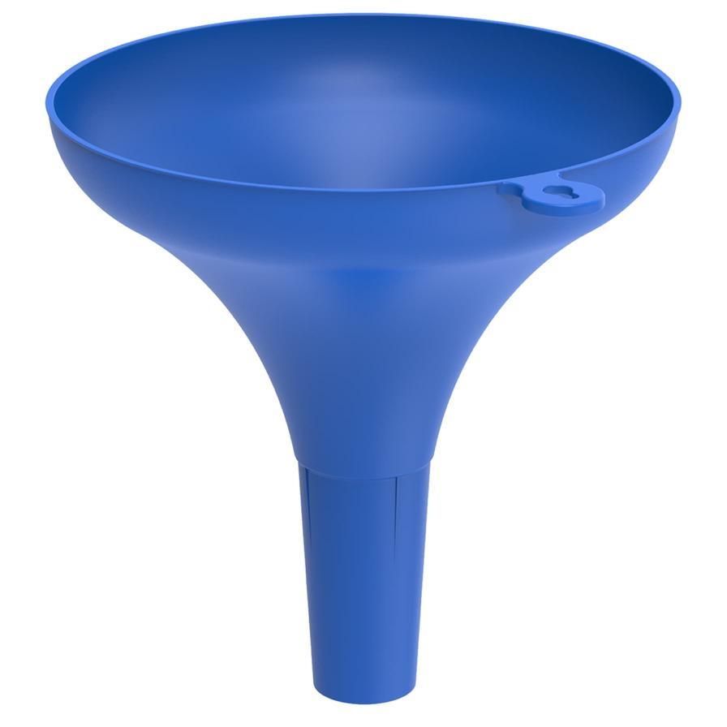
```
]
---

## Introduction - Your Turn

.pull-left[


- (A) Introduction to the gaps or unknowns you have addressed

- (B) Your exact research questions or hypotheses

- (C) Broad background and context

- (D) Review of relevant literature

- (E) Explanation of why these gaps are important


].pull-right[

]
---
## Introduction - Your Turn

.pull-left[


- (A) Introduction to the gaps or unknowns you have addressed

- (B) Your exact research questions or hypotheses

- (C) Broad background and context

- (D) Review of relevant literature

- (E) Explanation of why these gaps are important


].pull-right[


1. Broad background and context (C)

2. Review of relevant literature (D)

3. Introduction to the gaps or unknowns you have addressed (A)

4. Explanation of why these gaps are important (E)

5. Your exact research questions or hypotheses (B)


Answer C -> D -> A -> E -> B
]
---


```{r   out.width = "90%", echo = FALSE, fig.cap='', fig.align='center'}

```

source:  https://bluesyemre.com/2022/05/09/a-beginners-guide-on-how-to-write-a-journal-article-for-publication/
---

## Methods section

- The Methods section usually follows the Introduction in a research paper.

--

- It might have different headings like Methods, Materials and methods, Experimental details, etc.

--

- The Methods section provides detailed information about how the research was conducted.

--

- It essentially answers the question: " What did you do to find the answers to your research questions?"

--

- Methods section serves as the foundation of a scientific paper.

--

- Reviewers closely examine it for methodological validity.

--

- Clear description of the study process is essential.

---
## Methods section

- During paper review, reviewers will check if:

   - Your Methods section is clear and comprehensive .

   - Other researchers can replicate or expand on your work using your Methods.

- The Methods section enhances the scientific paper's credibility.

- Detail, clarity, and precision are essential in the Methods section.
---


```{r   out.width = "70%", echo = FALSE, fig.cap='', fig.align='center'}

```

Source: Cargill, M., & O'Connor, P. (2021). Writing scientific research articles: Strategy and steps. John Wiley & Sons.
<!-- Of course, not all scientific research articles follow the simple structure given in-->
---
## Results section

- The Results section typically appears after the Methods section in a scientific research paper.

--

- This section presents the research study's findings or outcomes.

--

- Typically, tables and graphs are included within the "Results" section of a research paper.

--

- As readers start reading the research paper, they see graphics and tables first. These visuals show a quick overview of the research before they read the detailed information.
--

- Each table or graph should be accompanied by a brief explanation in the text to help readers interpret the visual information correctly.
---


```{r   out.width = "70%", echo = FALSE, fig.cap='', fig.align='center'}

```

Source: Cargill, M., & O'Connor, P. (2021). Writing scientific research articles: Strategy and steps. John Wiley & Sons.
<!-- Of course, not all scientific research articles follow the simple structure given in-->
---

## Results section - Your turn

Read the below statements and select the ones that are correct.

- 1) In the Results section, provide all of the data that you gathered during your research.


- 2) In scientific study articles, both tables and figures are typical in the Results section.


- 3) Unless the Results section is part of a section named 'Results and Discussion,' just the findings, not explanations of the findings, should be included in the Results section.

---

## Results section - Your turn

Read the below statements and select the ones that are correct.

- 1) In the Results section, provide all of the data that you gathered during your research.  

   - **FALSE**


- 2) In scientific study articles, both tables and figures are typical in the Results section.

   - **TRUE**


- 3) Unless the Results section is part of a section named 'Results and Discussion,' just the findings, not explanations of the findings, should be included in the Results section. 

   - **TRUE**


---
## Discussion section


- Discussion section is usually at the end of a research paper.

--

- Purpose is to explain the research results.

--

- In some paper, a brief Conclusions section might follow the Discussion.

---

## Discussion section

- Provide insight into the significance of your discoveries

- Thoroughly address the research questions or hypotheses set in the Introduction

- **Acknowledge any limitations of your study, and their possible influence on the results**

- Establish connections between your findings and prior related studies

- Indicate the potential effects of your research on researchers, practitioners, or policymakers

- Propose avenues for future research based on your findings

---

```{r   out.width = "70%", echo = FALSE, fig.cap='', fig.align='center'}

```

Source: Cargill, M., & O'Connor, P. (2021). Writing scientific research articles: Strategy and steps. John Wiley & Sons.
---

```{r   out.width = "90%", echo = FALSE, fig.cap='', fig.align='center'}
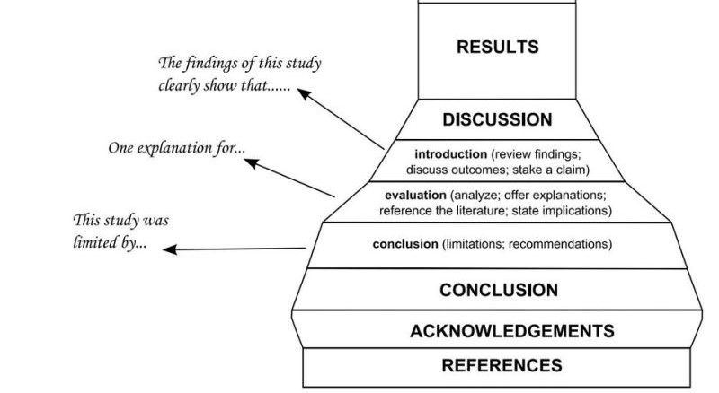
```

source:  https://bluesyemre.com/2022/05/09/a-beginners-guide-on-how-to-write-a-journal-article-for-publication/

---


 ### Introduction vs Discussion
 
 
.pull-left[

#### Introduction (broad to narrow)

```{r   out.width = "70%", echo = FALSE, fig.cap='', fig.align='center'}

```
].pull-right[

#### Discussion  (narrow to broad)
```{r   out.width = "70%", echo = FALSE, fig.cap='', fig.align='center'}
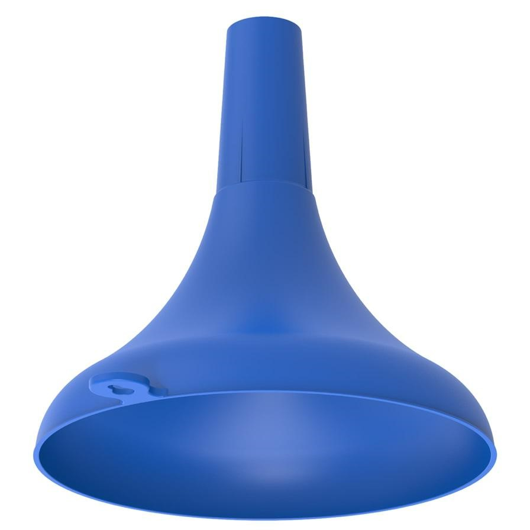
```

- This is an inverted or upside-down funnel
]

---
## Acknowledging others

- You can include a 'Acknowledgements' section at the end of your research report to acknowledge the persons who assisted you with your study in any way.

- Thank individuals like technicians and colleagues who reviewed your work/paper and provided useful comments

- If you received a grant, include its details like grant number and funding agency.
---

## References

- Sight what you cite  (https://robjhyndman.com/hyndsight/sight-what-you-cite/)

--

- Remember to cite while you write

--

- Avoiding plagiarism in your writing

<!-- https://robjhyndman.com/hyndsight/sight-what-you-cite/-->

---

## References

- **Consistency**: Follow a specific citation style consistently throughout your paper, whether it's APA, MLA, Chicago, IEEE etc. This includes how you format in-text citations and references. Consult the official style guides for the specific citation style you're using

--

- **Online Tools**: Consider using reference management tools like Zotero, EndNote, or Mendeley to help organize and format your citations and references automatically.

--

- **Check Formatting Guidelines**: Different citation styles have specific formatting rules. Ensure you understand and follow these guidelines for various types of sources (books, articles, websites, etc.).

--

- **Direct Quotes and Paraphrasin*g**: Clearly distinguish between direct quotes (use quotation marks) and paraphrased content (rephrased in your own words). Provide appropriate citations for both.

---
## References 

- **Double-Check Citations**: Before submitting your paper, carefully review all your citations and references. Make sure they are correctly formatted and match the sources you've used.

--

- **Online Sources**: Be careful when citing online sources, ensuring that you provide the full URL and access date if necessary.

--

- **Primary Sources**: Whenever possible, cite primary sources directly instead of relying on secondary sources.

--

- **Be Transparent**: Clearly indicate which parts of your paper are based on your ideas and which are derived from external sources. This helps maintain academic integrity.

---

class: center, middle, 
```{r   out.width = "90%", echo = FALSE, fig.cap='', fig.align='center'}
knitr::include_graphics("fig/19_Serve.jpg")
```

---

# Peer review process

- Purpose: to enhance the quality of your work.

--

- Reviewing peer review feedback for your conference paper can be a valuable opportunity for improving your work.

--

- **Single Blind Review**: In this type of review, the identity of the authors is known to the reviewers, but the authors don't know the identity of the reviewers. This reduces potential biases. 

- **Double Blind Review**: Both the authors and reviewers are anonymous to each other in double-blind review. This enhances objectivity by eliminating potential bias based on authors' reputation.


---
class: center, middle, 
```{r   out.width = "90%", echo = FALSE, fig.cap='', fig.align='center'}

```

---
### Enhancing Quality through Peer Review and Feedback


- **Take Time to Absorb**: When you receive the feedback, take some time to absorb it before reacting. This helps you approach the feedback with a clear and open mind.

--

- **Stay Objective**: Approach the feedback with an objective mindset. Remember that reviewers are providing their perspective to help you enhance your paper.

--

- **Read Carefully**: Read each comment and suggestion carefully. Make sure you understand the reviewer's point before responding.

--

- **Separate Emotion**: If you receive critical feedback, try to separate your emotional response from the feedback itself. Focus on the content and constructive aspects of the comments.


---

### Enhancing Quality through Peer Review and Feedback


- **Prioritize Feedback**: Not all feedback is of equal importance. Prioritize suggestions that are fundamental to the quality and clarity of your paper.

--

- **Accept and Reject**: Be prepared to accept feedback that resonates with you and reject suggestions that you believe aren't suitable for your work. Just ensure **your decisions are well-justified**.
--

- **Consult with Co-authors**: If you have co-authors, discuss the feedback with them. Collaborative input can lead to better revisions.

--

- **Be Thankful**: Respond to the reviewers with gratitude for their time and effort. A positive attitude can foster a productive exchange of ideas.

--

- **Stay Resilient and Reflective**: Regardless of the outcome, approach it as a learning opportunity. Reflect on feedback, whether it's for revisions, acceptance, or rejection, to enhance your research skills and improve future work.
---

class: center, middle, 
```{r   out.width = "90%", echo = FALSE, fig.cap='', fig.align='center'}
knitr::include_graphics("fig/22_serve.jpg")
```


---
### Presentation types that can be found at conferences


- **Oral Presentations**: involves delivering a talk to a live audience. Presenters usually have a set amount of time, often ranging from 10 to 30 minutes, to convey their research or ideas. Includes a question-and-answer session.

--

- **Poster Presentations**: One-on-one or small-group discussions with attendees.
Flexibility in timing and engagement. Opportunities for networking.

--

- **Panel Discussions**: Group of experts discuss a specific topic.
Varied perspectives presented and discussed.  Moderated by a facilitator.
Often includes audience Q&A.

--

- **Lightning Talks**: Brief, concise presentations (around 5 minutes).
Rapidly conveys key points of research. Focuses on essential information.

--

- **Ignite Talks**: Fast-paced presentations (5 minutes) with a fixed number of slides. Each slide advances automatically every 15 seconds. Energetic and impactful delivery.

---

### Presentation types that can be found at conferences

- **Demo Sessions**: Showcases prototypes, software, or tools. Demonstrates features and functionalities. Provides hands-on experience for attendees.

--

- **Roundtable Discussions**: Small group discussions around a topic.
Informal exchanges of ideas and experiences. Facilitator may guide the conversation.

--

- **Virtual Presentations**: Adapted for online conferences. Webinars, video presentations, virtual poster sessions. Utilizes digital tools for engagement.

---

### Tips to help you excel in conference presentations

- **Know Your Audience**: Understand the background and knowledge level of your audience. Tailor your content and language to match their expertise.

--

- **Prepare Thoroughly**: Rehearse your presentation multiple times to ensure you're comfortable with the material and timing. Familiarity with your content will boost your confidence.

--

- **Structure Your Presentation**: Organize your presentation with a clear structure This helps your audience follow your narrative.

--

- **Focus on Key Messages**: Identify the core messages you want to convey. Keep your content concise and avoid overwhelming the audience with excessive details.

--

- **Engaging Opening**: Begin with an engaging introduction that hooks the audience's interest. A compelling story, surprising fact, or thought-provoking question can set the tone.

---
### Tips to help you excel in conference presentations

- **Visual Aids**:  Keep your slides clean, concise, and visually appealing. Use images, graphs, and charts to illustrate your points.

--

- **Manage Timing**: Stay within your allocated time. Practice your presentation to ensure you don't rush or go over time.

--

- **Be Prepared for Questions**: Anticipate potential questions and prepare thoughtful answers. If you don't know the answer, it's okay to say you'll look into it.

--

- **Stay Engaged Afterward**: Attend other presentations and engage in discussions during breaks. Networking can lead to valuable connections and insights.

--

- **Gather Feedback**: After your presentation, seek feedback from peers, mentors, or attendees. Constructive criticism can help you improve for future presentations.

--

- **Be Adaptable**: Be ready to adapt to technical issues, changes in schedule, or unexpected circumstances. Flexibility is key to successful presentations.


---

## Key points

### 1. What is Already Known on This Topic.

### 2. What This Study Adds.

### 3. How This Study Might Affect Research, Practice, or Policy.
---

class: center, middle, inverse

# Thank you

```{r }
#icon::fontawesome("rocket", style = "solid")
icon::fa("envelope")
``` 
priyangad@uom.lk


```{r}
icon::fa("github")
icon::fa("twitter")

```
pridiltal

```{r}

icon::fa("globe")
```
https://prital.netlify.app// </br>
(Slides available)


This work was supported in part by RETINA research lab funded by the OWSD, a program unit of United Nations Educational, Scientific and Cultural Organization (UNESCO).


