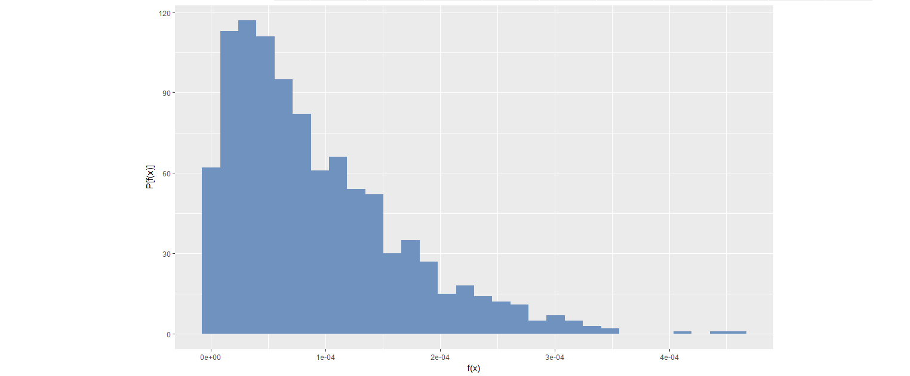
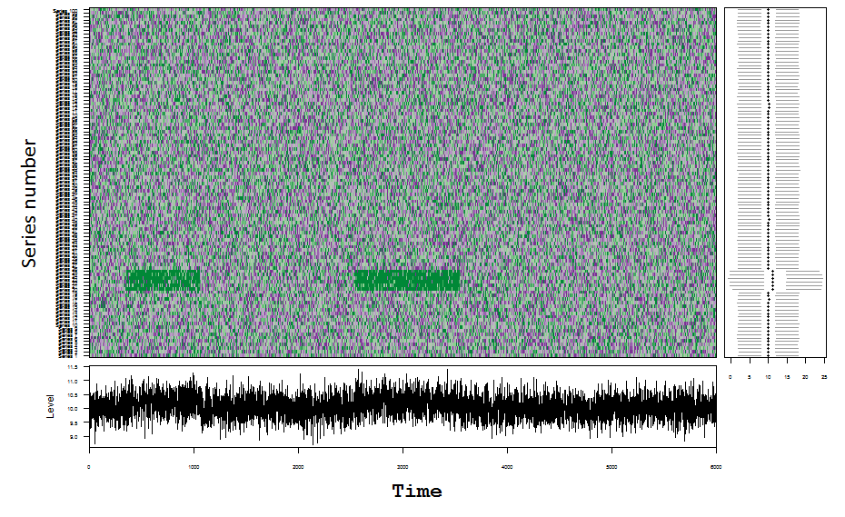

```{r setup, include=FALSE}
options(htmltools.dir.version = FALSE)

```
### Motivation: Fence-mounted perimeter intrusion detection systems
```{r  out.width = "100%", echo=FALSE}
knitr::include_graphics("fig/1_climb.png")
```
- Data obtained using  fiber optic cables attached to a fence 


--
- Intrusion events cause measurable changes in intensity, phase, wavelength or transit time of light in the fiber.


--
- Aim: Find anomalous time series (the location of the intrusion event)

---
## Motivation: Network intrusion detection systems
```{r  out.width = "100%", echo=FALSE, out.extra='style="center"'}

```
- Yahoo data breach in late 2014 --- world's largest ever cyber attack 


--
- Intrusion attacks cause measurable changes in times of logins, command executed during a single user session, number of password failures

--
- Aim: find anomalous time series (locate intrusion attacks)

---

## Motivation
-  All these applications generate millions or even billions of individual time series simultaneously


--
- Research question:  Finding anomalous time series within a large collection of time series


--
- Approaches to solving the problem of anomaly detection for temporal data :
--
.pull-left[
**Batch scenario**: <br/> whole set of data is available, focus - complete events


```{r   echo=FALSE, out.width = "100%"}

knitr::include_graphics("fig/3_batch.png")

```
]
--
.pull-right[

**Data stream scenario**: continuous, unbounded, flow at high speed, high volume

```{r  echo=FALSE, out.width = "100%", fig_align = 'center'}
knitr::include_graphics("fig/4_stream.gif")


```
]


---


## Automatic anomaly detection algorithm for streaming data is required:


- to give real-time support


--
-  to provide early detection of anomalies


--
- to learn and adapt to the changing environment automatically (concept drift)


--
- to deal with large amounts of data efficiently
---
class:  center, middle, inverse


# What is an anomaly ?
???

Image credit: [Wikimedia Commons](https://commons.wikimedia.org/wiki/File:Sharingan_triple.svg)

---

class: middle


## What is an anomaly ?


- By definition, anomalies are rare in comparison to a system's typical behaviour.


-  We define an anomaly as an observation that is very unlikely given the forecast distribution.


---
## Algorithm of the proposed framework

#### Aim

- To detect anomalous time series within a large collection of time series in a streaming data context

--

#### Main Assumptions

--
- Anomaly is a rare event which has a very low chance of occurrence with respect to the typical behavior of the system


--
- A representative data set of the system's typical behavior is available to define the model for the typical behavior of the system.


--
#### Proposed Algorithm

--
- Off-line Phase: Forecast a boundary for system's typical behavior (similar to (Clifton, Hugueny & Tarassenko, 2011))

--

- On-line Phases: Testing newly arrived data using the boundary

---

## Feature Based Representation of Time series
.pull-left[
- Mean   

- Variance  

- Changing variance in remainder 

- Level shift using rolling window   

- Variance change  

- Strength of linearity 

- Strength of curvature  

 ]

.pull-right[
- Strength of spikiness  
   
- Burstiness of time series (Fano Factor)  
 
- Minimum  
   
- Maximum  
   
- The ratio between interquartile mean and the arithmetic mean
   
- Moment 
   
- Ratio of means of data that is below and upper the global mean  

]


---
class: center, top
.pull-left[

## Feature Based Representation of Time series
```{r   echo=FALSE, out.width = "100%"}
knitr::include_graphics("fig/5_real_mvt.png")
```
]

.pull-right[
```{r  echo=FALSE, out.width = "100%", fig_align = 'center'}
knitr::include_graphics("fig/6_features.png")
```
]
---
class: top
### Dimension Reduction for Time Series 
```{r  echo=FALSE, out.width = "90%", fig_align = 'center'}
knitr::include_graphics("fig/7_pcspace.png")
```
- First two PCs explain 85% of variation
---
class: center
## Classical Extreme Value Theory
```{r  echo=FALSE, out.width = "90%", fig.cap="Figure: Extreme value distributions corresponding to m = 1; 10; 100; 1000, each describing where the maximum of m samples drawn from N(0; 1) will lie."}
knitr::include_graphics("fig/8_EVD_change.png")

```
---
### Theorem 1: Fisher-Tippett theorem (Limit laws for maxima) 
#### (Embrechts et al. (2013), p. 121)

Let $X = X_{1}, X_{2}, ..., X_{m}$ be a sequence of independent and identically distributed random variables and $X_{max} = max(X)$. If there exist centering constant $d_{m} (\in \Re)$ and normalizing constant $c_{m} (>0)$, and some non-degenerate distribution function $H^{+}$ such that


		
```{r   echo=FALSE, out.width = "40%"}

     knitr::include_graphics("fig/9_maxima1.png")

```


then $H^{+}$ belongs to one of the following three distribution functions:

```{r   echo=FALSE, out.width = "90%"}

knitr::include_graphics("fig/10_maxima2.png")

```


---

### Extreme Value Distribution of the Probability Density Values *(Clifton et al., 2011)*
- Estimate the probability density function of the 2D PC space --> Kernel density estimation


- Draw a large number N of extremes from the estimated probability density function

```{r   echo=FALSE, out.width = "90%", fig.cap="Figure: Distribution of 1000 extremes generated from bivariate kernel density function with m=500"}

```

---

### Extreme Value Distribution of Probability Density Values *(Clifton et al., 2011)*
- Define a $\Psi$-transform space, using the $\Psi$-transformation defined by
```{r   echo=FALSE, out.width = "85%"}
knitr::include_graphics("fig/12_psitrans.png")
```

- $\Psi$-transform maps the density values back into space into which a Gumbel distribution can be fitted.
```{r   echo=FALSE, out.width = "90%",  fig.cap = "Figure: Distribution of transformed values"}
knitr::include_graphics("fig/13_psi_trans.png")
```
---

class: middle, center

```{r   echo=FALSE, out.width = "100%"}
knitr::include_graphics("fig/14_logo1.png")
```

???

Image credit: [Wikimedia Commons](https://commons.wikimedia.org/wiki/File:Sharingan_triple.svg)


---
class: middle, center

```{r   echo=FALSE, out.width = "100%"}
knitr::include_graphics("fig/15_logo2.png")
```


---
## How it works?
```{r   echo=FALSE, out.width = "100%"}

```

---
## How it works?
```{r   echo=FALSE,  out.width = "100%"}
knitr::include_graphics("fig/20_example.png")
```


---
class: center, top
```{r eval=FALSE, tidy=FALSE}
oddstream::find_odd_streams(train_data, test_stream)
```
```{r   echo=FALSE, out.width = "60%"}
knitr::include_graphics("fig/18_mvtsplot.gif")
```
.pull-left[
```{r  echo=FALSE, out.width = "100%", fig_align = 'top'}
knitr::include_graphics("fig/16_line.gif")
```
]
.pull-right[
```{r  echo=FALSE, out.width = "100%", fig_align = 'top'}
knitr::include_graphics("fig/17_pcplot.gif")
```
]
---
## What Next?

- Explore more on feature extraction and feature selection methods to create a better feature space suitable for streaming data context.


--

- Use other dimension reduction techniques such as multidimensional scaling analysis, random projection to see the effect on the performance of the proposed framework.


--

- Do more experiments on density estimation methods to get a better tail estimation.


--

- Extend the algorithm to work with Multidimensional Multivariate Data Streams. 


---
### References

#### Images were taken:

- https://fibersensys.com/cache/mod_roksprocket/4d90594c170e9ec140017f07
19ce2c98_350_900.jpg
- http://55ca7cd0-f8ac-0132-1185-705681baa5c1.s3-website-sa-east-1.amazonaws.com/defesanet/site/upload/news_image/2016/03/30157.jpg
- https://www.intel.co.uk/content/dam/www/public/emea/xe/en/images/it-managers/datacenter-corridor-16x9.jpg.rendition.intel.web.1280.720.jpg
- https://c1.staticflickr.com/8/7065/26946304530_cb30c23660_b.jpg


#### Main references

- Clifton, D. A., Hugueny, S., & Tarassenko, L. (2011). Novelty detection with multivariate extreme value statistics. Journal of signal processing systems, 65 (3), (pp. 371-389).

- Fulcher, B. D. (2012). Highly comparative time-series analysis. PhD thesis, University of Oxford.

- Hyndman, R. J., Wang, E., & Laptev, N. (2015). Large-scale unusual time series detection. In 2015 IEEE International Conference on Data Mining Workshop (ICDMW), (pp. 1616-1619). IEEE.
---
class: center, middle

# Thank You

#### R package available at:  github.com/pridiltal/oddstream
#### Email: dilini.talagala@monash.edu
#### Slides available at: github.com/pridiltal/ISF-CAIRNS2017-talk


