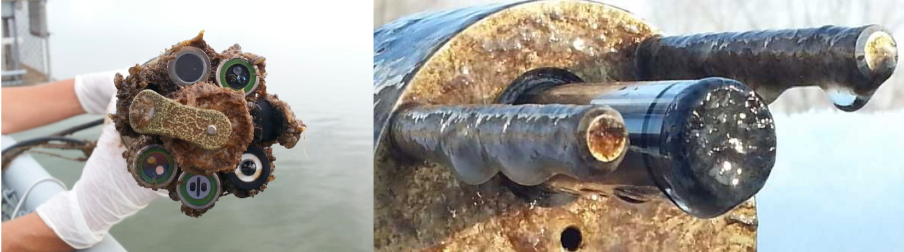
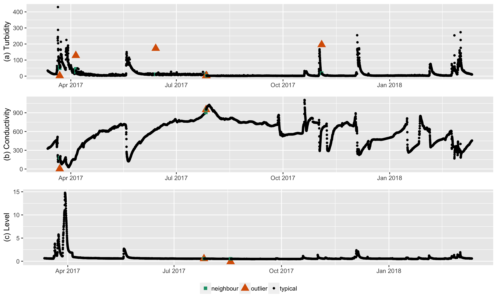
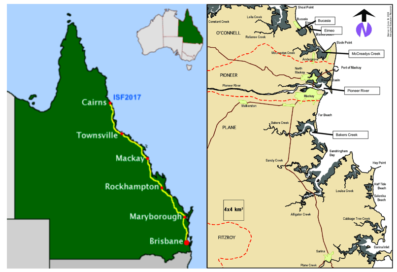
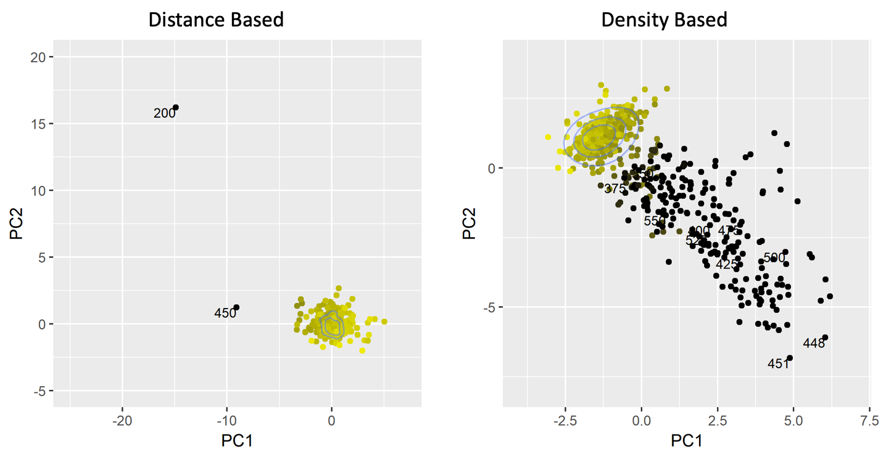

```{r setup, include=FALSE}
library(knitr)
options(htmltools.dir.version = FALSE)
opts_chunk$set(
  warning = FALSE,
  message = FALSE,
  echo = FALSE,
  fig.path = 'figure/',
  cache.path = 'cache/',
  fig.align = 'center',
  fig.show = 'hold',
  cache = TRUE,
  external = TRUE,
  dev = "pdf",
  fig.height = 6,
  fig.width = 10,
  out.width = "0.8\\textwidth"
)
library(tidyverse)
library(gridExtra)
library(ggpubr)
library(kableExtra)
library(knitr)
# install.packages("devtools")
# devtools::install_github("pridiltal/oddwater")
library(animation)
```

class: clear

The work is based on the collaborative research project carried out with the **Queensland University of Technology** and the Queensland Department of Environment and Science, **Great Barrier Reef Catchment Loads Monitoring Program**.

```{r echo=FALSE, out.width = "100%", fig.align = 'center'}
knitr::include_graphics("fig/sensor.png")
```


---
# Motivation

- Water quality sensors are exposed to changing environments and extreme weather conditions
--

- Two types of anomalies:
--

1. Water quality breaches associated  with real events 
--

2. Technical issues in the sensor equipment (low battery power, biofouling of the probes, errors in calibration, rust, sensor maintenance activities etc.)

```{r echo=FALSE, out.width = "100%", fig.align = 'center'}

```


---
# Motivation

- Water quality sensors are exposed to changing environments and extreme weather conditions


- Two types of anomalies:


1. Water quality breaches associated  with real events </br>
2. <span style="color:red"> Technical issues in the sensor equipment </span>  (low battery power, biofouling of the probes, errors in calibration, rust, sensor maintenance activities etc.)

```{r echo=FALSE, out.width = "100%", fig.align = 'center'}

```


---
# What is an anomaly

```{r  out.width = "100%", echo=FALSE}
knitr::include_graphics("fig/outtype.png")
```

---
# What is an anomaly

- Water-quality observations that were affected by <span style="color:red">technical errors </span>  in the sensor equipment

```{r  out.width = "100%", echo=FALSE}
knitr::include_graphics("fig/water_original.png")
```


---
# What is an anomaly

- Water-quality observations that were affected by <span style="color:red">technical errors </span>  in the sensor equipment

```{r  out.width = "100%", echo=FALSE}

```

---
# Why is this important?

- **Data managers**: for quality control and assurance and to increase confidence in the data by reporting the presence of such anomalies; automated correction
--

- **Sensor maintenance technicians**: to ensure timely and correct calibration and maintenance of equipment
--

- **Policy and decision makers**: to limit use of incorrect data and for reporting purposes
--

- **Public**: to avoid false warning of water quality breaches
--

- **Sensor manufacturers**: to improve performance, e.g. extend battery life, improve wiper quality to further minimize biofouling
--

- **Statisticians**: for AD methods to better detect other non-trivial anomaly types and/or for methods requiring regular and frequent observations.

---
# Materials and Methods

- **Study region**: two study sites in tropical northeast Australia that flow into the Great Barrier Reef lagoon (Pioneer River and Sandy Creek)

```{r  out.width = "45%", echo=FALSE}

```
--

- **Data**: in turbidity, conductivity and river level
--

- We compare two approaches to this problem: 
1. using forecasting models
2. using features with extreme value theory
   
---
class:  center, middle, inverse


#  Using forecasting models


---
#  Using forecasting models

- Forecasting models are used to generate a prediction with an associated measure of uncertainty at the next time point
--

- Constructed a $100(1-\alpha)\%$ prediction interval  for the one-step-ahead prediction
--

- If the one-step-ahead observation does not fall within the prediction interval, it is classified as an anomaly.
--

- For this comparison study we considered two strategies: 
1. anomaly detection (AD) 
--

2. anomaly detection and mitigation (ADAM): replaces anomalous measurements with forecasts for further forecasting

---
class: clear, middle

```{r  echo=FALSE, out.width = "20%", fig_align = 'top'}
knitr::include_graphics("fig/STOTEN.png")
```

Catherine Leigh, Omar Alsibai, Rob J Hyndman, Sevvandi Kandanaarachchi, Olivia C King, James M McGree, Catherine Neelamraju, Jennifer Strauss, Priyanga Dilini Talagala, Ryan S Turner, Kerrie Mengersen, Erin E Peterson (2019)  <a href="https://www.sciencedirect.com/science/article/pii/S0048969719305662">A framework for automated anomaly detection in high frequency water-quality data from in situ sensors.</a> <span style="color:blue">Science of the Total Environment, 664, 885-898.</span> 
---
# Limitations 

- Semisupervised approach: requires a representative sample from the typical behaviour
--

- Influenced strongly by the training data used to build the models (Nonstationarity, concept drift)
--

- Require additional time for training for prediction and to perform optimization to estimate
the model parameters
--

- Complex relationship between water-quality variables
--

- Irregular time series with lots of missing values (increase the frequency of measurements during high-flow events to capture greater resolution in water-quality dynamics)

---

class:  center, middle, inverse


#  Using features with extreme value theory 


---
# Main Contributions

- Proposed an unsupervised framework that provides early detection of technical outliers in water-quality data from  *in situ* sensors.

```{r  out.width = "100%", echo=FALSE}
knitr::include_graphics("fig/framework.png")
```
--

- Provided a comparative analysis of the efficacy and reliability of both density- and nearest neighbor distance-based outlier scoring techniques.


---
# oddwater R package

- Introduced an R package, `oddwater` ( <span style="color:red">O</span>utlier  <span style="color:red">D</span>etection in  <span style="color:red">D</span>ata from  <span style="color:red">WATER</span>-quality sensors) that implements the proposed framework
and related functions.

```{r  out.width = "25%", echo=FALSE}
knitr::include_graphics("fig/oddwater_logo.png")
```

`devtools::install_github("pridiltal/oddwater")`
--

- `oddwater` package also provides a shiny app to explore data. 

`oddwater::explore_data()`

---
class: clear
**Step 1: Identify the data features that differentiate outlying instances from typical behaviours**

```{r echo=FALSE, out.width = "100%", fig.align = 'up'}

```

---
class: clear
**Step 1: Identify the data features that differentiate outlying instances from typical behaviours**

```{r echo=FALSE, out.width = "100%", fig.align = 'up'}
knitr::include_graphics("fig/water_hd1.png")
```

---
class: clear
**Step 2: Apply statistical transformations to make the outlying instances stand out in transformed data space**

```{r echo=FALSE, out.width = "100%", fig.align = 'up'}
knitr::include_graphics("fig/trans.png")
```


---
class: clear

**Step 2: Apply statistical transformations to make the outlying instances stand out in transformed data space**

```{r echo=FALSE, out.width = "100%", fig.align = 'up'}
knitr::include_graphics("fig/water_hd2.png")
```

---
class: clear

**step 3:  Calculate unsupervised outlier scores for the observations in  the transformed data space**

```{r  echo=FALSE, out.width = "80%", fig_align = 'top'}

```
--

- Anomaly is an observation that deviates markedly from the majority by a large distance or low density in transformed (high dimensional) data space
--

- We considered eight unsupervised outlier scoring techniques for high dimensional
 data, involving nearest neighbor distances or densities 
---
class: clear
**step 4:  Calculate anomalous threshold**

- Use extreme value theory (EVT) to calculate a separate outlier threshold for each set
of outlier scores calculated using a given unsupervised outlier scoring technique.
--

- Let **n** be the size of the dataset
--

- Sort the resulting **n** outlier scores 
--

- Consider the half of the outlier scores  with the smallest values as typical
--

- Search for any significant large gap in the upper tail (Bottom up searching algorithm proposed by Schwarz, 2008)


---
# Spacing Theorem (Weissman, 1978)

Let $X_{1}, X_{2}, ..., X_{n}$ be a sample from a distribution function $F$ . </br>
Let $X_{1:n} \geq X_{2:n} \geq ... \geq X_{n:n}$ be the order statistics. </br>
The available data are $X_{1:n}, X_{2:n},  ..., X_{k:n}$ for some fixed $k$. </br>
Let $D_{i,n} = X_{i:n} - X_{i+1:n},$ $(i = 1,2,..., k)$ be the spacing between successive order statistics.</br>
If $F$ is in the maximum domain of attraction of the Gumbel distribution, then the spacings $D_{i,n}$ are asymptotically independent and exponentially distributed with mean proportional to $i^{-1}$.

```{r  echo=FALSE, out.width = "55%", fig_align = 'top'}
knitr::include_graphics("fig/P2_plot17.png")
```

---
class: clear

```{r echo=FALSE, out.width = "70%", fig.align = 'center'}
knitr::include_graphics("fig/one_sided_derivative_TCL_sandy.png")
```

---
# Advantages of the proposed framework

- Can take the correlation structure of the water-quality variables into account when
detecting outliers
--

- Applicable to both univariate and multivariate problems
--

- Outlier scoring techniques- unsupervised
--

- Outlier thresholds have a probabilistic interpretation
--

- The framework can easily be extended to streaming data such that it can provide near-real-time support
--

- Proposed framework has the ability to deal with irregular (unevenly spaced) time series


---
# Thank You
<p><font size=5>
1. Catherine Leigh, Omar Alsibai, Rob J Hyndman, Sevvandi Kandanaarachchi, Olivia C King, James M McGree, Catherine Neelamraju, Jennifer Strauss, Priyanga Dilini Talagala, Ryan S Turner, Kerrie Mengersen, Erin E Peterson (2019)  <a href="https://www.sciencedirect.com/science/article/pii/S0048969719305662">A framework for automated anomaly detection in high frequency water-quality data from in situ sensors.</a> <span style="color:blue">Science of the Total Environment, 664, 885-898.</span> </br></br>

2. Priyanga Dilini Talagala, Rob J. Hyndman, Catherine Leigh, Kerrie Mengersen, and Kate Smith-Miles. (2019) <a href="https://arxiv.org/abs/1902.06351">A feature-based framework for detecting technical outliers in water-quality data from in situ sensors</a>. arXiv preprint arXiv:1902.06351. 


.pull-left[

```{r}
icon::fa("envelope")
``` 
dilini.talagala@monash.edu

```{r}
icon::fa("github")
icon::fa("twitter")

```
pridiltal

```{r}

icon::fa("globe")
```
https://prital.netlify.com/ </br>
(Slides available)
]
.pull-right[

```{r  out.width = "30%", echo=FALSE}
knitr::include_graphics("fig/oddwater_logo.png")
```
<p><font size="4">
devtools::install_github("pridiltal/oddwater")
</p>
]
</p>


