```{r setup, include=FALSE}
options(htmltools.dir.version = FALSE)
library(kableExtra)
```
class: inverse, center, middle
# Popular Myths (false beliefs) about Statistics

- Why do they exist?
- How can we debunk them?

---
class: inverse, center, middle
# <span style="color: #D95F02;">Myth 1</span> 
##  Statistics (Mathematics) is  not relevant to me or my future


---
```{r plotcode, eval = FALSE, echo=FALSE}
p<- data %>% ggplot(aes(y = Rate, x = GCE_AL)) +
  geom_boxplot() +
   geom_dotplot(binaxis = "y", stackdir = "center", dotsize = 0.6) +
   facet_wrap(vars(Variable), ncol = 1)+
   theme( axis.title = element_blank(),
         text = element_text(size=35),
        axis.text.x = element_text(angle = 90, hjust = 1, size=20))
ggsave(filename = "sim2.png", plot = p, height = 16, width = 20)
```

```{r  echo=FALSE, out.height= "100%", fig_align = 'up', eval = FALSE}
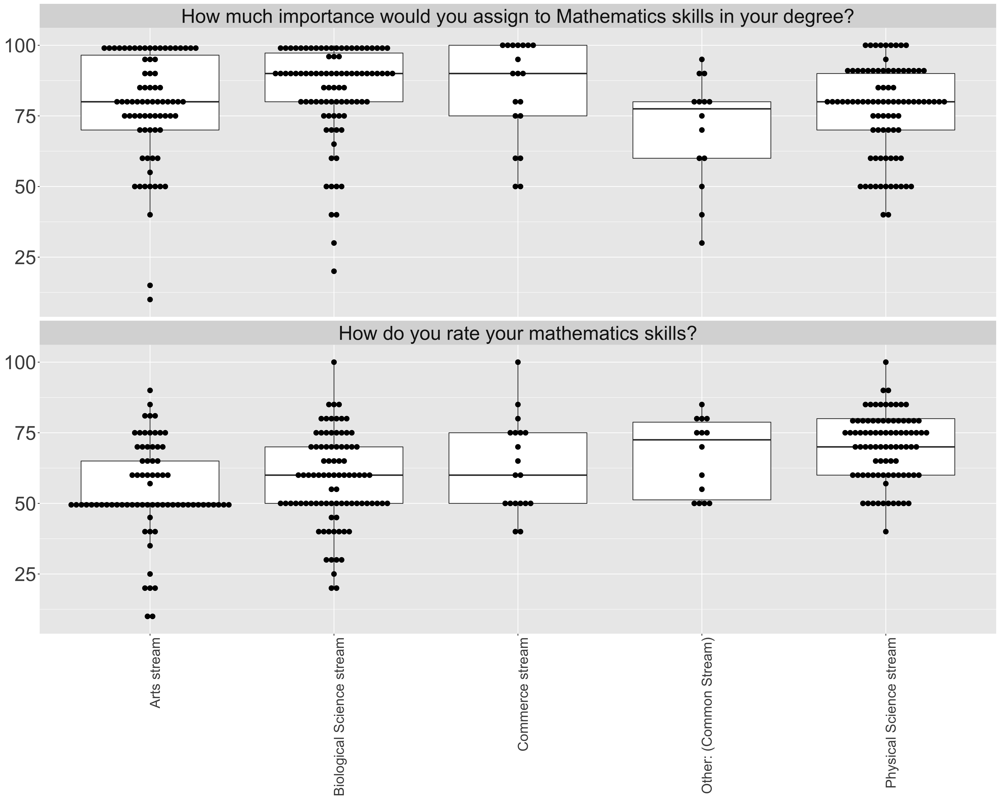
```

background-image: url('fig/sim2.png')
background-position: 50% 50%
background-size: 90%
class: right, top
---

## Origin of Statistics

- The term statistics is derived from
     - **"status"**  - political state   (Latin )
     - **"statista"**  - statesman or politician    (Italian)
--
- Original idea of **"statistics"** was restricted to information about states 
--

- Later extended to include all collections of information of all types
--

- In modern terms, **"statistics"** means both 
   - sets of collected information  
   - analytical work which requires statistical inference

---
background-image: url('fig/statistics1.png')
background-position: 50% 50%
background-size: 100%
class: right, bottom

- Research: Virtual reality and drones help to predict and protect koala habitat
---
background-image: url('fig/statistics2.png')
background-position: 50% 50%
background-size: 100%
class: right, top
---

background-image: url('fig/statistics3.png')
background-position: 50% 50%
background-size: 100%
class: right, top
---
background-image: url('fig/statistics4.png')
background-position: 50% 50%
background-size: 100%
class: right, top

---
background-image: url('fig/datascience.jpg')
background-position: 50% 10%
background-size: 50%
class: left, bottom


**Data science** is a "concept to unify <span style="color: red">**statistics**</span>, data analysis, machine learning and their related methods" in order to "understand and analyze actual phenomena" with data.
                                                          - wikipedia, 2019
                                                          
---

background-image: url('fig/datascienceHistory.jpg')
background-position: 50% 50%
background-size: 100%
class: right, top
---
background-image: url('fig/paper.png')
background-position: 50% 50%
background-size: 100%
class: right, top
---
background-image: url('fig/paper2.png')
background-position: 50% 50%
background-size: 100%
class: right, top
---
class: inverse, center, middle
# <span style="color: #D95F02;">Myth 1</span> 
##  ~~Statistics (Mathematics) is  not relevant to me or my future~~
--

##  Statistics (Mathematics) is  <span style="color: red;">**very**</span> relevant to me and my future
---

class: inverse, center, middle
# <span style="color: #D95F02;">Myth 2</span> 
## Statistics is only for </br> "genius" mathematician
---

class: inverse, center, middle
# <span style="color: #D95F02;">Myth 2</span> 
## Statistics is only for </br> <span style="color: red;">"genius"</span> mathematician
---
background-image: url('fig/mathmovies.png')
background-position: 50% 50%
background-size: 100%
class: center, middle

#<span style="color: white;">Hollywood's Stereotypes</span>

- A genius Mathematician is a male, loner type, socially awkward who sits alone in a room trying to solve an impossibly hard math problem for about a decade until they slowly lose their mind
---
# Arithmetic mean

```{r   out.width = "100%", echo = FALSE}
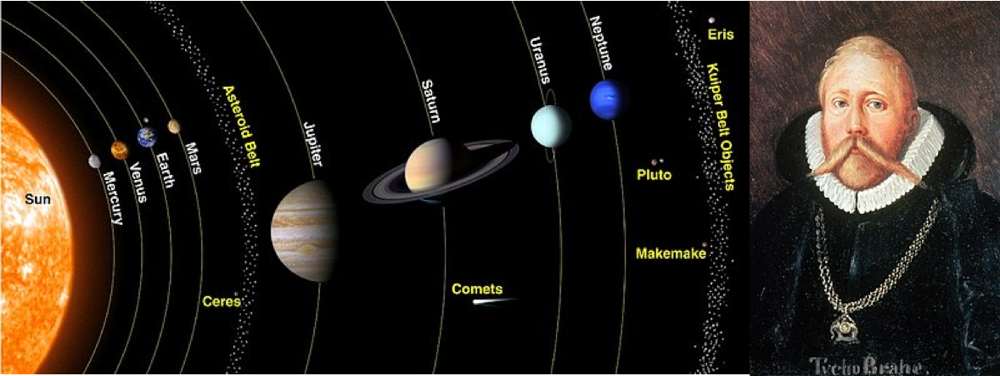
```

-  This method was first adopted in **astronomy** by Tycho Brahe who was attempting to reduce the errors in his estimates of the locations of various celestial bodies.

---
# Median

```{r   out.width = "100%", echo = FALSE}
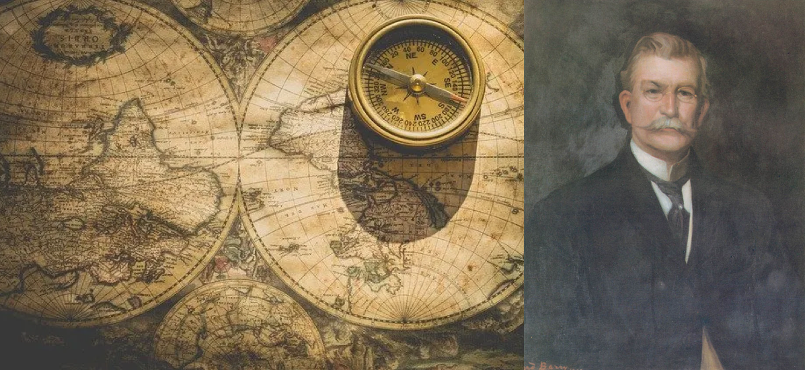
```
- The idea of the median originated in Edward Wright's book on navigation in 1599 
--

- Wright felt that this value was the most likely to be the correct value in a series of observations.
---
## Jacob Bernoulli (1654 - 1705)

.pull-left[
```{r   out.width = "100%", echo = FALSE}
knitr::include_graphics("fig/Jakob_Bernoulli.jpg")
```

 ]
.pull-right[

- Studied Philosophy at the University of Basel but learnt Mathematics on his own
- Discovered the fundamental mathematical constant $e$ 
- Derived the first version of the law of large numbers

]

---
- What is the probability of getting a head with the flip of a fair coin?

--
```{r   out.width = "60%", echo = FALSE, fig.align='center'}
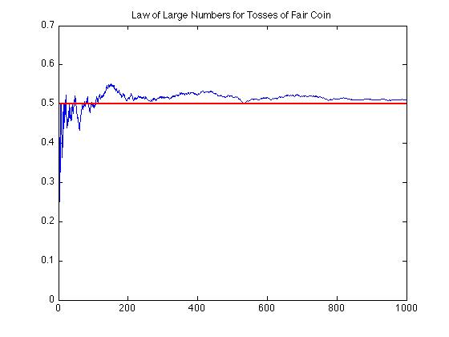
```

```{r   out.width = "70%", echo = FALSE, fig.align='center'}
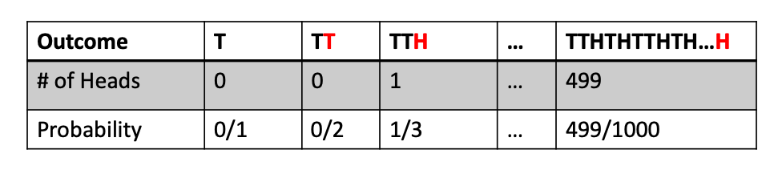
```
--

- It states that in a large number of trials, the average of the outcomes is likely to be very close to the expected value.

---
## Leonhard Euler (1707 - 1783)

.pull-left[
```{r   out.width = "100%", echo = FALSE}
knitr::include_graphics("fig/Leonhard_Euler.jpg")
```
 ]
.pull-right[
- Swiss mathematician, physicist, astronomer, geographer, logician and engineer 
- Calculus, graph theory
- Developed the basics of 'Sudoku'

```{r   out.width = "60%", echo = FALSE, fig.align='center'}
knitr::include_graphics("fig/Sudoku.png")
```

]
---
## Florence Nightingale (1820-1910)

.pull-left[
```{r   out.width = "100%", echo = FALSE}
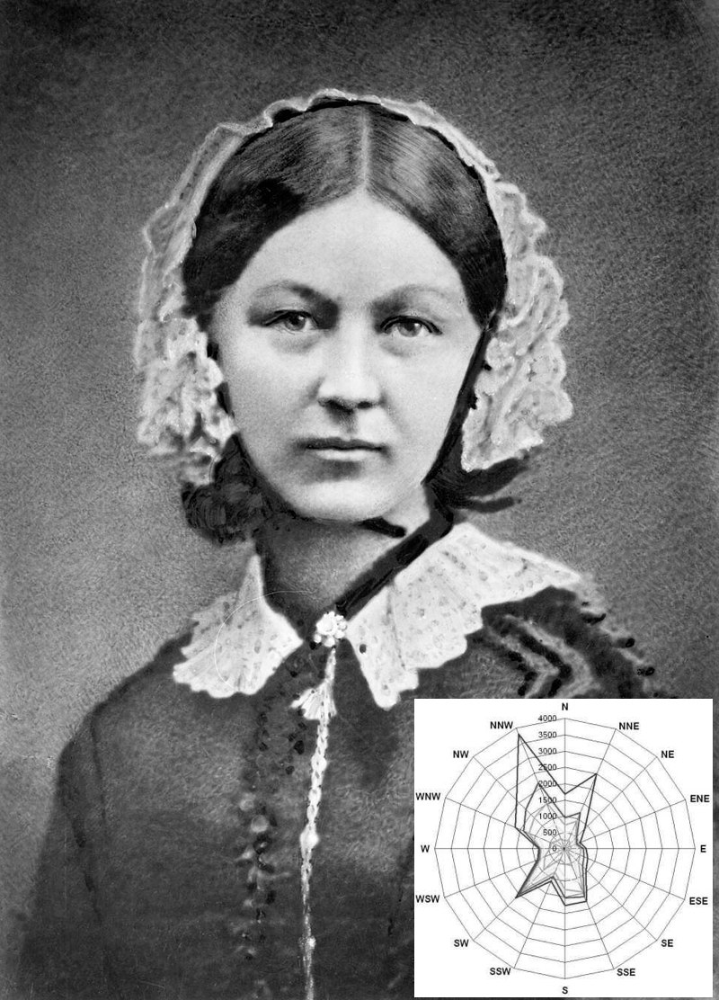
```

 ]
.pull-right[
- The founder of modern nursing
- She  worked as a statistician during a time when women were a rare presence in such fields.
- Traveled as a nurse to a hospital during the Crimean War in 1854.
- A pioneer in the field of statistical graphics.
]
---
# Ronald A. Fisher (1890-1962)

.pull-left[
```{r  echo=FALSE, out.height= "100%", fig_align = 'up'}
knitr::include_graphics("fig/fisher.jpg")
```
 ]

.pull-right[
- Statistician and geneticist 
- Father of modern biometry (the application of statistical analysis to biological data). 
- Laid foundation for: experimental design, statistical inference, and the procedure known as Analysis of Variance (ANOVA),
- Developed Maximum likelihood estimation method
]
---

## John Tukey (1915-2000)


.pull-left[
```{r  echo=FALSE, out.height= "100%", fig_align = 'up'}
knitr::include_graphics("fig/John_Tukey.jpg")
```
 ]

.pull-right[
- Tukey originally trained as a topologist (concerned with the properties of a geometric object)
- Became a statistician in the Second World War
- Father of exploratory data analysis 
- "bit"  (the smallest unit of data in a computer), "Box plot" "stem and leaf plot", ANOVA, "vacuum cleaner"
]

---
## John Tukey (1915-2000)

.pull-left[
```{r  echo=FALSE, out.height= "100%", fig_align = 'up'}
knitr::include_graphics("fig/John_Tukey.jpg")
```
 ]
 .pull-right[
- Tukey coined the word **software** to describe the non-hardware components of the computer, in particular the programs that were needed to make the computers perform their intended tasks
 
]
---
- My family tree - the Mathematical Genealogy Project
- Each successive person is the doctoral student of the person before him.

```{r  echo=FALSE, out.width= "90%", fig.align='center'}
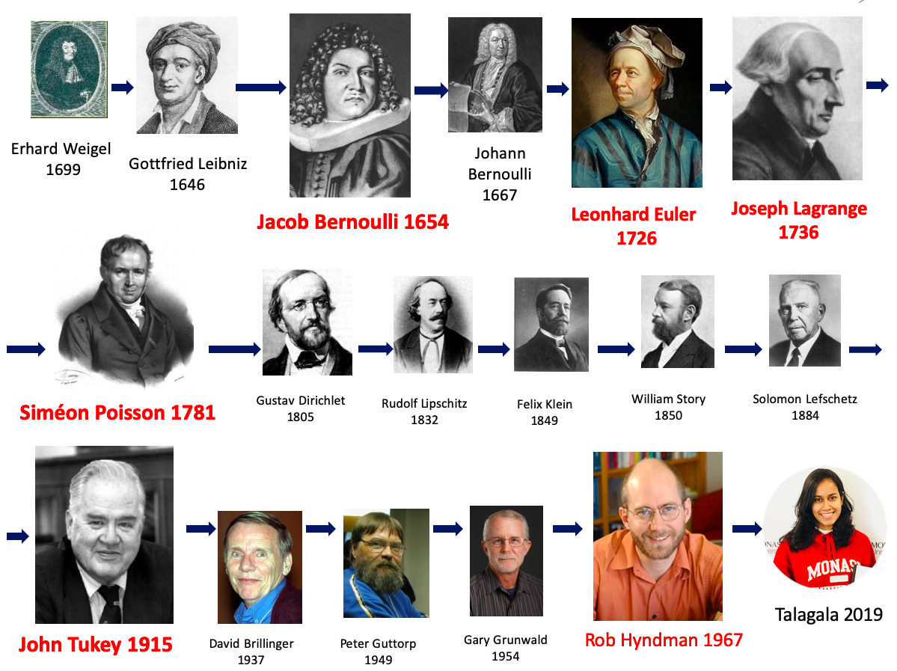
```
---
background-image: url('fig/statmovie.png')
background-position: 50% 50%
background-size: 100%
class: center, middle
---
class: inverse, center, middle
# <span style="color: #D95F02;">Myth 2</span> 
##  ~~Statistics is only for </br> "genius" mathematician~~
--

##  Statistics is for <span style="color: red;"> everyone</span> 
---
class: inverse, center, middle
# <span style="color: #D95F02;">Myth 3</span> 
##  Statistics hasn't changed much in years. It's just the same old stuff
---
# Ross Ihaka and Robert Gentleman

.pull-left[
```{r  echo=FALSE, out.height= "100%", fig_align = 'up'}
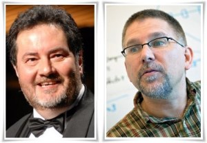
```
```{r  echo=FALSE, out.height= "100%"}
knitr::include_graphics("fig/rlogo.png")
```
 ]
.pull-right[
- New Zealand statisticians
- Originators of the R programming language
- R is a free software environment for statistical computing and graphics
- Currently, the CRAN (The Comprehensive R Archive Network) package repository features 15363  packages
]
---
# R-Ladies Global

```{r  echo=FALSE, out.width= "40%", fig.align='center'}
knitr::include_graphics("fig/RLadiesGlobal.png")
```

- An organization that promotes diversity in the R community worldwide
--

- This community is designed to develop  R skills & knowledge through social, collaborative learning & sharing. 
---
background-image: url('fig/rladiescol.png')
background-position: 30% 30%
background-size: 100%
class: right, bottom

- We meetup in person or virtually to learn about the R programming language, algorithms and advanced tools. 
---
# Hadley Wickham

.pull-left[
```{r  echo=FALSE, out.height= "100%", fig_align = 'up'}
knitr::include_graphics("fig/Hadley-Wickham.jpg")
```
 ]
.pull-right[
- New Zealand statisticians
- Chief Scientist at RStudio (RStudio is an IDE for R)
- He is best known for his development of open-source statistical software packages: ggplot2, tidyverse
- Wickham was awarded the international COPSS Presidents' Award in 2019 for "influential work in statistical computing, visualisation, graphics, and data analysis"
]

---
# Robert Tibshirani

.pull-left[
```{r  echo=FALSE, out.height= "100%", fig_align = 'up'}
knitr::include_graphics("fig/Robert_tibshirani.jpg")
```
 ]
.pull-right[
-  Professor in Statistics and Biomedical Data Science at Stanford University
- He develops statistical tools for the analysis of complex datasets.
- His most well-known contribution: the Lasso method,  Significance Analysis of Microarrays.
- Received the COPSS Presidents' Award in 1996
]

---
# Trevor Hastie

.pull-left[
```{r  echo=FALSE, out.height= "100%", fig_align = 'up'}
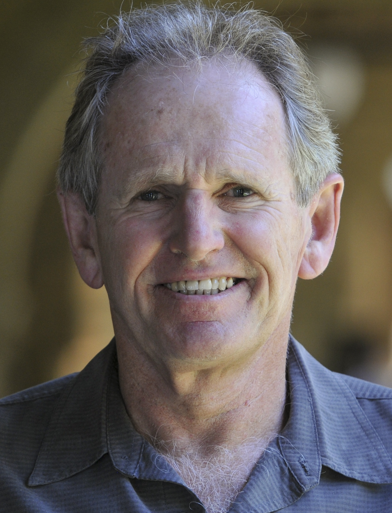
```
 ]
.pull-right[
- South African and American statistician and computer scientist.
- Hastie is known for his contributions to applied statistics, especially in the field of machine learning, data mining, and bioinformatics.
- Elements of Statistical Learning: Data Mining, Inference, and Prediction

]
---
**Timeline of machine learning**

- **<1950s**:	Statistical methods are discovered and refined.
--

- **1950s**: Pioneering ML research is conducted using simple algorithms.
--

- **1960s**:	Bayesian methods are introduced for probabilistic inference in ML
--

- **1970s**:	'AI Winter' caused by pessimism about ML effectiveness.
--

- **1980s**: Rediscovery of backpropagation causes a recovery in ML research
--

- **1990s**:	Work on ML shifts from a knowledge-driven approach to a data-driven approach. 
--

- **2000s**:	Support Vector Clustering and other Kernel methods  and unsupervised ML methods become widespread.
--

- **2010s**	Deep learning becomes feasible, which leads to machine learning becoming 	essential, to many widely used software services and applications.
---
# Andrew Ng

.pull-left[
```{r  echo=FALSE, out.height= "100%", fig_align = 'up'}
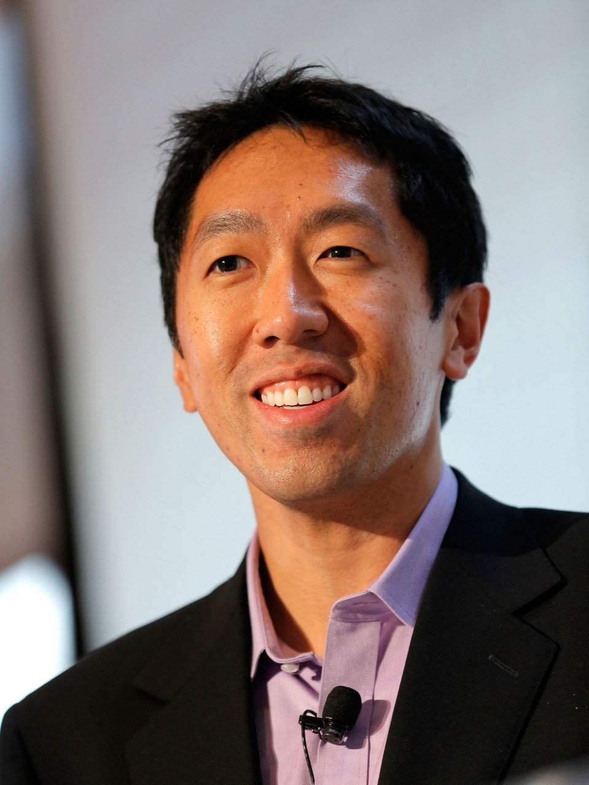
```
 ]
.pull-right[
- A Chinese-American computer scientist and statistician, focusing on machine learning and AI
-  He earned his undergraduate degree with a triple major in computer science, **statistics**, and economics
- Ng is a professor at Stanford University 
]
---
# Andrew Ng

.pull-left[
```{r  echo=FALSE, out.height= "100%", fig_align = 'up'}

```
 ]
.pull-right[
- Also a business executive and investor in the Silicon Valley
- Ng co-founded and led Google Brain 
- Also a pioneer in online education, Ng co-founded Coursera and deeplearning.ai
]
---
# C. R. Rao
.pull-left[
```{r  echo=FALSE, out.height= "100%", fig_align = 'up'}
knitr::include_graphics("fig/Rao.jpeg")
```
- An Indian-American-British mathematician and statistician
 ]
.pull-right[
- He obtained a PhD  under R. A. Fisher in 1948
- The American Statistical Association described him as "a living legend whose work has influenced not just statistics, but has had far reaching implications for fields as varied as economics, genetics, anthropology, geology, national planning, demography and  biometry"

]
---

.pull-left[
#### Emeritus Professor R.A Dayananda
```{r  echo=FALSE, out.height= "90%", fig_align = 'up'}
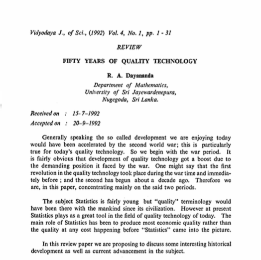
```
- The first statistics professor in Sri Lanka
 ]
--
.pull-right[
#### Professor A.S Karunananda
```{r  echo=FALSE, out.height= "90%", fig_align = 'up'}

```
- Senior Professor in AI
- Chairman, Committee for Popularization of AI, Sri Lanka Association for AI

]
---
background-image: url('fig/lookups.png')
background-position: 50% 50%
background-size: 100%
class: right, top

---
class: inverse, center, middle
# <span style="color: #D95F02;">Myth 3</span> 
## ~~Statistics hasn't changed much in years. It's just the same old stuff~~
--

## Statistics is a very rich tree that we haven't explored fully yet
---
class: inverse, center, middle
# <span style="color: #D95F02;">Myth 4</span> 
## We now have AI and Machine Learning so don't need statistics anymore
---
background-image: url('fig/GDPR.jpg')
background-position: 50% 50%
background-size: 100%
class: right, top
---
# GDPR rule

- The EU General Data Protection Regulation (GDPR) went into effect on May 25, 2018.
--

- GDPR Articles 13-15 and 21-22 outline requirements related to automated data processing and decision making. 
--

- The basic concept is that when a decision is generated solely from automated processing (no human intervention), including profiling, the data subject has the right to receive an explanation of how the decision was rendered.
--

- Automated data processing and decision systems typically use machine learning
--

- The problem with many state-of-the-art models is a lack of transparency and interpretability (Hard to explain internal logic and inner workings) 

---

- When it comes to AI, "explanation" could mean several things:

1) How an algorithm works or how the system functions.
      
2) The factors or data that resulted in a decision by the algorithm or system that impacted an individual (a data subject).
--

- But there are projects that aim to produce explainable AI such as the DARPA Explainable AI (XAI) program and Local Interpretable Model-agnostic Explanations (LIME).

---
# Statistical Machine Learning

- Statistical Machine Learning is a multidisciplinary field that integrates topics from the fields of Machine learning, Mathematical Statistics, and Numerical Optimization Theory.
--

- Machine learning algorithms require a stronger background in statistics and probability than do most neural network techniques,but even these approaches are often referred to as statistical machine learning or statistical learning, as if to distinguish themselves from the regular, less statistical kind. 

---
class: inverse, center, middle
# <span style="color: #D95F02;">Myth 4</span> 
## ~~We now have AI and Machine Learning so don't need statistics anymore~~
--

## Statistics plays a vital role in AI and ML
---
class: inverse, center, middle
# <span style="color: #D95F02;">Myth 5</span> 
## A statistician's work can be replaced by a computer, because it is all about performing certain numerical calculations
---
##  CareerCast Survey 2019

```{r  echo=FALSE, out.width= "70%", fig.align='center'}
knitr::include_graphics("fig/topjob.png")
```
- Recent CareerCast report ranked Data Scientist and Statistician as the top two jobs in USA, with very good work environment, low stress, high projected growth, and high  salary .
---
 ## CareerCast Survey 2019
 
- Data from the Bureau of Labor Statistics (BLS), a part of the U.S. Department of Labor
- Environment, Income, Outlook, and Stress.
- The top jobs in the report were
    1. Data Scientist, Median Salary: $114,520
    2. Statistician, Median Salary: $84,760
    3. University Professor, Median Salary: $76,000
    4. Occupational Therapist, Median Salary: $83,200
    5. Genetic Counselor, Median Salary: $77,480
- Data Scientist was ranked as best job in America, 3 years in a row by Glassdoor, and was among the top emerging jobs in the US according to LinkedIn back in 2017.

---
class: inverse, center, middle
# <span style="color: #D95F02;">Myth 5</span> 
## ~~A statistician's work can be replaced by a computer, because it is all about performing certain numerical calculations~~
--

## Data Scientist and statistician are consistently ranked as best jobs in the world 
---
class: inverse, center, middle
# <span style="color: #D95F02;">Myth 6</span> 
## Statistics is only for coursework
---
background-image: url('fig/App1.png')
background-position: 50% 50%
background-size: 100%
class: right, top
---
background-image: url('fig/App2.png')
background-position: 50% 50%
background-size: 100%
class: right, top
---
background-image: url('fig/App3.png')
background-position: 50% 50%
background-size: 100%
class: right, top
---
background-image: url('fig/App4.png')
background-position: 50% 50%
background-size: 100%
class: right, top
---
background-image: url('fig/App5.png')
background-position: 50% 50%
background-size: 100%
class: right, top
---
background-image: url('fig/App6.png')
background-position: 50% 50%
background-size: 100%
class: right, top
---
background-image: url('fig/App7.png')
background-position: 50% 50%
background-size: 100%
class: right, top
---
background-image: url('fig/App8.png')
background-position: 50% 50%
background-size: 100%
class: right, top
---
background-image: url('fig/App9.png')
background-position: 50% 50%
background-size: 100%
class: right, top
---
class: inverse, center, middle
# <span style="color: #D95F02;">Myth 6</span> 
## ~~Statistics is only for coursework~~
--

## There are so many applications in Statistics
---
# Recap

- Statistics (Mathematics) is  not relevant to me or my future
- Statistics is only for </br> "genius" mathematician
- Statistics hasn't changed much in years. It's just the same old stuff
- We now have AI and Machine Learning so don't need statistics anymore
- A statistician's work can be replaced by a computer, because it is all about performing certain numerical calculations
- Statistics is only for coursework
---

# Recap

- ~~Statistics (Mathematics) is  not relevant to me or my future~~
- ~~Statistics is only for </br> "genius" mathematician~~
- ~~Statistics hasn't changed much in years. It's just the same old stuff~~
- ~~We now have AI and Machine Learning so don't need statistics anymore~~
- ~~A statistician's work can be replaced by a computer, because it is all about performing certain numerical calculations~~
- ~~Statistics is only for coursework~~


---
# Recap

- Statistics (Mathematics) is  <span style="color: red;">**very**</span> relevant to me and my future
- Statistics is for <span style="color: red;"> everyone</span>
- Statistics is a very rich tree that we haven't explored fully yet
-  Statistics plays a vital role in AI and ML
-  Data Scientist and statistician are consistently ranked as best jobs in the world
- There are so many applications in Statistics
---

class: inverse, center, middle
# <span style="color: #D95F02;">Myth 7</span> 
## If a person knows probability theory, he/she can become a millionaire by participating in lotteries.
---
class: inverse, center, middle
# <span style="color: #D95F02;">Myth 7</span> 
## ~~If a person knows probability theory, he/she can become a millionaire by participating in lotteries.~~
--

## If a person knows probability theory, he/she knows why he <span style="color: red;">can't</span>  become a millionaire by participating in lotteries.
---
class: inverse, center, middle

# Let's discuss this in our Probability class
---
class: center, middle, inverse

# Happy Learning Statistics and Mathematics

```{r en, echo =FALSE, warning=FALSE, message=FALSE}
icon::fa("envelope")
``` 
priyangad@uom.lk

```{r  echo =FALSE, warning=FALSE, message=FALSE}
icon::fa("twitter")
```
pridiltal

```{r  echo =FALSE, warning=FALSE, message=FALSE}
icon::fa("globe")
```
https://prital.netlify.com/ </br>
(Slides available)

---
---

---

# Topics

- Careers in Statistics/ Mathematics (data scientist )
- History of Statistics/ Mathematics
- Online resources for Statistics/ Mathematics (eg: online courses/ meetup groups, blogs)
- Applications of Statistics/ Mathematics (different fields: Medicine, sports, Economy, environment)
- Statistical/ Mathematical software (Python, R, Julia)
- Documentaries/ Movies related to Statistics/Mathematics

---
[Rain Man: numbers](https://www.youtube.com/watch?v=FEa6QocYl1A)

[Monty Hall problem](https://www.youtube.com/watch?v=9vRUxbzJZ9Y)

[Movie 21](https://www.youtube.com/watch?v=iBdjqtR2iK4)
---