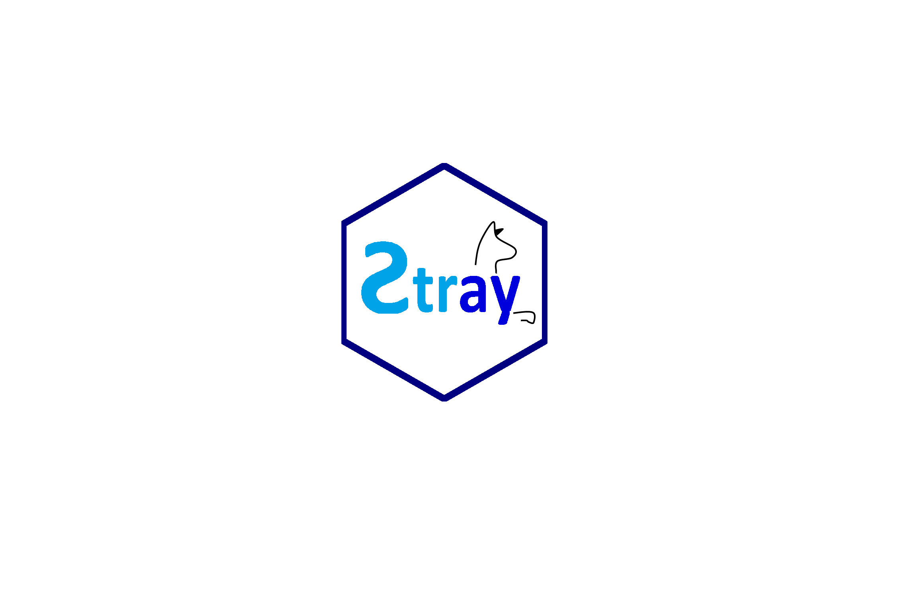
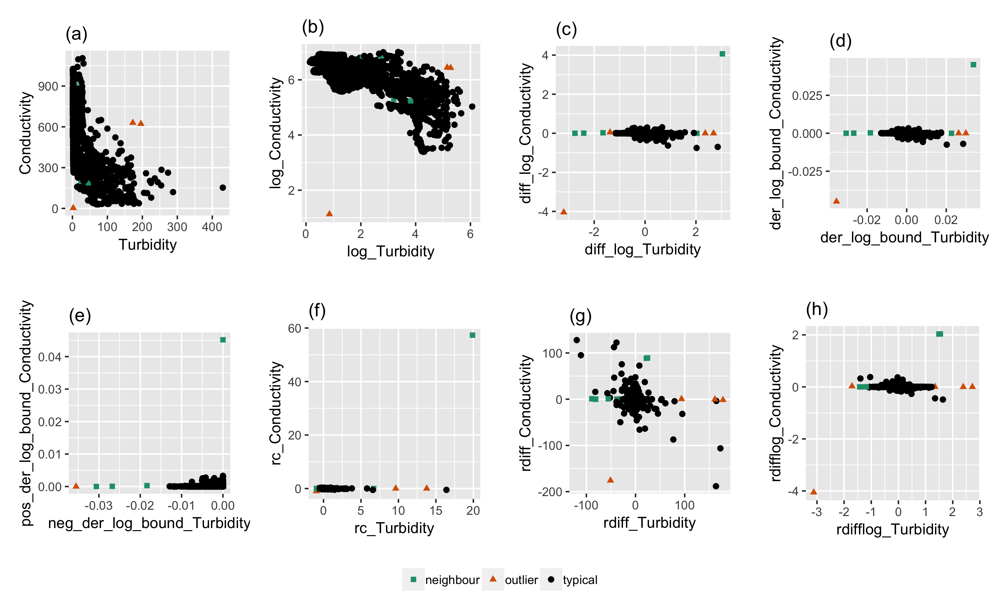
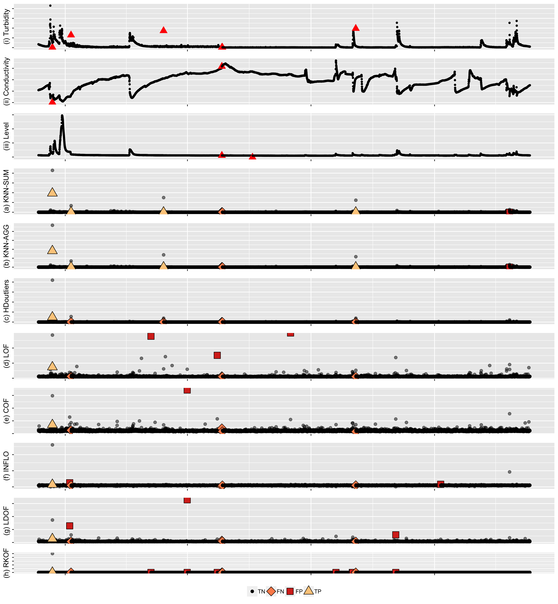
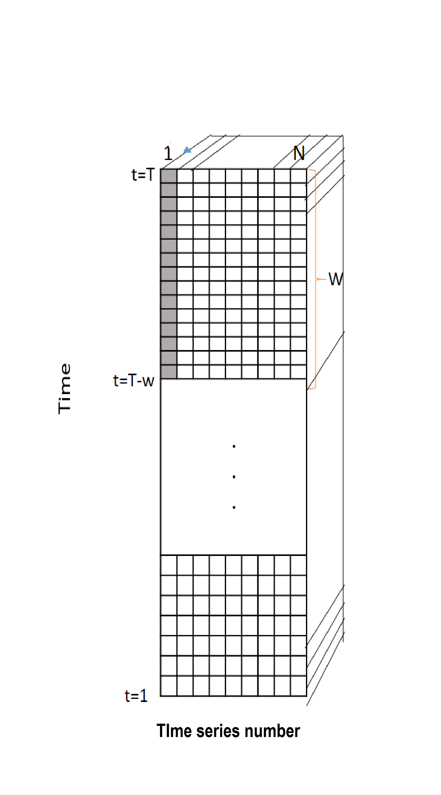
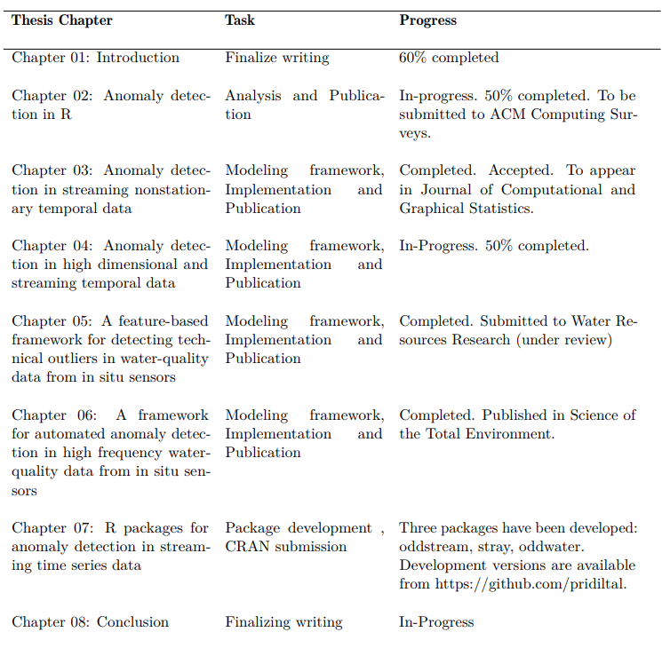

```{r setup, include=FALSE}
library(knitr)
options(htmltools.dir.version = FALSE)
opts_chunk$set(
  warning = FALSE,
  message = FALSE,
  echo = FALSE,
  eval = TRUE,
  fig.path = 'figure/',
  cache.path = 'cache/',
  fig.align = 'center',
  fig.show = 'hold',
  cache = TRUE,
  external = TRUE,
  dev = "pdf",
  fig.height = 6,
  fig.width = 10,
  out.width = "0.8\\textwidth"
)
read_chunk('src/main.R')
library(tidyverse)
library(gridExtra)
library(ggpubr)
# install.packages("devtools")
# devtools::install_github("pridiltal/oddstream")
library(oddstream)
library(animation)
```


## Overview

- **Project 1**: Anomaly Detection in R


- **Project 2**: Anomaly Detection in Streaming Non-Stationary Temporal Data 


- **Project 3**: Anomaly Detection for High Dimensional and Streaming Temporal Data


- **Project 4**:  Anomaly Detection and Correction in Water Quality Sensors


---

## Overview

- <span style="color:lightgrey">**Project 1**: Anomaly Detection in R </span>


- **Project 2**: Anomaly Detection in Streaming Non-Stationary Temporal Data 


- **Project 3**: Anomaly Detection for High Dimensional and Streaming Temporal Data


- **Project 4**:  Anomaly Detection and Correction in Water Quality Sensors


---


class:  center, middle, inverse


# <span style="color:#cc5900"> **Project 2**  </span>  
## Anomaly Detection in Streaming Non-Stationary Temporal Data 

*This article has been accepted to the* **Journal of Computational and Graphical Statistics** *and is currently in press.*

---

### Different types of anomalies in temporal data

```{r echo=FALSE, out.width = "80%"}
knitr::include_graphics("fig/outype2.png")
```

--

-  Many R software packages supporting anomaly detection tasks 
--

-  160 R packages with anomaly detection capabilities
--

-  Only 2 packages to detect anomalous time series within a large collection of series (Case c)

---

background-image:url('fig/sydney_full.png')
background-position: 50% 50%
background-size: 100%
class: right, top

## Motivation

.footnote[
Sydney Harbour Bridge: world's largest steel arch bridge
]
---

background-image:url('fig/2_sydney21.png')
background-position: 50% 50%
background-size: 100%
class: right, top


.footnote[
Source: [https://www.computerworld.com.au/article/648145/how-2400-sensors-machine-learning-models-keep-sydney-harbour-bridge-spanning-decades/?pp=2](https://www.computerworld.com.au/article/648145/how-2400-sensors-machine-learning-models-keep-sydney-harbour-bridge-spanning-decades/?pp=2) 
]

---

background-image:url('fig/2_sydney22.png')
background-position: 50% 50%
background-size: 100%
class: right, top


.footnote[
Source: [https://www.computerworld.com.au/article/648145/how-2400-sensors-machine-learning-models-keep-sydney-harbour-bridge-spanning-decades/?pp=2](https://www.computerworld.com.au/article/648145/how-2400-sensors-machine-learning-models-keep-sydney-harbour-bridge-spanning-decades/?pp=2) 
]

---

background-image:url('fig/2_sydney23.png')
background-position: 50% 50%
background-size: 100%
class: right, top


.footnote[
Source: [https://www.computerworld.com.au/article/648145/how-2400-sensors-machine-learning-models-keep-sydney-harbour-bridge-spanning-decades/?pp=2](https://www.computerworld.com.au/article/648145/how-2400-sensors-machine-learning-models-keep-sydney-harbour-bridge-spanning-decades/?pp=2) 
]

---

background-image:url('fig/2_sydney24.png')
background-position: 50% 50%
background-size: 100%
class: right, top


.footnote[
Source: [https://www.computerworld.com.au/article/648145/how-2400-sensors-machine-learning-models-keep-sydney-harbour-bridge-spanning-decades/?pp=2](https://www.computerworld.com.au/article/648145/how-2400-sensors-machine-learning-models-keep-sydney-harbour-bridge-spanning-decades/?pp=2) 
]

---
background-image:url('fig/2_application.png')
background-position: 50% 50%
background-size: 100%
class: right, top

## Motivation

---
- All these applications generate millions or even billions of individual time series simultaneously
--

- Research question: Finding anomalous time series within a large collection of time series
--

- Approaches to solving the problem of anomaly detection for temporal data :
--
.pull-left[
### Batch scenario 
- whole set of data is available
- complete events <br/><br/><br/>
```{r mvtsplot, out.width = "100%",  fig.align = 'bottom'}
knitr::include_graphics("fig/2_batch.png")
```
]
--
.pull-right[
### Data stream scenario
- continuous, unbounded, flow at high speed, high volume
- incomplete events
```{r  echo=FALSE, out.width = "100%", fig.align = 'up'}
knitr::include_graphics("fig/1_stream.gif")
```
]
---


### Feature Based Representation of Time series
.pull-left[
- Mean   
- Variance  
- Changing variance in remainder 
- Level shift using rolling window   
- Variance change  
- Strength of linearity 
- Strength of curvature  
 ]

.pull-right[
- Strength of spikiness  
- Burstiness of time series (Fano Factor)  
- Minimum  
- Maximum  
- The ratio between 50% trimmed mean and the arithmetic mean
- Moment 
- Ratio of means of data that is below and above the global mean  

]


---
class:  top
### Feature Based Representation of Time series
    
.pull-left[


```{r   echo=FALSE, out.width = "100%", fig_align = 'bottom'}
knitr::include_graphics("fig/3_batch.png")
```


]
.pull-right[
```{r  echo=FALSE, out.width = "100%",}
knitr::include_graphics("fig/tsfeatures.png")
```
]

---
class:  top
### Feature Based Representation of Time series
  
.pull-left[


```{r   echo=FALSE, out.width = "100%", fig_align = 'bottom'}
knitr::include_graphics("fig/3_batch.png")
```

]
.pull-right[
```{r  echo=FALSE, out.width = "100%",}
knitr::include_graphics("fig/5_high_typical.gif")
```
]


---


### Main Contributions
- Propose a framework that provides early detection of anomalies within a large collection of streaming time series data
--

- Propose an algorithm that adapts to nonstationarity (concept drift)

--

### Main Assumptions

- A representative data set of the system's typical behavior is available to define the model for the typical behavior of the system.
--

- We define an anomaly as an observation that is very unlikely given the recent distribution of a given system

--

### Proposed Algorithm

- Off-line Phase: Building a model of a system's typical behaviour; (similar to Clifton, Hugueny & Tarassenko, 2011)
--

- On-line Phase: Testing newly arrived data using the boundary
---


class: middle, center

```{r   echo=FALSE, out.width = "100%"}
knitr::include_graphics("fig/12_logo1.png")
```


---

class: middle, center

```{r   echo=FALSE, out.width = "100%"}
knitr::include_graphics("fig/13_logo2.png")
```

---
### How oddstream works
```{r   echo=FALSE, out.width = "100%"}
knitr::include_graphics("fig/3_batch.png")
```

---
### How oddstream works
```{r   echo=FALSE, out.width = "100%"}
knitr::include_graphics("fig/14_oddstream_typical.png")
```

---
class: top
### Dimension Reduction for Time Series 

.pull-left[
`load(train_data)`
```{r   echo=FALSE, out.width = "90%", fig_align = 'bottom'}
knitr::include_graphics("fig/4_typical.png")
```
]
--
.pull-right[
`tsfeatures <- oddstream::extract_tsfeatures(train_data)`
```{r  echo=FALSE, out.width = "60%",}
knitr::include_graphics("fig/5_high_typical.gif")
```
]

--

`pc<- oddstream::get_pc_space(tsfeatures)` <br/>
`oddstream::plotpc(pc$pcnorm)` 
```{r  echo=FALSE, out.width = "25%",}
knitr::include_graphics("fig/6_typicalfeature.png")
```
First two PCs explain 85% of variation


---


### Anomalous threshold calculation 

- Estimate the probability density function of the 2D PC space $\longrightarrow$ Kernel density estimation
--

- Draw a large number N of extremes $(arg min_{x\in X}[f_{2}(x)])$ from the estimated probability density function
--

- Define a $\Psi$-transform space, using the $\Psi$-transformation defined by (Clifton et al., 2011)

```{r   echo=FALSE, out.width = "50%"}
knitr::include_graphics("fig/10_psitrans.png")
```

- $\Psi$-transform maps the density values back into space into which a Gumbel distribution can be fitted.
--

- Anomalous threshold calculation $\longrightarrow$ extreme value theory

---

class: center, top
`oddstream::find_odd_streams(train_data, test_stream)`
```{r   echo=FALSE, out.width = "50%"}
knitr::include_graphics("fig/18_oddstream_mvtsplot.gif")
```
.pull-left[
```{r  echo=FALSE, out.width = "100%", fig_align = 'top'}
knitr::include_graphics("fig/16_oddstream_out_loc.gif")
```
]
.pull-right[
```{r  echo=FALSE, out.width = "100%", fig_align = 'top'}
knitr::include_graphics("fig/17_oddstream_pcplot.gif")
```
]

---
class:  center, middle, inverse


# Anomaly Detection with <br/>  <span style="color:#cc5900"> Non-stationarity </span>


---
#### Anomaly detection with non-stationarity

```{r  echo=FALSE, out.width = "70%", fig_align = 'top'}
knitr::include_graphics("fig/19_nonstationaritytypes.png")
```

---
### Anomaly detection with non-stationarity

```{r  echo=FALSE, out.width = "100%", fig_align = 'top'}
knitr::include_graphics("fig/20_suddenplot2.png")
```

```{r  echo=FALSE, out.width = "35%", fig_align = 'top'}
knitr::include_graphics("fig/21_noCD1.png")
```

---
### Anomaly detection with non-stationarity

```{r  echo=FALSE, out.width = "100%", fig_align = 'top'}
knitr::include_graphics("fig/20_suddenplot3.png")
```

```{r  echo=FALSE, out.width = "35%", fig_align = 'top'}
knitr::include_graphics("fig/21_noCD2.png")
```

---

### Anomaly detection with non-stationarity

```{r  echo=FALSE, out.width = "100%", fig_align = 'top'}
knitr::include_graphics("fig/20_suddenplot4.png")
```

```{r  echo=FALSE, out.width = "35%", fig_align = 'top'}
knitr::include_graphics("fig/21_noCD3.png")
```

---
### Anomaly detection with non-stationarity

```{r  echo=FALSE, out.width = "100%", fig_align = 'top'}
knitr::include_graphics("fig/20_suddenplot2.png")
```

```{r  echo=FALSE, out.width = "100%", fig_align = 'top'}
knitr::include_graphics("fig/22_conceptdrift_pval.png")
```

- $H_{0} : f_{t_{0}} = f_{t_{t}}$


- squared discrepancy measure $T = \int[f_{t_{0}}(x) - f_{t_{t}}(x)]^{2}dx$ (Anderson et al., 1994)

---
### Anomaly detection with non-stationarity

```{r  echo=FALSE, out.width = "100%", fig_align = 'top'}
knitr::include_graphics("fig/23_sudden_out.png")
```


---
class:  center, middle

```{r  echo=FALSE, out.width = "20%", fig_align = 'top'}
knitr::include_graphics("fig/JCGS.png")
```

Priyanga Dilini Talagala, Rob J Hyndman, Kate Smith-Miles, Sevvandi Kandanaarachchi and Mario A Muñoz (2019) [Anomaly detection in streaming nonstationary temporal data](https://www.researchgate.net/publication/323694683_Anomaly_Detection_in_Streaming_Nonstationary_Temporal_Data). <span style="color:blue"> **Journal of Computational and Graphical Statistics, to appear.**</span>
---

class:  center, middle, inverse


# <span style="color:#cc5900"> Project 3  </span>  
## Anomaly Detection for High Dimensional and Streaming Temporal Data

---
### Main Contributions
- Propose a framework to detect anomalies in high dimensional data. Our proposed algorithm addresses the limitations of HDoutliers algorithm (Wilkinson, 2018).
--

- Propose an algorithm to detect anomalies in streaming temporal data
--


### What is an anomaly ?
- We define an anomaly as an observation that deviates markedly from the majority with a large distance gap.
--


### Main Assumptions
- There is a large distance between typical data and the anomalies in comparison to the distance among typical data.


---

```{r  echo=FALSE, out.width = "60%", fig_align = 'top'}
knitr::include_graphics("fig/P2_plot5.png")
```
-  Normalize the columns of the data. (median and IQR)
-  This prevents variables with large variances having disproportional influence on Euclidean distances.
---


```{r  echo=FALSE, out.width = "60%", fig_align = 'top'}
knitr::include_graphics("fig/P2_plot6.png")
```
- Leader Algorithm (Hartingan, 1975)
- $r= 1/2(1/n)^{1/d}$: expected distance between data points in a d-dimensional space. n is the sample size (Kantardzic, 2011)

---


```{r  echo=FALSE, out.width = "60%", fig_align = 'top'}
knitr::include_graphics("fig/P2_plot7.png")
```

---


```{r  echo=FALSE, out.width = "60%", fig_align = 'top'}
knitr::include_graphics("fig/P2_plot9.png")
```

- Select the k nearest neighbour distance with the maximum gap

--
- Sort the resulting k nearest neighbour distances

--
- Define an anomalous threshold using Extreme Value Theory  (Bottom up searching algorithm proposed by Schwarz, 2008)

---
`devtools::install_github("pridiltal/stray")` <br/>
`outliers <- stray::find_HDoutliers(data)` <br/>
`stray::display_HDoutliers(data, outliers)`

```{r  echo=FALSE, out.width = "60%", fig_align = 'top'}
knitr::include_graphics("fig/P2_plot10.png")
```

---


class: middle, center

```{r   echo=FALSE, out.width = "100%"}

```


---

class: middle, center

```{r   echo=FALSE, out.width = "100%"}
knitr::include_graphics("fig/P2_plot20.png")
```

---

### Identify anomalous series within a large collection of time series

- use a moving window to deal with streaming data


- Extract time series features from window


- Apply stray algorithm to identify anomalous series

.pull-left[

```{r   echo=FALSE, out.width = "100%"}
knitr::include_graphics("fig/P2_plot22.png")
```

]
.pull-right[
```{r   echo=FALSE, out.width = "70%"}
knitr::include_graphics("fig/stray.gif")
```
]

`tsfeatures <- oddstream::extract_tsfeatures(ts_data)` <br/>
`outliers <- stray::find_HDoutliers(tsfeatures)` <br/>
`stray::display_HDoutliers(tsfeatures, outliers)`


---
### Advantages of the Proposed Algorithm

- Detect clusters of outlying points
--

- Applied to both uni- and multi- dimensional data
--

- Handle large datasets due to the use of a one-pass algorithm
--

- Does not require a training set to build the decision model
--

- Deal with multimodal typical classes
--

- Outlier threshold has a probabilistic interpretation


---


class:: center
.pull-left[
 .Large[<span style="color:blue">`stray`</span>]
 
```{r   echo=FALSE, out.width = "70%"}
knitr::include_graphics("fig/P2_plot21a.png")
```

- Definition: distance 
- no training set 
]
.pull-right[
.Large[<span style="color:blue">`oddstream`  </span>]

```{r   echo=FALSE, out.width = "70%"}
knitr::include_graphics("fig/P2_plot21b.png")
```

- Definition: density
- need a training set
]


---

class:  center, middle, inverse


# <span style="color:#cc5900"> Project 4   </span>  
## Anomaly Detection and correction in Water Quality Sensors

The work is based on the collaborative research project carried out with the Queensland
University of Technology and the Queensland Department of Environment and Science,
Great Barrier Reef Catchment Loads Monitoring Program.

---
background-image: url('fig/water.png')
background-position: 50% 5.0%
class: center, top


## Anomaly detection and correction in water quality sensors 


---

### Different types of anomalies in temporal data

```{r echo=FALSE, out.width = "100%", fig.align = 'up'}
knitr::include_graphics("fig/outype2.png")
```


---

#### Time series for turbidity, conductivity and river level measured by in situ sensors at Sandy Creek


```{r echo=FALSE, out.width = "100%", fig.align = 'up'}
knitr::include_graphics("fig/water_original.png")
```


---

#### Time series for turbidity, conductivity and river level measured by in situ sensors at Sandy Creek

```{r echo=FALSE, out.width = "100%", fig.align = 'up'}
knitr::include_graphics("fig/water_out.png")
```


--

-  Unusual behaviours due to technical issues with the sensor equipment
-  Real events 

---

background-image:url('fig/table_water.png')
background-position: 50% 50%
background-size: 100%
class: right, top


---

#### Time series for turbidity, conductivity and river level measured by in situ sensors at Sandy Creek

```{r echo=FALSE, out.width = "100%", fig.align = 'up'}
knitr::include_graphics("fig/water_out.png")
```

---
#### Bivariate relationships between water-quality variables (turbidity, conductivity and river level) measured by in~situ sensors at Sandy Creek

```{r echo=FALSE, out.width = "100%", fig.align = 'up'}
knitr::include_graphics("fig/water_hd1.png")
```

---
#### Bi-variate relationships between transformed series of turbidity and conductivity measured by in situ sensors at Pioneer River 

```{r echo=FALSE, out.width = "100%", fig.align = 'up'}

```

---


```{r echo=FALSE, out.width = "75%", fig.align = 'center'}

```

---
### Advantages of the proposed framework

- Can take the correlation structure of the water-quality variables into account when
detecting outliers
--

- Applicable to both univariate and multivariate problems
--

- Outlier scoring techniques- unsupervised
--

- Outlier thresholds have a probabilistic interpretation 
--

- The framework can easily be extended to streaming data such that it can provide near-real-time support
--

- Proposed framework has the ability to deal with irregular (unevenly spaced) time series

---

### Main Contributions

- Proposed an unsupervised framework that provides early detection of technical outliers in water-quality data from  *in situ* sensors.
--

- Provided a comparative analysis of the efficacy and reliability of both density- and nearest neighbor distance-based outlier scoring techniques.
--

- Introduced an R package, `oddwater` that implements the proposed framework
and related functions.

```{r echo=TRUE, eval=FALSE}
# install.packages("devtools")
devtools::install_github("pridiltal/oddwater")
```
- `oddwater` package also provides a shiny app to explore data. 


```{r eval = FALSE, echo=TRUE}
## Launch Shiny application
oddwater::explore_data()
```
---
class:  center, middle


```{r  echo=FALSE, out.width = "20%", fig_align = 'top'}
knitr::include_graphics("fig/STOTEN.png")
```

Catherine Leigh, Omar Alsibai, Rob J Hyndman, Sevvandi Kandanaarachchi, Olivia C King, James M McGree, Catherine Neelamraju, Jennifer Strauss, Priyanga Dilini Talagala, Ryan S Turner, Kerrie Mengersen, Erin E Peterson (2019) [A framework for automated anomaly detection in high frequency water-quality data from in situ sensors](https://www.sciencedirect.com/science/article/pii/S0048969719305662). <span style="color:blue">Science of the Total Environment, 664, 885-898.</span>


Priyanga Dilini Talagala, Rob J. Hyndman, Catherine Leigh, Kerrie Mengersen, and Kate Smith-Miles. (2019) [A feature-based framework for detecting technical outliers in water-quality data from in situ sensors.](https://arxiv.org/abs/1902.06351) arXiv preprint arXiv:1902.06351.

---
### What Next? 

#### Multidimensional multivariate data

```{r   echo=FALSE, out.width = "40%"}

```

---
### What Next? 

#### Multidimensional multivariate data

```{r   echo=FALSE, out.width = "40%"}
knitr::include_graphics("fig/P3_future2.png")
```

---
### What Next? 

#### Multidimensional multivariate data

```{r   echo=FALSE, out.width = "40%"}
knitr::include_graphics("fig/P3_future3.png")
```


---
### What Next? 

#### Multidimensional multivariate data

```{r   echo=FALSE, out.width = "40%"}
knitr::include_graphics("fig/P3_future4.png")
```


---
### Progress to Date


```{r   echo=FALSE, out.width = "80%"}

```

---
class: center, middle

# Thank You

---
