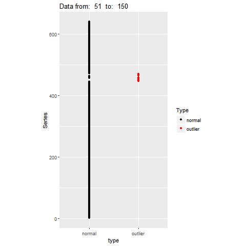
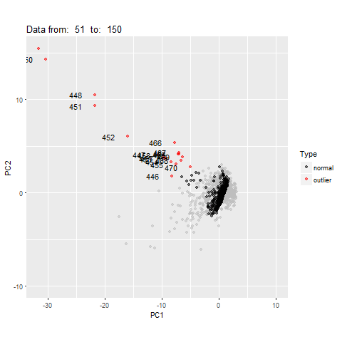
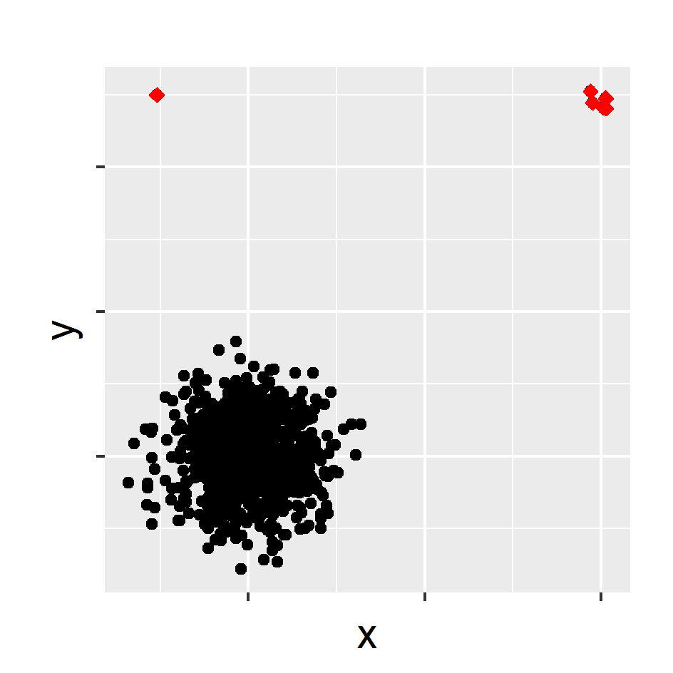
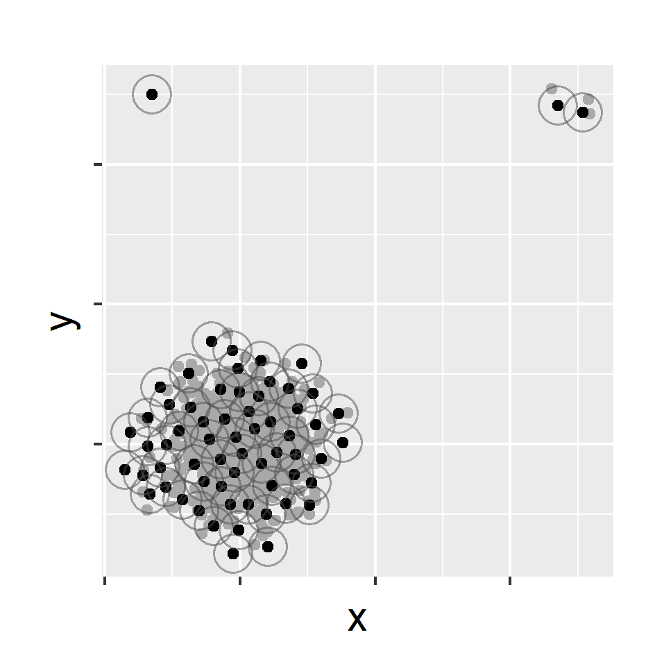
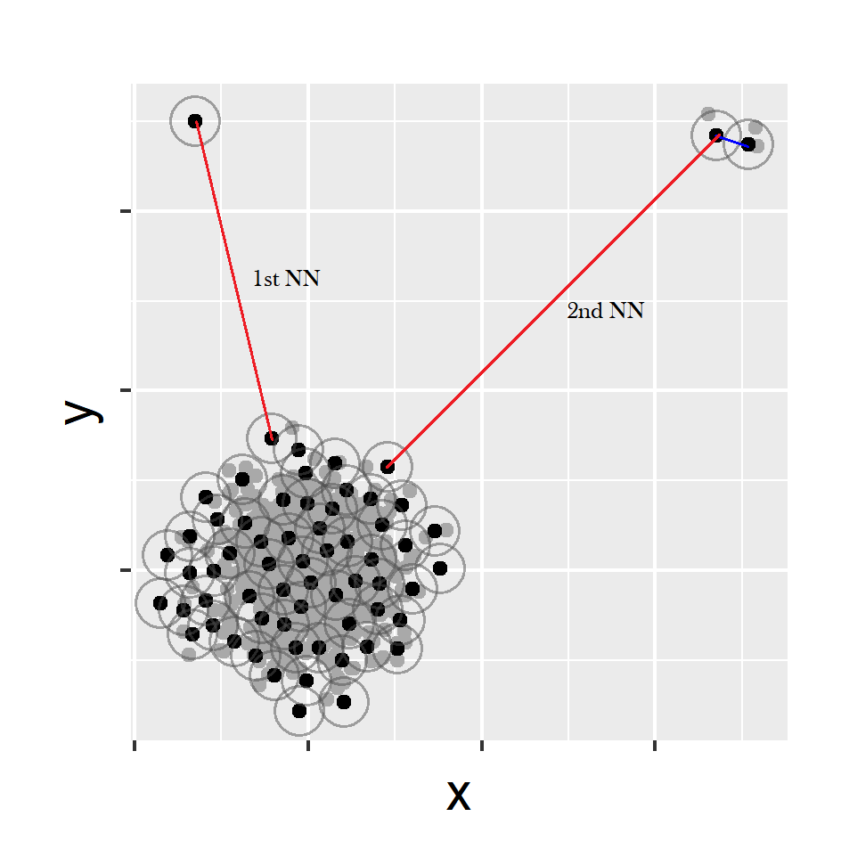
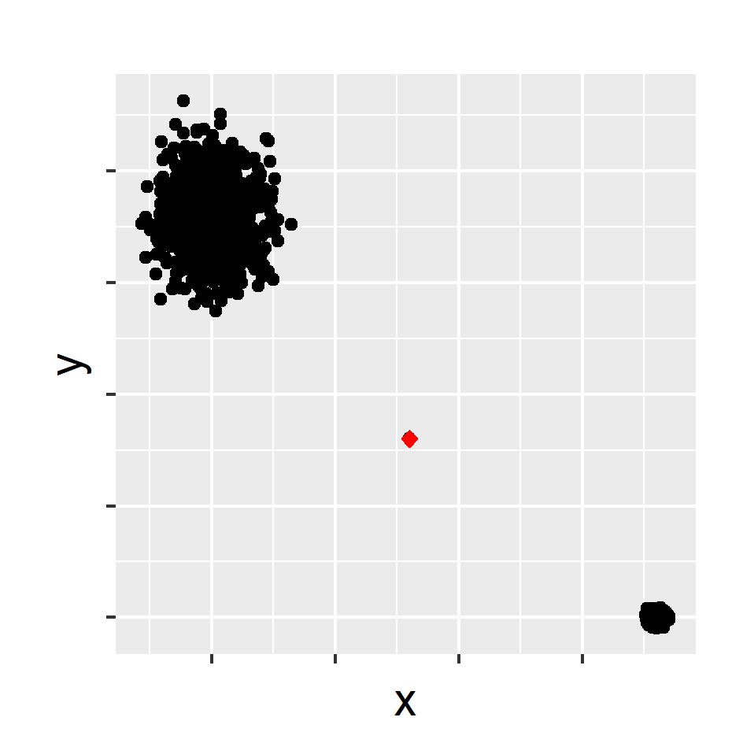

```{r setup, include=FALSE}
library(knitr)
options(htmltools.dir.version = FALSE)
opts_chunk$set(
  warning = FALSE,
  message = FALSE,
  echo = FALSE,
  fig.path = 'figure/',
  cache.path = 'cache/',
  fig.align = 'center',
  fig.show = 'hold',
  cache = TRUE,
  external = TRUE,
  dev = "pdf",
  fig.height = 6,
  fig.width = 10,
  out.width = "0.8\\textwidth"
)
read_chunk('src/main.R')
library(tidyverse)
library(gridExtra)
library(ggpubr)
# install.packages("devtools")
# devtools::install_github("pridiltal/oddstream")
library(oddstream)
library(animation)
```
### Motivation: Fence-mounted perimeter intrusion detection systems

```{r  out.width = "100%", echo=FALSE}
knitr::include_graphics("fig/1_climb.png")
```

- Data obtained using  fiber optic cables attached to a fence 
--

- Intrusion events cause measurable changes in intensity, phase, wavelength or transit time of light in the fiber.
--

- Aim: Find anomalous time series (the location of the intrusion event)

---
background-image: url(https://raw.githubusercontent.com/pridiltal/pritalks/master/PhD_mid_candidature_review_2018/fig/1_application.png?token=ATXvCnmhR6UZOnl_VSKmZDPtme5FFO9Bks5asAaAwA%3D%3D)
background-position: 50% 50%
background-size: 100%
class: center, middle


---
- All these applications generate millions or even billions of individual time series simultaneously
--

- Research question: Finding anomalous time series within a large collection of time series
--

- Approaches to solving the problem of anomaly detection for temporal data :
--
.pull-left[
### Batch scenario 
- whole set of data is available
- complete events <br/><br/><br/>
```{r mvtsplot, out.width = "100%",  fig.align = 'bottom'}
knitr::include_graphics("fig/2_batch.png")
```
]
--
.pull-right[
### Data stream scenario
- continuous, unbounded, flow at high speed, high volume
- incomplete events
```{r  echo=FALSE, out.width = "100%", fig.align = 'up'}
knitr::include_graphics("fig/1_stream.gif")
```
]
---


## Automatic anomaly detection algorithm for streaming data is required:


- to give real-time support


--
-  to provide early detection of anomalies


--
- to learn and adapt to the changing environment automatically (nonstationarity, concept drift)


--
- to deal with large amounts of data efficiently
---

## Overview

- **Project 1**: Anomaly detection in R


- **Project 2**: Anomaly detection in streaming nonstationary temporal data 


- **Project 3**: Anomaly detection for high dimensional and streaming temporal data


- **Project 4**: Anomaly detection and correction in water quality sensors


- **Project 5**: R packages for anomaly detection in streaming time series data

---
## Overview

- <span style="color:lightgrey">**Project 1**: Anomaly detection in R </span>


- **Project 2**: Anomaly detection in streaming nonstationary temporal data 


- **Project 3**: Anomaly detection for high dimensional and streaming temporal data


- <span style="color:lightgrey">**Project 4**: Anomaly detection and correction in water quality sensors</span>


- **Project 5**: R packages for anomaly detection in streaming time series data

---


class:  center, middle, inverse


# <span style="color:#ff08ac"> **Project 2**:  </span>  
## Anomaly detection in streaming nonstationary temporal data 


---
#### **Project 2**: Anomaly detection in streaming nonstationary temporal data 


### Main Contributions
- Propose a framework that provides early detection of anomalies within a large collection of streaming time series data
--

- Propose an algorithm that adapts to nonstationarity (concept drift) <br/> <br/>
--


### What is an anomaly ?

- We define an anomaly as an observation that is very unlikely given the recent distribution of a given system

---

#### **Project 2**: Anomaly detection in streaming nonstationary temporal data 


### Main Assumptions
- Anomaly is a rare event which has a very low chance of occurrence with respect to the typical behavior of the system
--

- A representative data set of the system's typical behavior is available to define the model for the typical behavior of the system. <br/> <br/>
--


### Proposed Algorithm

- Off-line Phase: Building a model of a system's typical behaviour; (similar to Clifton, Hugueny & Tarassenko, 2011)
--

- On-line Phase: Testing newly arrived data using the boundary

---


#### **Project 2**: Anomaly detection in streaming nonstationary temporal data 
### Feature Based Representation of Time series
.pull-left[
- Mean   
- Variance  
- Changing variance in remainder 
- Level shift using rolling window   
- Variance change  
- Strength of linearity 
- Strength of curvature  
 ]

.pull-right[
- Strength of spikiness  
- Burstiness of time series (Fano Factor)  
- Minimum  
- Maximum  
- The ratio between 50% trimmed mean and the arithmetic mean
- Moment 
- Ratio of means of data that is below and above the global mean  

]


---
class:  top
#### **Project 2**: Anomaly detection in streaming nonstationary temporal data 
### Feature Based Representation of Time series

.pull-left[


```{r   echo=FALSE, out.width = "100%", fig_align = 'bottom'}
knitr::include_graphics("fig/3_batch.png")
```
]
.pull-right[
```{r  echo=FALSE, out.width = "100%",}
knitr::include_graphics("fig/tsfeatures.png")
```
]
---
class: top
### Dimension Reduction for Time Series 

.pull-left[
Typical dataset
```{r   echo=FALSE, out.width = "90%", fig_align = 'bottom'}
knitr::include_graphics("fig/4_typical.png")
```
]
--
.pull-right[

Feature Extraction $\Longrightarrow$ Feature Space
```{r  echo=FALSE, out.width = "60%",}
knitr::include_graphics("fig/5_high_typical.gif")
```
]

--


Principal Component Decomposition $\Longrightarrow$ 2D Feature Space
```{r  echo=FALSE, out.width = "30%",}
knitr::include_graphics("fig/6_typicalfeature.png")
```

- First two PCs explain 85% of variation


---
#### **Project 2**: Anomaly detection in streaming nonstationary temporal data 
### Classical Extreme Value Theory
```{r  echo=FALSE, out.width = "60%", fig.cap="Extreme value distributions corresponding to m = 1; 10; 100; 1000, each describing where the maximum of m samples drawn from N(0; 1) will lie."}
knitr::include_graphics("fig/7_EVD1.png")

```


---
#### **Project 2**: Anomaly detection in streaming nonstationary temporal data 
### Theorem 1: Fisher-Tippett theorem (Limit laws for maxima) 

(Embrechts et al. (2013), p. 121)

Let $\textbf{X} = X_{1}, X_{2}, ..., X_{m}$ be a sequence of independent and identically distributed random variables and $X_{max} = max(\textbf{X})$. If there exist centering constant $d_{m} (\in \Re)$ and normalizing constant $c_{m} (>0)$, and some non-degenerate distribution function $H^{+}$ such that


		
```{r   echo=FALSE, out.width = "30%"}

     knitr::include_graphics("fig/8_maxima1.png")

```


then $H^{+}$ belongs to one of the following three distribution functions:

```{r   echo=FALSE, out.width = "50%"}

knitr::include_graphics("fig/8_maxima2.png")

```


---
#### **Project 2**: Anomaly detection in streaming nonstationary temporal data
### Extreme Value Distribution of the Probability Density Values (Clifton et al., 2011)

- Estimate the probability density function of the 2D PC space $\longrightarrow$ Kernel density estimation


- Draw a large number N of extremes from the estimated probability density function

```{r   echo=FALSE, out.width = "50%", fig.cap="Distribution of 1000 extremes generated from bivariate kernel density function with m=500"}
knitr::include_graphics("fig/9_threshold1.png")
```

---
#### **Project 2**: Anomaly detection in streaming nonstationary temporal data
### Extreme Value Distribution of Probability Density Values (Clifton et al., 2011)

- Define a $\Psi$-transform space, using the $\Psi$-transformation defined by

```{r   echo=FALSE, out.width = "50%"}
knitr::include_graphics("fig/10_psitrans.png")
```

- $\Psi$-transform maps the density values back into space into which a Gumbel distribution can be fitted.
```{r   echo=FALSE, out.width = "50%",  fig.cap = "Distribution of transformed values"}
knitr::include_graphics("fig/11_psi_trans.png")
```
---


class: middle, center

```{r   echo=FALSE, out.width = "100%"}
knitr::include_graphics("fig/12_logo1.png")
```


---

class: middle, center

```{r   echo=FALSE, out.width = "100%"}
knitr::include_graphics("fig/13_logo2.png")
```

---
### How oddstream works
```{r   echo=FALSE, out.width = "100%"}
knitr::include_graphics("fig/3_batch.png")
```

---
### How oddstream works
```{r   echo=FALSE, out.width = "100%"}
knitr::include_graphics("fig/14_oddstream_typical.png")
```

---

class: top
.pull-left[
`load(train_data)`

```{r   echo=FALSE, out.width = "100%", fig_align = 'bottom'}
knitr::include_graphics("fig/4_typical.png")
```
]

.pull-right[

`tsfeatures <- oddstream::extract_tsfeatures(train_data)`
```{r  echo=FALSE, out.width = "50%",}
knitr::include_graphics("fig/15_typicalfeatures.png")
```
]


`pc<- oddstream::get_pc_space(tsfeatures)` <br/>
`oddstream::plotpc(pc$pcnorm)`

```{r  echo=FALSE, out.width = "30%",}
knitr::include_graphics("fig/6_typicalfeature.png")
```


---
class: center, top
`oddstream::find_odd_streams(train_data, test_stream)`
```{r   echo=FALSE, out.width = "50%"}
knitr::include_graphics("fig/18_oddstream_mvtsplot.gif")
```
.pull-left[
```{r  echo=FALSE, out.width = "100%", fig_align = 'top'}

```
]
.pull-right[
```{r  echo=FALSE, out.width = "100%", fig_align = 'top'}

```
]
---

class:  center, middle, inverse


# Anomaly Detection with <br/>  <span style="color:#ff08ac"> Non-stationarity </span>


---
#### Anomaly detection with non-stationarity

```{r  echo=FALSE, out.width = "70%", fig_align = 'top'}
knitr::include_graphics("fig/19_nonstationaritytypes.png")
```

---
#### **Project 2**: Anomaly detection in streaming nonstationary temporal data
### Anomaly detection with non-stationarity

```{r  echo=FALSE, out.width = "100%", fig_align = 'top'}
knitr::include_graphics("fig/20_suddenplot2.png")
```

```{r  echo=FALSE, out.width = "35%", fig_align = 'top'}
knitr::include_graphics("fig/21_noCD1.png")
```

---

#### **Project 2**: Anomaly detection in streaming nonstationary temporal data
### Anomaly detection with non-stationarity

```{r  echo=FALSE, out.width = "100%", fig_align = 'top'}
knitr::include_graphics("fig/20_suddenplot3.png")
```

```{r  echo=FALSE, out.width = "35%", fig_align = 'top'}
knitr::include_graphics("fig/21_noCD2.png")
```

---

#### **Project 2**: Anomaly detection in streaming nonstationary temporal data
### Anomaly detection with non-stationarity

```{r  echo=FALSE, out.width = "100%", fig_align = 'top'}
knitr::include_graphics("fig/20_suddenplot4.png")
```

```{r  echo=FALSE, out.width = "35%", fig_align = 'top'}
knitr::include_graphics("fig/21_noCD3.png")
```

---
#### **Project 2**: Anomaly detection in streaming nonstationary temporal data
### Anomaly detection with non-stationarity

```{r  echo=FALSE, out.width = "100%", fig_align = 'top'}
knitr::include_graphics("fig/20_suddenplot2.png")
```

```{r  echo=FALSE, out.width = "100%", fig_align = 'top'}
knitr::include_graphics("fig/22_conceptdrift_pval.png")
```

- $H_{0} : f_{t_{0}} = f_{t_{t}}$


- squared discrepancy measure $T = \int[f_{t_{0}}(x) - f_{t_{t}}(x)]^{2}dx$ (Anderson et al., 1994)

---
#### **Project 2**: Anomaly detection in streaming nonstationary temporal data
### Anomaly detection with non-stationarity

```{r  echo=FALSE, out.width = "100%", fig_align = 'top'}
knitr::include_graphics("fig/23_sudden_out.png")
```


---

class:  center, middle, inverse


# <span style="color:#ff08ac"> Project 3:  </span>  
## Anomaly detection for high dimensional and streaming temporal data

---
#### **Project 3**: Anomaly detection for high dimensional and streaming temporal data

### Main Contributions
- Propose a framework to detect anomalies in high dimensional data. Our proposed algorithm addresses the limitations of HDoutliers algorithm (Wilkinson, 2018).
--

- Propose an algorithm to detect anomalies in streaming temporal data
--


### What is an anomaly ?
- We define an anomaly as an observation that deviates markedly from the majority with a large distance gap.
--


### Main Assumptions
- There is a large distance between typical data and the anomalies in comparison to the distance among typical data.


---

#### **Project 3**: Anomaly detection for high dimensional and streaming temporal data

```{r  echo=FALSE, out.width = "60%", fig_align = 'top'}
knitr::include_graphics("fig/P2_plot1.png")
```
-  Normalize the columns of the data. (median and IQR)
-  This prevents variables with large variances having disproportional influence on Euclidean distances.
---

#### **Project 3**: Anomaly detection for high dimensional and streaming temporal data

```{r  echo=FALSE, out.width = "60%", fig_align = 'top'}
knitr::include_graphics("fig/P2_plot2.png")
```
- Leader Algorithm (Hartingan, 1975)
- $r= 1/2(1/n)^{1/d}$: expected distance between data points in a d-dimensional space. n is the sample size (Kantardzic, 2011)
---


#### **Project 3**: Anomaly detection for high dimensional and streaming temporal data

```{r  echo=FALSE, out.width = "60%", fig_align = 'top'}
knitr::include_graphics("fig/P2_plot3.png")
```

---


#### **Project 3**: Anomaly detection for high dimensional and streaming temporal data

```{r  echo=FALSE, out.width = "60%", fig_align = 'top'}
knitr::include_graphics("fig/P2_plot3b.png")
```

---


#### **Project 3**: Anomaly detection for high dimensional and streaming temporal data

```{r  echo=FALSE, out.width = "60%", fig_align = 'top'}

```

---


#### **Project 3**: Anomaly detection for high dimensional and streaming temporal data

```{r  echo=FALSE, out.width = "60%", fig_align = 'top'}
knitr::include_graphics("fig/P2_plot5.png")
```

---


#### **Project 3**: Anomaly detection for high dimensional and streaming temporal data

```{r  echo=FALSE, out.width = "60%", fig_align = 'top'}
knitr::include_graphics("fig/P2_plot6.png")
```

---

#### **Project 3**: Anomaly detection for high dimensional and streaming temporal data

```{r  echo=FALSE, out.width = "60%", fig_align = 'top'}

```

---

#### **Project 3**: Anomaly detection for high dimensional and streaming temporal data

```{r  echo=FALSE, out.width = "60%", fig_align = 'top'}
knitr::include_graphics("fig/P2_plot7b.png")
```

---

#### **Project 3**: Anomaly detection for high dimensional and streaming temporal data

```{r  echo=FALSE, out.width = "60%", fig_align = 'top'}
knitr::include_graphics("fig/P2_plot8.png")
```
- Limitation of HDoutliers algorithm
---


#### **Project 3**: Anomaly detection for high dimensional and streaming temporal data

```{r  echo=FALSE, out.width = "60%", fig_align = 'top'}

```

---

#### **Project 3**: Anomaly detection for high dimensional and streaming temporal data

```{r  echo=FALSE, out.width = "60%", fig_align = 'top'}

```

- Select the k nearest neighbour distance with the maximum gap
---


#### **Project 3**: Anomaly detection for high dimensional and streaming temporal data

```{r  echo=FALSE, out.width = "60%", fig_align = 'top'}
knitr::include_graphics("fig/P2_plot10.png")
```

---


#### **Project 3**: Anomaly detection for high dimensional and streaming temporal data

```{r  echo=FALSE, out.width = "60%", fig_align = 'top'}
knitr::include_graphics("fig/P2_plot11.png")
```

---

#### **Project 3**: Anomaly detection for high dimensional and streaming temporal data

```{r  echo=FALSE, out.width = "60%", fig_align = 'top'}
knitr::include_graphics("fig/P2_plot12.png")
```

---

#### **Project 3**: Anomaly detection for high dimensional and streaming temporal data

```{r  echo=FALSE, out.width = "60%", fig_align = 'top'}
knitr::include_graphics("fig/P2_plot13.png")
```

---

#### **Project 3**: Anomaly detection for high dimensional and streaming temporal data

```{r  echo=FALSE, out.width = "60%", fig_align = 'top'}
knitr::include_graphics("fig/P2_plot14.png")
```
- Limitation of HDoutliers algorithm
---

#### **Project 3**: Anomaly detection for high dimensional and streaming temporal data

```{r  echo=FALSE, out.width = "60%", fig_align = 'top'}
knitr::include_graphics("fig/P2_plot15.png")
```
- incorporate an upper bound for the size of a cluster
---

#### **Project 3**: Anomaly detection for high dimensional and streaming temporal data

```{r  echo=FALSE, out.width = "60%", fig_align = 'top'}

```

---

#### **Project 3**: Anomaly detection for high dimensional and streaming temporal data


- Sort the resulting k nearest neighbour distances

--


- Consider the half of the exemplars with the smallest k-nearest neighbour distances as typical.

--


- Search for any significant large gap in the upper tail (Bottom up searching algorithm proposed by Schwarz, 2008)

---

#### **Project 3**: Anomaly detection for high dimensional and streaming temporal data
### Spacing Theorem (Weissman, 1978)

Let $X_{1}, X_{2}, ..., X_{n}$ be a sample from a distribution function $F$ .
Let $X_{1:n} \geq X_{2:n} \geq ... \geq X_{n:n}$ be the order statistics.
The available data are $X_{1:n}, X_{2:n},  ..., X_{k:n}$ for some fixed $k$.

Let $D_{i,n} = X_{i:n} - X_{i+1:n},$ $(i = 1,2,..., k)$ be the spacing between successive order statistics.

If $F$ is in the maximum domain of attraction of the Gumbel distribution, then the spacings $D_{i,n}$ are asymptotically independent and exponentially distributed with mean proportional to $i^{-1}$.


```{r  echo=FALSE, out.width = "60%", fig_align = 'top'}
knitr::include_graphics("fig/P2_plot17.png")
```
---


class: middle, center

```{r   echo=FALSE, out.width = "100%"}
knitr::include_graphics("fig/P2_plot19.png")
```


---

class: middle, center

```{r   echo=FALSE, out.width = "100%"}
knitr::include_graphics("fig/P2_plot20.png")
```

---


#### **Project 3**: Anomaly detection for high dimensional and streaming temporal data
### Identify anomalous series within a large collection of streaming time series

- use a moving window to deal with streaming data


- Extract time series features from window


- Apply stray algorithm to identify anomalous series

.pull-left[

```{r   echo=FALSE, out.width = "100%"}
knitr::include_graphics("fig/P2_plot22.png")
```

]
.pull-right[
```{r   echo=FALSE, out.width = "70%"}
knitr::include_graphics("fig/stray.gif")
```
]


---

class:: center
.pull-left[
 .Large[<span style="color:blue">`stray`</span>]
 
```{r   echo=FALSE, out.width = "70%"}
knitr::include_graphics("fig/P2_plot21a.png")
```

- Definition: distance 
- no training set 
]
.pull-right[
.Large[<span style="color:blue">`oddstream`  </span>]

```{r   echo=FALSE, out.width = "70%"}
knitr::include_graphics("fig/P2_plot21b.png")
```

- Definition: density
- need a trining set
]


---

class:  center, middle, inverse


# <span style="color:#ff08ac"> Project 4:  </span>  
## Anomaly detection and correction in water quality sensors

---
#### Project 4: Anomaly detection and correction in water quality sensors
### Multidimensional multivariate data

```{r   echo=FALSE, out.width = "40%"}
knitr::include_graphics("fig/P3_future1.png")
```

---
#### Project 4: Anomaly detection and correction in water quality sensors
### Multidimensional multivariate data

```{r   echo=FALSE, out.width = "40%"}
knitr::include_graphics("fig/P3_future4.png")
```


---
background-image: url(https://prd-wret.s3-us-west-2.amazonaws.com/assets/palladium/production/s3fs-public/styles/full_width/public/thumbnails/image/20160729_CheneyMonitor.jpg?itok=AIGue8GL)
background-position: 50% 0%
class: center, top


## Anomaly detection and correction in water quality sensors 

This is a joint work with Prof. Kerrie Mengersen, QUT.

---
### Time Plan


```{r   echo=FALSE, out.width = "100%"}
knitr::include_graphics("fig/timeplan.png")
```

---
class: center, middle

# Thank You

---
---


[oddstream_paper](https://robjhyndman.com/papers/oddstream.pdf)

[tour](https://klevas.mif.vu.lt/~tomukas/Knygos/tourr.pdf)

[nonstationarity](https://ac.els-cdn.com/S0047259X84710335/1-s2.0-S0047259X84710335-main.pdf?_tid=4d4e1492-0417-4055-b75b-f7f30b253e06&acdnat=1520995337_55a8fbf3b8a7921fddc51acbf619632d)

---

- vchange : A function to calculate the maximum difference in variance using rolling window The 'variance change' is defined as the maximum difference in variance between consecutive blocks of 10 observations measure7 - variance change using rolling  window
- lshift: A function to calculate Level shift using rolling window The 'level shift' is defined as the maximum difference in mean between consecutive blocks of 10 observations measure6 - Level shift using rolling window
- Changing variance in the remainder (lumpiness) : A function to calculate Lumpiness: cannot be used for yearly data first divide a series into blocks. Then the variances  of each block are computed. The variance of the variances across these blocks measures the 'lumpiness' of the series. 
- Burstiness (FF) : A function to calculate the burstiness of time series using Fano Factor Returns the 'burstiness' statistic: $(\sigma^2) / \mu$. Another measures of burstiness is the Fano Factor: a ratio between the variance and the mean . In statistis Fano  Factor , like the coefficient of variation, is a measure of dispersion of proability distributions of a Fano noise. Fano  factor is defined as $(\sigma^2) / \mu$. 

---

- strength of linearity, curvature, spikiness: A function to find Strength of trend and seasonality and spike Some of our features rely on a robust STL decomposition . For example, the size and location of the peaks and troughs in the seasonal component are used, and the spikiness feature is the variance of the leave-one-out variances of the remainder component. Other features measure structural changes over time.
- the ratio beteen means: a function to calculate the ratio between trimmed mean to mean the ratio between interquartile mean and the arithmetic mean of the scaled data. Low values (values closer to zero) indicate the presence of outliers


--- 

---


```{r   echo=FALSE, out.width = "100%"}
knitr::include_graphics("fig/extremedef.png")
```

---