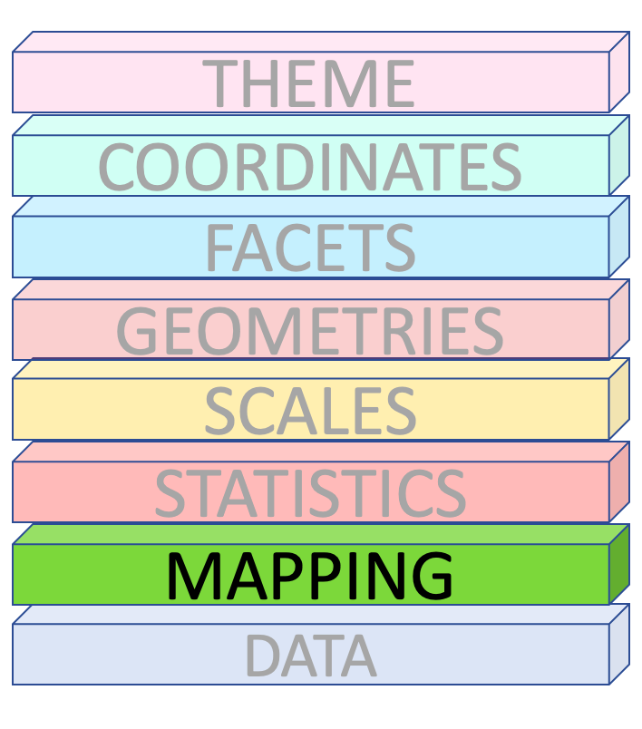
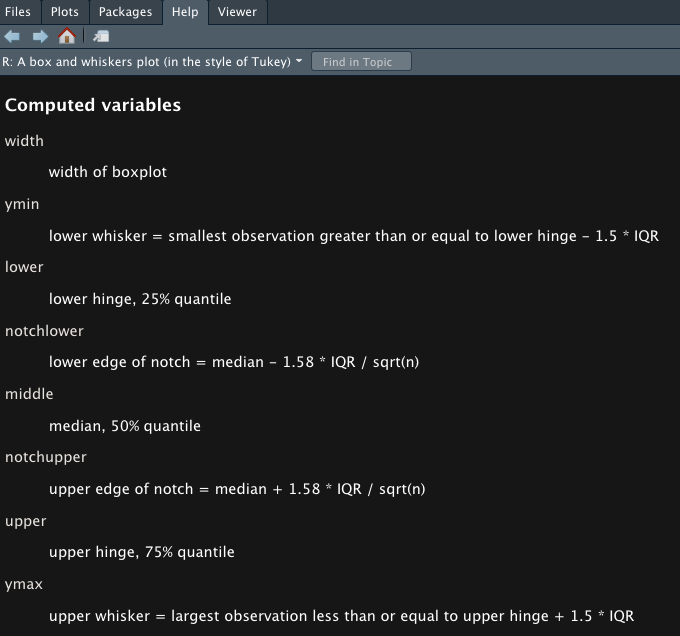
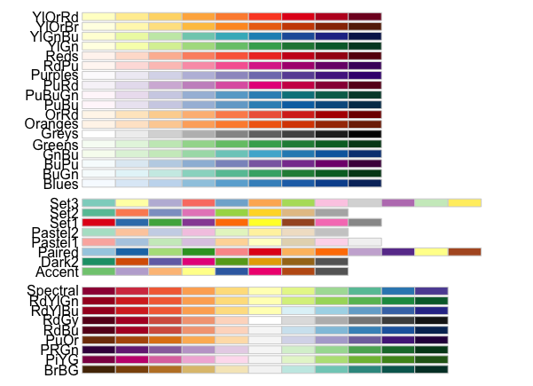

```{r setup, include=FALSE}
library(knitr)
options(htmltools.dir.version = FALSE)
opts_chunk$set(
  warning = FALSE,
  message = FALSE,
  echo = FALSE,
  cache.path = 'cache/',
  fig.align = 'center',
  cache = TRUE
)

library(tidyverse)
library(patchwork)

```
background-image:url('fig/tidyworkflow1.png')
background-position: 60% 80%
background-size: 100%
class: top, center
# Tidy Workflow
---

background-image:url('fig/tidyworkflow2.png')
background-position: 60% 80%
background-size: 100%
class: top, center
# Tidy Workflow
---

background-image:url('fig/tidyworkflow3.png')
background-position: 60% 80%
background-size: 100%
class: top, center
# Tidy Workflow
---
class: inverse

## The Datasaurus Dozen

```{r echo=TRUE, fig.height=4, fig.width=4, cache=TRUE}
library(datasauRus)
library(ggplot2)
library(gganimate)

ggplot(datasaurus_dozen, aes(x=x, y=y))+
  geom_point()+
  theme_minimal() +
  transition_states(dataset, 3, 1) + 
  theme(aspect.ratio = 1)

```

---

## The Datasaurus Dozen

```{r echo=TRUE, fig.height=4, fig.width=4, cache=TRUE, eval = FALSE}
library(datasauRus)
library(ggplot2)
library(gganimate)

ggplot(datasaurus_dozen, aes(x=x, y=y))+
  geom_point()+
  theme_minimal() +
  transition_states(dataset, 3, 1) + 
  theme(aspect.ratio = 1)

```

.pull-left[
```{r echo=FALSE, fig.height=4, fig.width=4, cache=TRUE}
library(datasauRus)
library(ggplot2)
library(gganimate)

ggplot(datasaurus_dozen, aes(x=x, y=y))+
  geom_point()+
  theme_minimal() +
  transition_states(dataset, 3, 1) + 
  theme(aspect.ratio = 1)

```
]
.pull-right[

```{r}
library(datasauRus)
dino <- datasaurus_dozen %>%
  filter(dataset == "dino")
```


Summary statistics | 
-------------------|----
X Mean     | `r round(mean(dino$x),2)`
Y Mean     | `r round(mean(dino$y),2)`
X SD    | `r round(sd(dino$x),2)`
Y SD     | `r round(sd(dino$y),2)`
Corr.    |  `r round(cor(dino$x, dino$y),2)`

]

---

class: inverse, middle, center

# The Grammar of Graphics


---


class: inverse, middle, center

### The Book
# The Grammar of Graphics

```{r   out.width = "35%", echo = FALSE, fig.cap='' }
knitr::include_graphics("fig/6_ggbook.jpg")
```


---

```{r base}
library(palmerpenguins)
data <- penguins %>%
  count(species, name ='Count')
labels <- data$species

data2 <- c(7,12,28,3,41)
```

#### R Base Graphics 

.pull-left[
```{r  fig.height=5}
pie(data$Count,labels, radius = 1, main = "pie(data$Count,labels, radius = 1)")
```

```{r  fig.height=5}
plot(data2,type = "o", main = "plot(data2,type = ''o'')")
```

]
.pull-right[

```{r  fig.height=5}
barplot(data$Count, names.arg = labels, main = "barplot(data$Count, names.arg = labels)")
```

```{r  fig.height=5}
plot(x= penguins$flipper_length_mm,
     y = penguins$body_mass_g, main = "plot(x= penguins$flipper_length_mm,
     y = penguins$body_mass_g)")
```

]
---
class: middle, center
## The Grammar of Graphics

.pull-left[

.pull-left[
Pie Chart
```{r  fig.height=6}
pie(data$Count,labels, radius = 1)
```

Line Chart
```{r  fig.height=6}
plot(data2,type = "o")
```

]
.pull-right[

Bar Chart
```{r  fig.height=6}
barplot(data$Count, names.arg = labels)
```

Scatterplot
```{r  fig.height=6}
plot(x= penguins$flipper_length_mm,
     y = penguins$body_mass_g)
```
]
].pull-right[

```{r   out.height="100%" }
knitr::include_graphics("fig/7_GG_a.png")
```
]

---
## The Grammar of Graphics

.pull-left[
**`penguins` dataset**

Size measurements for adult foraging penguins near Palmer Station, Antarctica
```{r comment=NA}
glimpse(penguins)
```

```{r   out.width = "35%", echo = FALSE, fig.cap='' }
knitr::include_graphics("fig/15_palmerpenguins.png")
```
].pull-right[

```{r   out.width = "100%", echo = FALSE, fig.cap='' }

```
]
---

## The Grammar of Graphics
.pull-left[
```{r fig.height=5, comment=NA}
glimpse(penguins)

penguins %>% ggplot(aes(x =species )) +
  xlab ("Species") +
  theme(text = element_text(size=25))

```
].pull-right[

```{r   out.width = "100%", echo = FALSE, fig.cap='' }

```
]
---

## The Grammar of Graphics
.pull-left[
```{r comment=NA}
glimpse(penguins)
```

**Counts**

```{r comment=NA}
penguins %>%
  count(species, .drop = FALSE)

```
].pull-right[

```{r   out.width = "100%", echo = FALSE, fig.cap='' }

```
]
---

## The Grammar of Graphics
.pull-left[
```{r   out.width = "100%", echo = FALSE, fig.cap='' }

```
].pull-right[

```{r   out.width = "100%", echo = FALSE, fig.cap='' }

```
]
---

## The Grammar of Graphics
.pull-left[

```{r   out.width = "100%", echo = FALSE, fig.cap='' }

```

**Bar Plot**

```{r fig.height= 5}
penguins %>% ggplot()+
  geom_bar(aes(x= species, fill = species)) +
   scale_fill_manual(values = c("darkorange","purple","cyan4"),
                    guide = FALSE) +
    theme(text = element_text(size=25))
```

].pull-right[

```{r   out.width = "100%", echo = FALSE, fig.cap='' }

```
]

---

## The Grammar of Graphics
.pull-left[

```{r comment=NA}
glimpse(penguins)
```

```{r fig.height= 6}
penguins %>% ggplot()+
  geom_bar(aes(x= species, fill = species)) +
   scale_fill_manual(values = c("darkorange","purple","cyan4"),
                    guide = FALSE) + facet_wrap(vars(island), ncol = 1)+
  theme(text = element_text(size=25))
```
].pull-right[

```{r   out.width = "100%", echo = FALSE, fig.cap='' }

```
]
---

## The Grammar of Graphics
.pull-left[
```{r fig.height= 4.5}
penguins %>% ggplot()+
  geom_bar(aes(x= species, fill = species)) +
   scale_fill_manual(values = c("darkorange","purple","cyan4"),
                    guide = FALSE) +
    theme(text = element_text(size=25))
```

].pull-right[

```{r   out.width = "100%", echo = FALSE, fig.cap='' }

```
]
---


## The Grammar of Graphics
.pull-left[
```{r fig.height= 4.5}
penguins %>% ggplot()+
  geom_bar(aes(x= species, fill = species)) +
   scale_fill_manual(values = c("darkorange","purple","cyan4"),
                    guide = FALSE) +
    theme(text = element_text(size=25))
```

```{r fig.height= 4.5}
penguins %>% ggplot()+
  geom_bar(aes(x= species, fill = species)) +
  coord_polar()+
   scale_fill_manual(values = c("darkorange","purple","cyan4"),
                    guide = FALSE) +
    theme(text = element_text(size=25))
```
].pull-right[

```{r   out.width = "100%", echo = FALSE, fig.cap='' }

```
]
---

## The Grammar of Graphics
.pull-left[
```{r fig.height= 4.5}
penguins %>% ggplot()+
  geom_bar(aes(x= species, fill = species)) +
   scale_fill_manual(values = c("darkorange","purple","cyan4"),
                    guide = FALSE) +
    theme(text = element_text(size=25))
```

**Excel Theme**

```{r fig.height= 4.5}
library(ggthemes)
penguins %>% ggplot()+
  geom_bar(aes(x= species, fill = species)) +
   scale_fill_manual(values = c("darkorange","purple","cyan4"),
                    guide = FALSE) +
  theme_excel(base_size = 60) +
  labs(title = "Distribution of penguins", x = "Species" , y = "Counts")
```

].pull-right[

```{r   out.width = "100%", echo = FALSE, fig.cap='' }
knitr::include_graphics("fig/7_GG.png")
```
]
---

class: inverse, middle, center


# The ggplot2 API

```{r   out.width = "40%", echo = FALSE, fig.cap=''}
knitr::include_graphics("fig/ggplot.png")
```
---

class: middle, center

## Which dataset to plot?

```{r   out.width = "40%", echo = FALSE, fig.cap=''}

```


---

.pull-left[
## `palmerpenguins` data

The Palmer Archipelago penguins. Artwork by `@allison_horst`.

```{r   out.width = "100%", echo = FALSE, fig.cap=''}
knitr::include_graphics("fig/17_lter_penguins.png")
```

```{r   out.width = "70%", echo = FALSE, fig.cap=''}
knitr::include_graphics("fig/18_culmen_depth.png")
```
].pull-right[

```{r   out.width = "35%", echo = FALSE, fig.cap='' }
knitr::include_graphics("fig/15_palmerpenguins.png")
```
```{r comment=NA}
head(penguins)
glimpse(penguins)
```
]

---
## Which dataset to plot?


```{r echo=TRUE, eval = FALSE}

ggplot() 
```

```{r fig.height=5}

ggplot(data = penguins) +
  theme(text = element_text(size=14))
```


---
## Which dataset to plot?


```{r echo=TRUE, eval = FALSE}

ggplot(data = penguins) #<< 
```

```{r fig.height=5}

ggplot(data = penguins) +
  theme(text = element_text(size=14))
```


---

class: middle, center

## Mapping 

```{r   out.width = "40%", echo = FALSE, fig.cap=''}

```


---
## Which columns to use for x and y?


```{r echo=TRUE, eval = FALSE}

ggplot(data = penguins,
       mapping = aes(x = flipper_length_mm, #<<
                     y = body_mass_g))  #<<
```

```{r  fig.height=5}

ggplot(data = penguins,
       mapping = aes(x = flipper_length_mm,
                     y = body_mass_g)) +
  theme(text = element_text(size=14))
```


---
class: middle, center

## Geometries

```{r   out.width = "40%", echo = FALSE, fig.cap=''}

```


---
## How to draw the plot?


```{r echo=TRUE, eval = FALSE}

ggplot(data = penguins,
       mapping = aes(x = flipper_length_mm,
                     y = body_mass_g)) +
  geom_point()  #<<
```

```{r fig.height=5}

ggplot(data = penguins,
       mapping = aes(x = flipper_length_mm,
                     y = body_mass_g)) +
  geom_point() +
  theme(text = element_text(size=14))
```

---


class: middle, center

## Data, Mapping and Geometries

```{r   out.width = "40%", echo = FALSE, fig.cap=''}

```
---
## How to draw the plot?


```{r echo=TRUE, eval = FALSE}

ggplot(data = penguins) +
  geom_point(mapping = aes(x = flipper_length_mm,   #<<
                           y = body_mass_g))  #<<
```

```{r fig.height=5, message=FALSE, warning=FALSE, results='hide'}

ggplot(data = penguins) +
  geom_point(mapping = aes(x = flipper_length_mm,   #<<
                           y = body_mass_g))+
  theme(text = element_text(size=14))
```

---

## How to draw the plot?


```{r echo=TRUE, eval = FALSE}

ggplot() +
  geom_point(mapping = aes(x = flipper_length_mm, 
                           y = body_mass_g),
             data = penguins) #<< 
```

```{r fig.height=5, message=FALSE, warning=FALSE, results='hide'}

ggplot() +
  geom_point(mapping = aes(x = flipper_length_mm, 
                           y = body_mass_g),
             data = penguins)+
  theme(text = element_text(size=14))
```
---

## Mapping Colours


```{r echo=TRUE, eval = FALSE}

ggplot(penguins) +
  geom_point( aes(x = flipper_length_mm,
                  y = body_mass_g,
                  color = species, #<<
                  shape = species)) #<<
```

```{r fig.height=5, message=FALSE, warning=FALSE, results='hide'}

ggplot(penguins) +
  geom_point( aes(x = flipper_length_mm,
                  y = body_mass_g,
                  color = species, #<<
                  shape = species)) +
  theme(text = element_text(size=14))
```


---
## Mapping Colours


```{r echo=TRUE, eval = FALSE}

ggplot(penguins) +
  geom_point( aes(x = flipper_length_mm,
                  y = body_mass_g,
                  colour = flipper_length_mm < 205)) #<<
```

```{r fig.height=5, message=FALSE, warning=FALSE, results='hide'}

ggplot(penguins) +
  geom_point( aes(x = flipper_length_mm,
                  y = body_mass_g,
                  colour = flipper_length_mm < 205))+
  theme(text = element_text(size=14))
```


---
## Setting Colours


```{r echo=TRUE, eval = FALSE}

ggplot(penguins) +
  geom_point( aes(x = flipper_length_mm,
                  y = body_mass_g),
                  colour = 'purple') #<<
```

```{r fig.height=5, message=FALSE, warning=FALSE, results='hide'}

ggplot(penguins) +
  geom_point( aes(x = flipper_length_mm,
                  y = body_mass_g),
                  colour = 'purple')+
  theme(text = element_text(size=14))
```

---

.pull-left[
```{r echo=TRUE, eval = FALSE}

ggplot(penguins, 
       aes(x = flipper_length_mm,
           y = body_mass_g,
           color = species, 
           shape = species)) +
  geom_point() +
  geom_density_2d() #<<

```

- Syntax starts with `geom_*`.
- eg: geom_histogram(), geom_bar(), geom_boxplot().
- Each shape has its own specific aesthetics arguments.

].pull-right[
```{r fig.height=7, message=FALSE, warning=FALSE, results='hide'}

ggplot(penguins, 
       aes(x = flipper_length_mm,
           y = body_mass_g,
           color = species, 
           shape = species)) +
  geom_point() +
  geom_density_2d()  +
  theme(text = element_text(size=14))
```

]
--

.pull-left[

```{r echo=TRUE, eval = FALSE}
ggplot(penguins) +
  geom_histogram(
    aes(x = flipper_length_mm)) #<<
```
].pull-right[

```{r fig.height=4}
ggplot(penguins) +
  geom_histogram(aes(x = flipper_length_mm))+
    theme(text = element_text(size=14))
```
]
---

Each shape has its own specific aesthetics arguments.

`?geom_point`

```{r   out.width = "90%", echo = FALSE, fig.cap=''}
knitr::include_graphics("fig/22_help.png")
```


---
class: middle, center

## Statistics

```{r   out.width = "40%", echo = FALSE, fig.cap=''}
knitr::include_graphics("fig/21_statistics.png")
```

---
## `geom_bar()` uses `stat_count()` by default

```{r echo=TRUE, eval = FALSE}
ggplot(penguins) +
  geom_bar(aes(x = species)) 
```

```{r fig.height=6}
ggplot(penguins) +
  geom_bar(aes(x = species))+
    theme(text = element_text(size=14))
```

---
## `after_stat()`

```{r echo=TRUE, eval = FALSE}
ggplot(penguins) +
  geom_bar(aes(x = species,
               y = after_stat(100*count/ sum  (count)) )) #<<
```

```{r fig.height=6}
ggplot(penguins) +
  geom_bar(aes(x = species,
               y = after_stat(100*count/ sum  (count)) )) +
    theme(text = element_text(size=14))
```

---

## Old version of ggplot2

```{r echo=TRUE, eval = FALSE}
ggplot(penguins) +
  geom_bar(aes(x = species,
               y = 100*(..count..)/sum(..count..) ))#<<
```

```{r fig.height=6}
ggplot(penguins) +
  geom_bar(aes(x = species,
               y = 100*(..count..)/sum(..count..) )) +
    theme(text = element_text(size=14))
```
---
## `after_stat()` (ggplot2 3.0.0)

```{r echo=TRUE, eval = FALSE}
ggplot(penguins) +
  geom_bar(aes(x = species,
               y = after_stat(100*count/ sum  (count)) )) #<<
```

```{r fig.height=6}
ggplot(penguins) +
  geom_bar(aes(x = species,
               y = after_stat(100*count/ sum  (count)) )) +
    theme(text = element_text(size=14))
```

---
- There are two ways to use statistical functions. 

.pull-left[
**define `stat_*()` function and `geom` argument inside that function**

```{r echo=TRUE, fig.height= 5 }
ggplot(penguins,
       aes(x = flipper_length_mm,
           y = body_mass_g)) +
  stat_summary( #<<
    geom ="point", #<<
    fun.y ="mean",
    colour ="red")

```

].pull-right[
**define `geom_*()` function and `stat` argument inside that function**

```{r echo=TRUE, fig.height= 5}
ggplot(penguins,
       aes(x = flipper_length_mm,
           y = body_mass_g)) +
  geom_point( #<<
    stat ="summary", #<<
    fun.y ="mean",
    colour ="red")

```

]

---

Statistics  | Geometries
------------|----------
`stat_count` | `geom_bar`
`stat_boxplot` | `geom_boxplot`
`stat_identity` | `geom_col`
`stat_bin`  | `geom_bar`, `geom_histogram`
`stat_density` | `geom_density`

--

.pull-left[

```{r   out.width = "100%", echo = FALSE, fig.cap='?geom_boxplot'}

```
].pull-right[

```{r   out.width = "120%", echo = FALSE, fig.cap='?geom_bar'}

```
]
---
class: middle, center

## Scales

```{r   out.width = "40%", echo = FALSE, fig.cap=''}
knitr::include_graphics("fig/25_scale.png")
```
---

## Scales

```{r echo=TRUE, eval = FALSE}

ggplot(penguins) +
  geom_point( aes(x = flipper_length_mm,
                  y = body_mass_g,
                  color = species, #<<
                  shape = species)) #<<
```

```{r fig.height=5, message=FALSE, warning=FALSE, results='hide'}

ggplot(penguins) +
  geom_point( aes(x = flipper_length_mm,
                  y = body_mass_g,
                  color = species, #<<
                  shape = species)) +
  theme(text = element_text(size=14))
```

---

## Scales

```{r echo=TRUE, eval = FALSE}

ggplot(penguins) +
  geom_point( aes(x = flipper_length_mm,
                  y = body_mass_g,
                  color = species, #<<
                  shape = island)) #<<
```

```{r fig.height=5, message=FALSE, warning=FALSE, results='hide'}

ggplot(penguins) +
  geom_point( aes(x = flipper_length_mm,
                  y = body_mass_g,
                  color = species, #<<
                  shape = island)) +
  theme(text = element_text(size=14))
```
---


## Scales

```{r echo=TRUE, eval = FALSE}

ggplot(penguins) +
  geom_point( aes(x = flipper_length_mm,
                  y = body_mass_g,
                  color = bill_length_mm, #<<
                  shape = island)) #<<
```

```{r fig.height=5, message=FALSE, warning=FALSE, results='hide'}

ggplot(penguins) +
  geom_point( aes(x = flipper_length_mm,
                  y = body_mass_g,
                  color = bill_length_mm, #<<
                  shape = island)) +
  theme(text = element_text(size=14))
```


---


## Scales

```{r echo=TRUE, eval = FALSE}

ggplot(penguins) +
  geom_point(aes(x = flipper_length_mm,
                  y = body_mass_g,
                  color = species)) +
  scale_color_brewer(type = 'qual', #<<
                     palette =  'Dark2')#<<
```

```{r fig.height=5, message=FALSE, warning=FALSE, results='hide'}

ggplot(penguins) +
  geom_point(aes(x = flipper_length_mm,
                  y = body_mass_g,
                  color = species)) +
  scale_color_brewer(type = 'qual', #<<
                     palette =  'Dark2') +
  theme(text = element_text(size=14))
```

--

- `scale_<aesthetic>_<type>`

---

`RColorBrewer::display.brewer.all()`


```{r   out.width = "120%", echo = FALSE, fig.cap=''}

```

---

```{r echo=TRUE, eval = FALSE}

ggplot(penguins) +
  geom_point(aes(x = flipper_length_mm,
                 y = body_mass_g,
                 color = species)) + #<<
  scale_color_viridis_d()#<<
```

```{r fig.height=5, message=FALSE, warning=FALSE, results='hide'}

ggplot(penguins) +
  geom_point(aes(x = flipper_length_mm,
                 y = body_mass_g,
                 color = species)) +
  scale_color_viridis_d() +
  theme(text = element_text(size=14))
```
--

- `viridis` and `RColorBrewer` provide different color scales that are robust to color-blindness.
--

- For details and an interactive palette selection tools see http://colorbrewer.org

---
```{r echo=TRUE, eval = FALSE}

ggplot(penguins) +
  geom_point(aes(x = flipper_length_mm,
                 y = body_mass_g,
                 color = species,
                 shape = species,
                 alpha = species)) +
  scale_x_continuous( breaks = c(170,200,230)) + #<<
  scale_y_log10() + #<<
  scale_colour_viridis_d(direction = -1, option= 'plasma') + #<<
  scale_shape_manual( values = c(17,18,19)) + #<<
  scale_alpha_manual( values = c( "Adelie" = 0.6, "Gentoo" = 0.5, ##<<
                                  "Chinstrap" = 0.7)) #<<
```

```{r fig.height= 5, message=FALSE, warning=FALSE, results='hide'}

ggplot(penguins) +
  geom_point(aes(x = flipper_length_mm,
                 y = body_mass_g,
                 color = species,
                 shape = species,
                 alpha = species)) +
  scale_x_continuous( breaks = c(170,200,230)) + #<<
  scale_y_log10() + #<<
  scale_colour_viridis_d(direction = -1, option= 'plasma') + #<<
  scale_shape_manual( values = c(17,18,19)) + #<<
  scale_alpha_manual( values = c("Adelie" = 0.6, "Gentoo" = 0.5, "Chinstrap" = 0.7)) +
  theme(aspect.ratio = 1, text = element_text(size=14))
```


---
class: middle, center

## Facets

```{r   out.width = "40%", echo = FALSE, fig.cap=''}
knitr::include_graphics("fig/28_facets.png")
```
---
## `facet_wrap()`

```{r echo=TRUE, eval = FALSE}

ggplot(penguins) +
  geom_point(aes(
    x = flipper_length_mm,
    y = body_mass_g)) + 
  facet_wrap(vars(species)) #<<
```


```{r fig.height=5, message=FALSE, warning=FALSE, results='hide'}

ggplot(penguins) +
  geom_point(aes(
    x = flipper_length_mm,
    y = body_mass_g)) + 
  facet_wrap(vars(species))+
  theme(text = element_text(size=14))
```

---
## `facet_wrap()`

```{r echo=TRUE, eval = FALSE}

ggplot(penguins) +
  geom_point(aes(
    x = flipper_length_mm,
    y = body_mass_g)) + 
  facet_wrap(vars(species),
             scales = "free_x") #<<
```


```{r fig.height=5, message=FALSE, warning=FALSE, results='hide'}

ggplot(penguins) +
  geom_point(aes(
    x = flipper_length_mm,
    y = body_mass_g)) + 
  facet_wrap(vars(species),
             scales = "free_x")+
  theme(text = element_text(size=14))
```

---

## `facet_grid()`

```{r echo=TRUE, eval = FALSE}

ggplot(penguins) +
  geom_point(aes(
    x = flipper_length_mm,
    y = body_mass_g)) + 
  facet_grid( vars(species), vars(sex)) #<<
```


```{r fig.height=5, message=FALSE, warning=FALSE, results='hide'}

ggplot(penguins) +
  geom_point(aes(
    x = flipper_length_mm,
    y = body_mass_g)) + 
  facet_grid( vars(species), vars(sex))+
  theme(text = element_text(size=14))
```

---
class: middle, center

## Coordinates

```{r   out.width = "40%", echo = FALSE, fig.cap=''}

```

---
## Coordinates

```{r echo=TRUE, eval = FALSE}

ggplot(penguins) +
  geom_bar(aes(x= species, fill = species)) 
```


```{r fig.height=5, message=FALSE, warning=FALSE, results='hide'}

ggplot(penguins) +
  geom_bar(aes(x= species, fill = species)) +
  theme(text = element_text(size=14))
```
---

```{r echo=TRUE, eval = FALSE}

ggplot(penguins) +
  geom_bar(aes(x= species, fill = species)) +
  coord_flip() #<<
```


```{r fig.height=5, message=FALSE, warning=FALSE, results='hide'}

ggplot(penguins) +
  geom_bar(aes(x= species, fill = species)) +
    coord_flip()+
  theme(text = element_text(size=14))
```

--


- There are two types of coordinate systems:  
   - Linear coordinate systems
   - Non-linear coordinate systems 
--

- Linear coordinate systems : `coord_cartesian()`, `coord_flip()`, `coord_fixed()`
--

- Non-linear coordinate systems : eg : `coord_map()`, `coord_quickmap()`, `coord_sf()`, `coord_polar()`, `coord_trans()`
---


## Coordinates

```{r echo=TRUE, eval = FALSE}

ggplot(penguins) +
  geom_bar(aes(x= species, fill = species)) +
  coord_polar() #<<
```


```{r fig.height=5, message=FALSE, warning=FALSE, results='hide'}

ggplot(penguins) +
  geom_bar(aes(x= species, fill = species)) +
  coord_polar() +
  theme(text = element_text(size=14))
```
---


## Coordinates

```{r echo=TRUE, eval = FALSE}

ggplot(penguins) +
  geom_bar(aes(x= species, fill = species)) +
  coord_polar(theta = "y") #<<
```


```{r fig.height=5, message=FALSE, warning=FALSE, results='hide'}

ggplot(penguins) +
  geom_bar(aes(x= species, fill = species)) +
  coord_polar(theta = "y") +
  theme(text = element_text(size=14))
```
---
#### Zooming into a plot 

```{r echo=TRUE, eval = FALSE}

ggplot(penguins) +
  geom_bar(aes(x= year, fill = species))
```


```{r fig.height=5, message=FALSE, warning=FALSE, results='hide'}

ggplot(penguins) +
  geom_bar(aes(x= year, fill = species)) +
  theme(text = element_text(size=14))
```

---

#### Zooming into a plot with `scale`

```{r echo=TRUE, eval = FALSE}

ggplot(penguins) +
  geom_bar(aes(x= year, fill = species)) +
  scale_y_continuous(limits = c(0,115)) #<<
```


```{r fig.height=4, message=FALSE, warning=FALSE, results='hide'}

ggplot(penguins) +
  geom_bar(aes(x= year, fill = species)) +
  scale_y_continuous(limits = c(0,105)) + 
  theme(text = element_text(size=14))
```
--

```{r   out.width = "15%", echo = FALSE, fig.cap=''}
knitr::include_graphics("fig/30_caution.png")
```

**<span style="color:red">When zooming with `scale`, any data outside the limits is thrown away</span>**


---

#### Proper zoom with `coord_cartesian()`

```{r echo=TRUE, eval = FALSE}

ggplot(penguins) +
  geom_bar(aes(x= year, fill = species)) +
  coord_cartesian(ylim = c(0,115)) #<<
```


```{r fig.height=4, message=FALSE, warning=FALSE, results='hide'}

ggplot(penguins) +
  geom_bar(aes(x= year, fill = species)) +
  coord_cartesian(ylim = c(0,115)) + 
  theme(text = element_text(size=14))
```
--

```{r   out.width = "15%", echo = FALSE, fig.cap=''}

```

**<span style="color:green">Zooming with `coord` is like looking at the plot under a magnifying glass.</span>**

---
class: middle, center

## Themes

```{r   out.width = "40%", echo = FALSE, fig.cap=''}
knitr::include_graphics("fig/32_themes.png")
```
---
These are complete themes which control all **non-data** display. 

.pull-left[
```{r echo=TRUE, eval = FALSE}
ggplot(data = penguins,
       aes(x = flipper_length_mm,
           y = body_mass_g)) +
  geom_point(aes(
    color = species,
    shape = species),
    size = 3,
    alpha = 0.8) +
  theme_minimal() #<<
```

].pull-right[

```{r fig.height=5, message=FALSE, warning=FALSE, results='hide'}

ggplot(data = penguins,
       aes(x = flipper_length_mm,
           y = body_mass_g)) +
  geom_point(aes(
    color = species,
    shape = species),
    size = 3,
    alpha = 0.8) +
  theme_minimal()
```
]

--
.pull-left[
```{r echo=TRUE, eval = FALSE}
ggplot(data = penguins,
       aes(x = flipper_length_mm,
           y = body_mass_g)) +
  geom_point(aes(
    color = species,
    shape = species),
    size = 3,
    alpha = 0.8) +
  theme_dark() #<<
```
].pull-right[
```{r fig.height=5, message=FALSE, warning=FALSE, results='hide'}

ggplot(data = penguins,
       aes(x = flipper_length_mm,
           y = body_mass_g)) +
  geom_point(aes(
    color = species,
    shape = species),
    size = 3,
    alpha = 0.8) +
  theme_dark()
```
]

---
Create custom themes in ggplot.

.pull-left[
```{r echo=TRUE, eval = FALSE}
ggplot(penguins,
       aes(x = flipper_length_mm,
           y = body_mass_g)) +
  geom_point(aes(color = species,
                 shape = species),
             size = 3, alpha = 0.8) +
  scale_color_viridis_d() +
  theme_minimal() + #<<
  labs( #<<
    title = "Penguin size, Palmer Station LTER", #<<
    subtitle = "Flipper length and body mass for Adelie, Chinstrap and Gentoo Penguins", #<<
    x = "Flipper length (mm)", #<<
    y = "Body mass (g)", #<<
    color = "Penguin species", #<<
    shape = "Penguin species") + #<<
  theme( #<<
    aspect.ratio = 1, #<<
    legend.position = c(0.2, 0.7), #<<
    legend.background =  #<<
      element_rect( #<<
        fill = "white", #<<
        color = NA), #<<
    plot.title.position = "plot", #<<
    plot.caption = #<<
      element_text( #<<
        hjust = 0, #<<
        face= "italic"), #<<
    plot.caption.position = "plot") #<<
```

].pull-right[

```{r fig.height=4, message=FALSE, warning=FALSE, results='hide'}

ggplot(penguins,
       aes(x = flipper_length_mm,
           y = body_mass_g)) +
  geom_point(aes(color = species,
                 shape = species),
             size = 3, alpha = 0.8) +
  scale_color_viridis_d()
```

```{r fig.height=6, message=FALSE, warning=FALSE, results='hide'}

ggplot(penguins,
       aes(x = flipper_length_mm,
           y = body_mass_g)) +
  geom_point(aes(color = species,
                 shape = species),
             size = 3, alpha = 0.8) +
  scale_color_viridis_d() +
  theme_minimal() + #<<
  labs( #<<
    title = "Penguin size, Palmer Station LTER", #<<
    subtitle = "Flipper length and body mass for Adelie, Chinstrap and Gentoo Penguins", #<<
    x = "Flipper length (mm)", #<<
    y = "Body mass (g)", #<<
    color = "Penguin species", #<<
    shape = "Penguin species") + #<<
  theme( #<<
    aspect.ratio = 1, #<<
    legend.position = c(0.2, 0.7), #<<
    legend.background =  #<<
      element_rect( #<<
        fill = "white", #<<
        color = NA), #<<
    plot.title.position = "plot", #<<
    plot.caption = #<<
      element_text( #<<
        hjust = 0, #<<
        face= "italic"), #<<
    plot.caption.position = "plot")
```
]


---

background-image:url('fig/33_gg.png')
background-position: 50% 50%
background-size: 100%
class: top, center
---
class: inverse, middle, center

# ggplot2 extensions
---
background-image:url('fig/34_extension.png')
background-position: 50% 90%
background-size: 100%
class: top, center
### ggplot2 extensions: `https://exts.ggplot2.tidyverse.org/`


---

class:  middle, center

# 1. `patchwork` for plot composition

```{r   out.width = "40%", echo = FALSE, fig.cap=''}
knitr::include_graphics("fig/35_patchwork.png")
```
---
```{r echo = TRUE}
p1 <-  ggplot(data = penguins, aes(x = flipper_length_mm, y = body_mass_g)) +
  geom_point(aes(color = species, shape = species), size = 2) +
  scale_color_manual(values = c("darkorange","darkorchid","cyan4")) +
  theme(aspect.ratio = 1)

p2 <-  ggplot(data = penguins, aes(x = bill_length_mm, y = bill_depth_mm)) +
  geom_point(aes(color = species, shape = species), size = 2)  +
  scale_color_manual(values = c("darkorange","darkorchid","cyan4")) +
    theme(aspect.ratio = 1)

p3 <- ggplot(data = penguins, aes(x = flipper_length_mm)) +
  geom_histogram(aes(fill = species), alpha = 0.5, position = "identity") +
  scale_fill_manual(values = c("darkorange","darkorchid","cyan4"))
```

---

```{r echo=TRUE , fig.height=10, fig.width=12}
library(patchwork)
p1 + p3 
```

---


```{r echo=TRUE, fig.height= 7 }
library(patchwork)
(p1 | p2) / p3
```
---
```{r echo=TRUE, fig.height=6}
library(patchwork)
p <- (p1 | p2) / p3

p + plot_layout(guide = 'collect') #<<
```
---
```{r echo=TRUE, fig.height=5}
library(patchwork)
p <- (p1 | p2) / p3

p +
  plot_layout(guide = 'collect') +
  plot_annotation(
    title = 'Size measurements for adult foraging penguins near Palmer Station, Antarctica', #<<
    tag_levels = 'A') #<<
```
---
```{r echo=TRUE, fig.height=5}
library(patchwork)
p <- (p1 | p2) / p3

p & 
  theme(legend.position =  'none') #<<
```

---


class:  middle, center

# 2. `plotly` 

An R package for creating **interactive web graphics** via the open source JavaScript graphing library plotly.js.


---

```{r echo=TRUE }
p1 ## a ggplot object

```

---

```{r echo=TRUE, out.width="100%"}
plotly::ggplotly(p1)
```

---
class:  middle, center

# 3. `GGally` 


---

```{r echo=TRUE, fig.height=6, fig.asp=1}
GGally::ggpairs(penguins[, 1:5], aes(color = species, fill = species))+
  scale_color_viridis_d() +
  scale_fill_viridis_d()
```

---
class:  middle, center

# 4. `gganimate` 

```{r   out.width = "40%", echo = FALSE, fig.cap=''}
knitr::include_graphics("fig/36_gganimate.png")
```
---

```{r echo=TRUE, fig.height=5}
library("ggplot2")
library("dlstats")

data <- cran_stats("ggplot2")

p <- ggplot(data, aes(x= end, y = downloads)) +
  geom_line() +
  labs(title = "Download stats of ggplot2 package", x = "Time", y = "Downloads")

p

```

---
```{r echo=TRUE, fig.height=5}
library(gganimate)
p + 
  transition_reveal(along = end) #<<
```

---

```{r echo=TRUE, fig.height=3, cache=FALSE, eval=FALSE}
p <- ggplot(penguins, aes(flipper_length_mm, body_mass_g , color = species)) +
  geom_point() + scale_color_viridis_d() +
  labs(title = "Measurements of penguins {closest_state}")+
  transition_states(states = year) + enter_grow() + exit_fade() #<<
p

```


---

class:  middle, center

# 5. `ggrepel` 

```{r   out.width = "40%", echo = FALSE, fig.cap=''}
knitr::include_graphics("fig/37_ggrepel.png")
```
---
### Text annotation

```{r echo=TRUE, fig.height=5}
df <-  penguins %>%
  filter( flipper_length_mm > 225 )

ggplot(penguins, aes(x=flipper_length_mm, y= body_mass_g))+
  geom_point()+
  theme(aspect.ratio = 1) + 
  geom_text(data= df,  #<<
            aes(x=flipper_length_mm, y= body_mass_g, label= island)) #<<

```
---

### Text annotation

```{r echo=TRUE, fig.height=5}
ggplot(penguins, aes(x=flipper_length_mm, y= body_mass_g))+
  geom_point()+
  theme(aspect.ratio = 1) + 
  ggrepel::geom_text_repel(data= df,  #<<
            aes(x=flipper_length_mm, y= body_mass_g, label= island)) #<<
```

---
class:  middle, center

# 6. `ggforce` 

```{r   out.width = "40%", echo = FALSE, fig.cap=''}
knitr::include_graphics("fig/38_ggforce.jpeg")
```
---


```{r echo=TRUE, fig.height=5}
library(ggforce)

penguins <- penguins %>% drop_na()
p <- ggplot(penguins, aes(x=flipper_length_mm, y= body_mass_g))+
  geom_mark_ellipse(aes( #<<
    filter = species == "Gentoo", #<<
    label = 'Gentoo penguins'), #<<
    description = 'Palmer Station Antarctica LTER and K. Gorman. 2020.') + #<<
  geom_point() 

p
```

---

```{r echo = TRUE, fig.height= 7}

library(ggforce)
ggplot(penguins, aes(x=flipper_length_mm, y= body_mass_g, color = species)) +
    geom_point() +
  scale_color_viridis_d() +
    facet_zoom(x = species == "Gentoo") 
```


---

class: inverse, middle, center

# Thank you

Slides available at:
```{r}

icon::fa("globe")
```
prital.netlify.app

```{r}
icon::fa("github")
icon::fa("twitter")

```
pridiltal

# Acknowledgements:

Hadley Wickham, Thomas Lin Pedersen and ggplot2 development team

## Key References 

- ggplot2: Elegant Graphics for Data Analysis https://ggplot2-book.org/
- ggplot2 workshop by Thomas Lin Pedersen https://www.youtube.com/watch?v=h29g21z0a68 

This work is licensed under a Creative Commons Attribution-ShareAlike 4.0 International License.