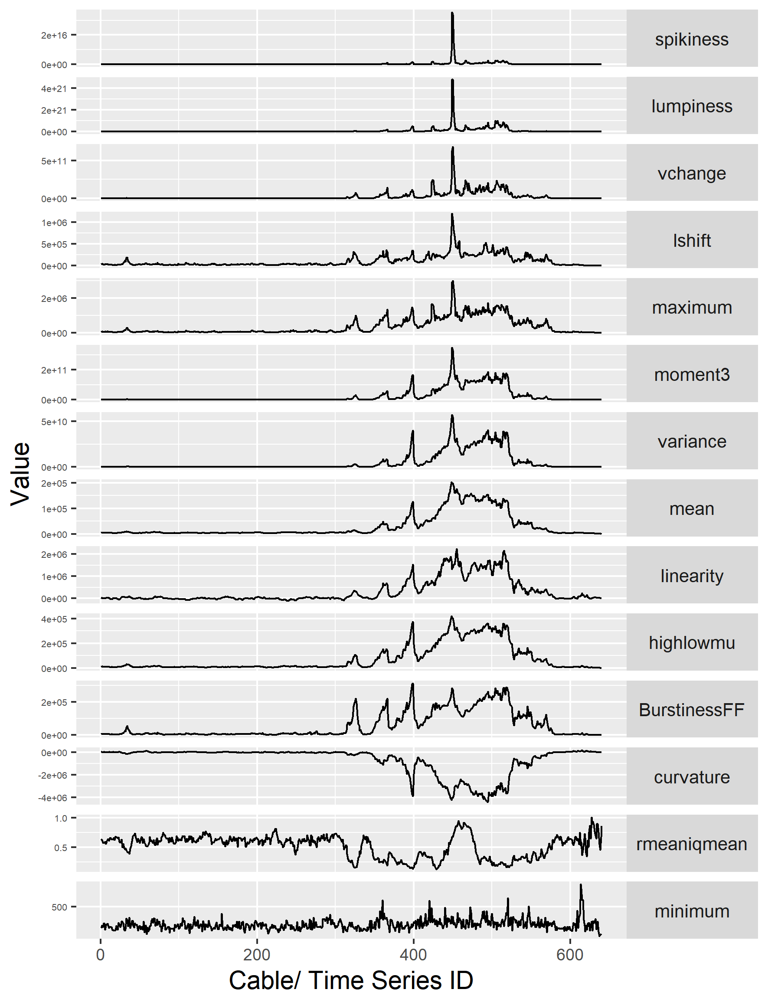
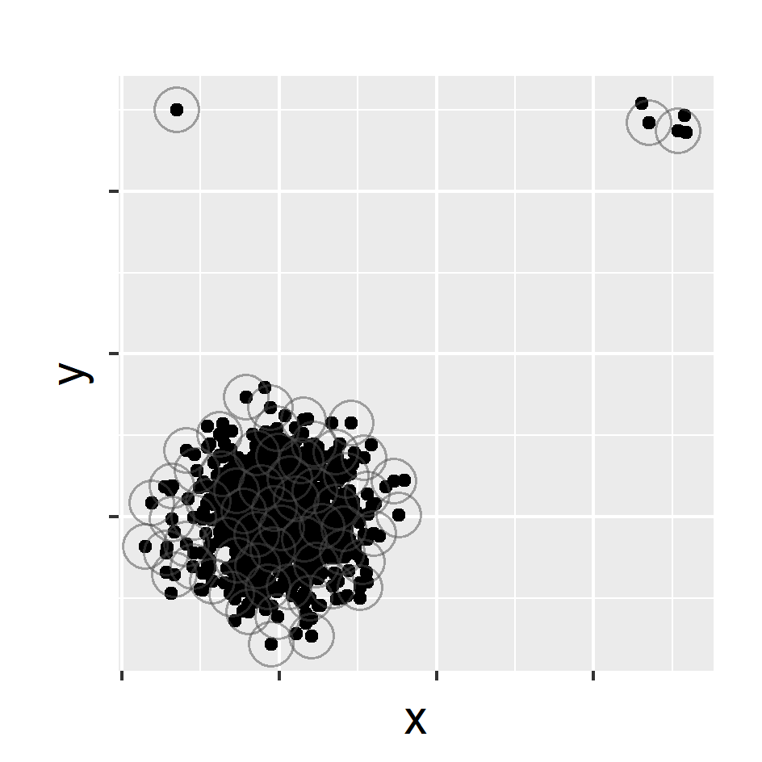
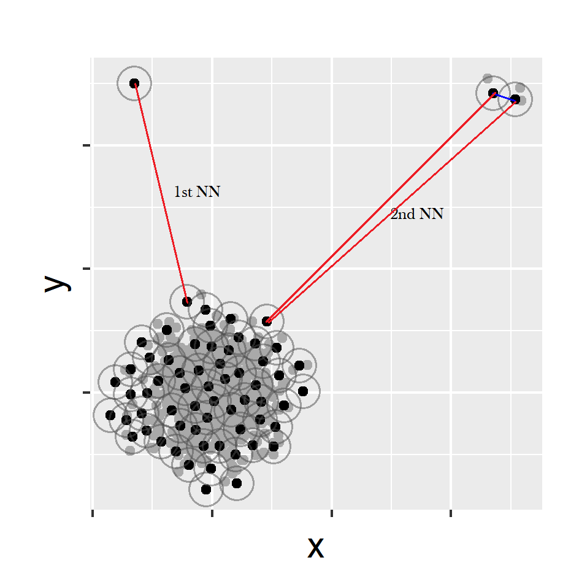
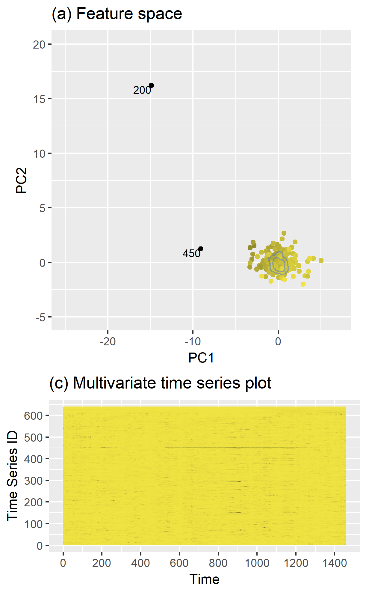

```{r setup, include=FALSE}
library(knitr)
options(htmltools.dir.version = FALSE)
opts_chunk$set(
  warning = FALSE,
  message = FALSE,
  echo = FALSE,
  fig.path = 'figure/',
  cache.path = 'cache/',
  fig.align = 'center',
  fig.show = 'hold',
  cache = FALSE,
  external = TRUE,
  dev = "pdf",
  fig.height = 6,
  fig.width = 10,
  out.width = "0.8\\textwidth"
)
read_chunk('src/main.R')
library(tidyverse)
library(gridExtra)
library(ggpubr)
# install.packages("devtools")
# devtools::install_github("pridiltal/oddstream")
library(oddstream)
library(animation)
library(icon)
```


background-image: url(https://raw.githubusercontent.com/pridiltal/pritalks/master/USER2018/USER2018%20talk/fig/2_application.png?token=ATXvCrnMUdIGRrbTsO5fn2Y6zG4-0Uvtks5bTMsLwA%3D%3D)
background-position: 50% 50%
background-size: 100%
class: right, top

## Motivation

---
class: middle, center

```{r   echo=FALSE, out.width = "100%"}
knitr::include_graphics("fig/13_logo2.png")
```

---


### Feature Based Representation of Time series
.pull-left[
- Mean   
- Variance  
- Changing variance in remainder 
- Level shift using rolling window   
- Variance change  
- Strength of linearity 
- Strength of curvature  
 ]

.pull-right[
- Strength of spikiness  
- Burstiness of time series (Fano Factor)  
- Minimum  
- Maximum  
- The ratio between 50% trimmed mean and the arithmetic mean
- Moment 
- Ratio of means of data that is below and above the global mean  

]
---
class:  top
### Feature Based Representation of Time series
    `devtools::install_github("pridiltal/oddstream")`
    `tsfeatures <- oddstream::extract_tsfeatures(train_data)`
.pull-left[


```{r   echo=FALSE, out.width = "100%", fig_align = 'bottom'}
knitr::include_graphics("fig/3_batch.png")
```


```{r  out.width = "30%", echo=FALSE}
knitr::include_graphics("fig/oddstream1.png")
```
<span style="color:blue">O</span>utlier <span style="color:blue">D</span>etection in <span style="color:blue">D</span>ata <span style="color:blue">STREAM</span>s

]
.pull-right[
```{r  echo=FALSE, out.width = "100%",}

```
]

---
class:  top
### Feature Based Representation of Time series
    `devtools::install_github("pridiltal/oddstream")` 
    `tsfeatures <- oddstream::extract_tsfeatures(train_data)`
.pull-left[


```{r   echo=FALSE, out.width = "100%", fig_align = 'bottom'}
knitr::include_graphics("fig/3_batch.png")
```

```{r  out.width = "30%", echo=FALSE}
knitr::include_graphics("fig/oddstream1.png")
```
<span style="color:blue">O</span>utlier <span style="color:blue">D</span>etection in <span style="color:blue">D</span>ata <span style="color:blue">STREAM</span>s
]
.pull-right[
```{r  echo=FALSE, out.width = "100%",}
knitr::include_graphics("fig/5_high_typical.gif")
```
]

---


### Main Contributions
- Propose a framework that provides early detection of anomalies within a large collection of streaming time series data
--

- Propose an algorithm that adapts to nonstationarity (concept drift)

--

### Main Assumptions
- We define an anomaly as an observation that is very unlikely given the recent distribution of a given system

--
- A representative data set of the system's typical behavior is available to define the model for the typical behavior of the system. 


--

### Proposed Algorithm

- Off-line Phase: Building a model of a system's typical behaviour; (similar to Clifton, Hugueny & Tarassenko, 2011)
--

- On-line Phase: Testing newly arrived data using the boundary


---
class: top
### Dimension Reduction for Time Series 

.pull-left[
`load(train_data)`
```{r   echo=FALSE, out.width = "90%", fig_align = 'bottom'}
knitr::include_graphics("fig/4_typical.png")
```
]
--
.pull-right[
`tsfeatures <- oddstream::extract_tsfeatures(train_data)`
```{r  echo=FALSE, out.width = "60%",}
knitr::include_graphics("fig/5_high_typical.gif")
```
]

--

`pc<- oddstream::get_pc_space(tsfeatures)` <br/>
`oddstream::plotpc(pc$pcnorm)` 
```{r  echo=FALSE, out.width = "25%",}
knitr::include_graphics("fig/6_typicalfeature.png")
```
First two PCs explain 85% of variation


---

### Anomalous threshold calculation 

- Estimate the probability density function of the 2D PC space $\longrightarrow$ Kernel density estimation
--

- Draw a large number N of extremes $(arg min_{x\in X}[f_{2}(x)])$ from the estimated probability density function
--

- Define a $\Psi$-transform space, using the $\Psi$-transformation defined by (Clifton et al., 2011)

```{r   echo=FALSE, out.width = "50%"}
knitr::include_graphics("fig/10_psitrans.png")
```

- $\Psi$-transform maps the density values back into space into which a Gumbel distribution can be fitted.
--

- Anomalous threshold calculation $\longrightarrow$ extreme value theory


---

class: center, top
`oddstream::find_odd_streams(train_data, test_stream)`
```{r   echo=FALSE, out.width = "50%"}
knitr::include_graphics("fig/18_oddstream_mvtsplot.gif")
```
.pull-left[
```{r  echo=FALSE, out.width = "100%", fig_align = 'top'}
knitr::include_graphics("fig/16_oddstream_out_loc.gif")
```
]
.pull-right[
```{r  echo=FALSE, out.width = "100%", fig_align = 'top'}
knitr::include_graphics("fig/17_oddstream_pcplot.gif")
```
]
---

class:  center, middle, inverse


# Anomaly Detection with <br/>  <span style="color:#ff08ac"> Non-stationarity </span>


---
#### Anomaly detection with non-stationarity

```{r  echo=FALSE, out.width = "70%", fig_align = 'top'}
knitr::include_graphics("fig/19_nonstationaritytypes.png")
```

---
### Anomaly detection with non-stationarity

```{r  echo=FALSE, out.width = "100%", fig_align = 'top'}
knitr::include_graphics("fig/20_suddenplot2.png")
```

```{r  echo=FALSE, out.width = "35%", fig_align = 'top'}
knitr::include_graphics("fig/21_noCD1.png")
```

---

### Anomaly detection with non-stationarity

```{r  echo=FALSE, out.width = "100%", fig_align = 'top'}
knitr::include_graphics("fig/20_suddenplot3.png")
```

```{r  echo=FALSE, out.width = "35%", fig_align = 'top'}
knitr::include_graphics("fig/21_noCD2.png")
```

---

### Anomaly detection with non-stationarity

```{r  echo=FALSE, out.width = "100%", fig_align = 'top'}
knitr::include_graphics("fig/20_suddenplot4.png")
```

```{r  echo=FALSE, out.width = "35%", fig_align = 'top'}
knitr::include_graphics("fig/21_noCD3.png")
```

---

### Anomaly detection with non-stationarity

```{r  echo=FALSE, out.width = "100%", fig_align = 'top'}
knitr::include_graphics("fig/20_suddenplot2.png")
```

```{r  echo=FALSE, out.width = "100%", fig_align = 'top'}
knitr::include_graphics("fig/22_conceptdrift_pval.png")
```

- $H_{0} : f_{t_{0}} = f_{t_{t}}$


- squared discrepancy measure $T = \int[f_{t_{0}}(x) - f_{t_{t}}(x)]^{2}dx$ (Anderson et al., 1994)

---
### Anomaly detection with non-stationarity
`oddstream::find_odd_streams(train_data, test_stream, concept_drift = TRUE)`

```{r  echo=FALSE, out.width = "90%", fig_align = 'top'}
knitr::include_graphics("fig/23_sudden_out.png")
```
---
class: middle, center

```{r   echo=FALSE, out.width = "100%"}
knitr::include_graphics("fig/P2_plot20.png")
```

---

### Main Contributions
- Propose a framework to detect anomalies in high dimensional data. Our proposed algorithm addresses the limitations of HDoutliers algorithm (Wilkinson, 2018).
--

- Propose an algorithm to detect anomalies in streaming temporal data

--

### Main Assumptions

- We define an anomaly as an observation that deviates markedly from the majority with a large distance gap.


---


```{r  echo=FALSE, out.width = "60%", fig_align = 'top'}
knitr::include_graphics("fig/P2_plot5.png")
```
-  Normalize the columns of the data. (median and IQR)
-  This prevents variables with large variances having disproportional influence on Euclidean distances.
---


```{r  echo=FALSE, out.width = "60%", fig_align = 'top'}

```
- Leader Algorithm (Hartingan, 1975)
- $r= 1/2(1/n)^{1/d}$: expected distance between data points in a d-dimensional space. n is the sample size (Kantardzic, 2011)

---


```{r  echo=FALSE, out.width = "60%", fig_align = 'top'}
knitr::include_graphics("fig/P2_plot7.png")
```

---


```{r  echo=FALSE, out.width = "60%", fig_align = 'top'}

```

- Select the k nearest neighbour distance with the maximum gap

--
- Sort the resulting k nearest neighbour distances

--
- Define an anomalous threshold using Extreme Value Theory  (Bottom up searching algorithm proposed by Schwarz, 2008)

---
`devtools::install_github("pridiltal/stray")` <br/>
`outliers <- stray::find_HDoutliers(data)` <br/>
`stray::display_HDoutliers(data, outliers)`

```{r  echo=FALSE, out.width = "60%", fig_align = 'top'}
knitr::include_graphics("fig/P2_plot10.png")
```

---
### Identify anomalous series within a large collection of time series

- use a moving window to deal with streaming data


- Extract time series features from window


- Apply stray algorithm to identify anomalous series

.pull-left[

```{r   echo=FALSE, out.width = "100%"}
knitr::include_graphics("fig/P2_plot22.png")
```

]
.pull-right[
```{r   echo=FALSE, out.width = "70%"}
knitr::include_graphics("fig/stray.gif")
```
]

`tsfeatures <- oddstream::extract_tsfeatures(ts_data)` <br/>
`outliers <- stray::find_HDoutliers(tsfeatures)` <br/>
`stray::display_HDoutliers(tsfeatures, outliers)`

---

class:: center
.pull-left[
 .Large[<span style="color:blue">`stray`</span>]
 
```{r   echo=FALSE, out.width = "80%"}

```

- Definition: distance 
- no training set 
]
.pull-right[
.Large[<span style="color:blue">`oddstream`  </span>]

```{r   echo=FALSE, out.width = "80%"}
knitr::include_graphics("fig/P2_plot21b.png")
```

- Definition: density
- need a training set
]

---


class: center, middle

# Thank You
.pull-left[
```{r  out.width = "45%", echo=FALSE}
knitr::include_graphics("fig/oddstream1.png")
```

`devtools::install_github` <br/> `("pridiltal/oddstream")`

Full paper available at: [https://robjhyndman.com/papers/oddstream.pdf](https://robjhyndman.com/papers/oddstream.pdf) <br/><br/>

]
.pull-right[
```{r  out.width = "45%", echo=FALSE}
knitr::include_graphics("fig/stray-logo.png")
```

`devtools::install_github` <br/>`("pridiltal/stray")`
]


```{r}
icon::fa("envelope")
``` 
dilini.talagala@monash.edu

```{r}
icon::fa("github")
```
pridiltal


```{r}
icon::fa("twitter")
``` 
@pridiltal


