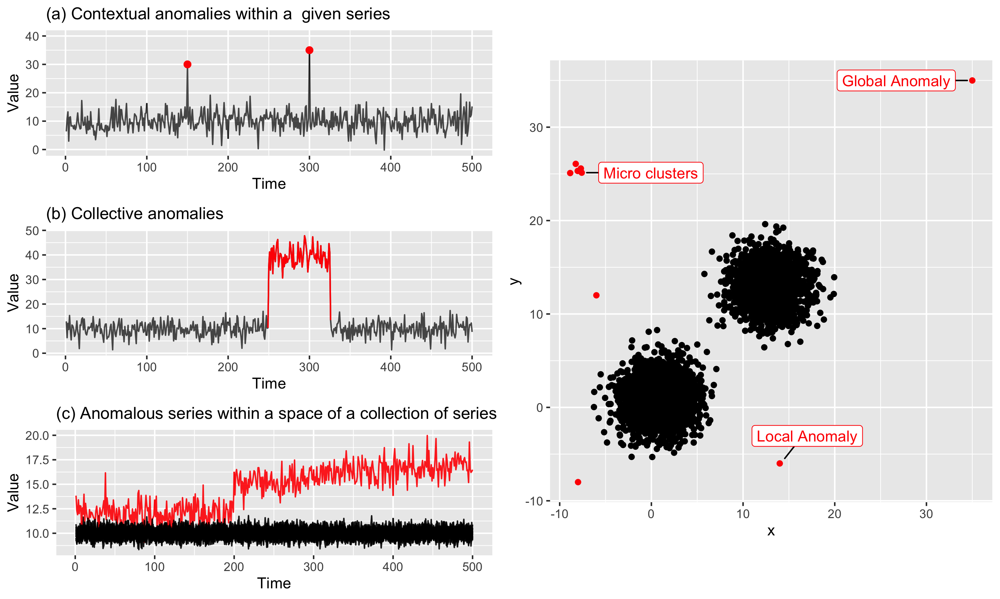
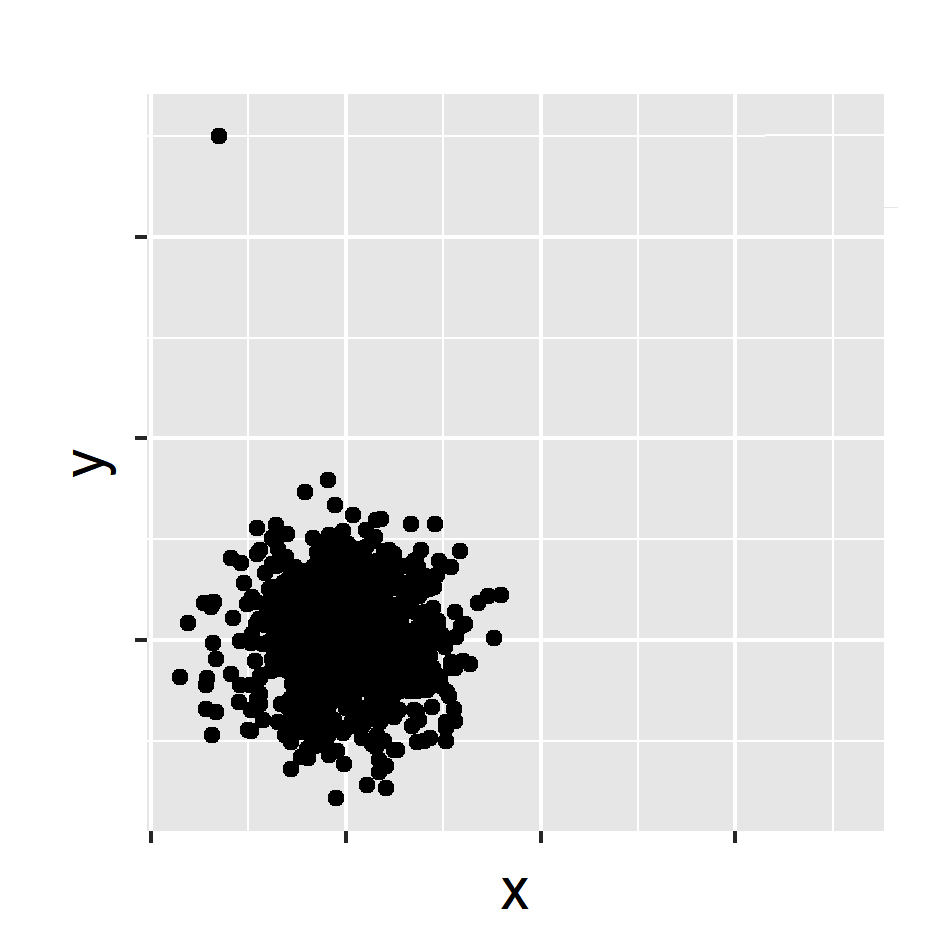
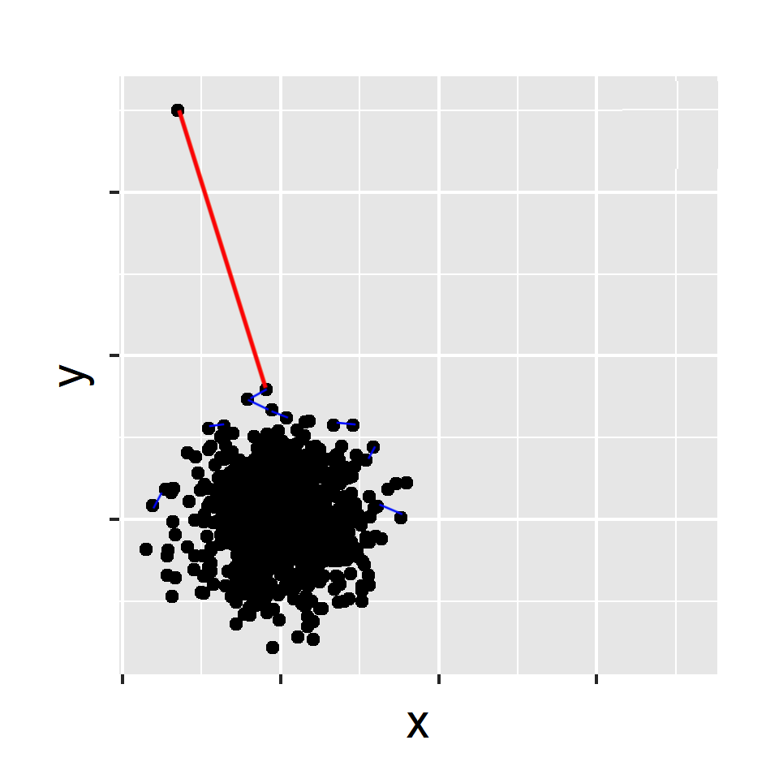

```{r setup, include=FALSE}
library(knitr)
options(htmltools.dir.version = FALSE)
opts_chunk$set(
  warning = FALSE,
  message = FALSE,
  echo = FALSE,
  fig.path = 'figure/',
  cache.path = 'cache/',
  fig.align = 'center',
  fig.show = 'hold',
  cache = FALSE,
  external = TRUE,
  dev = "png",
  fig.height = 6,
  fig.width = 10,
  out.width = "0.8\\textwidth"
)
read_chunk('src/main.R')
library(tidyverse)
library(gridExtra)
library(ggpubr)
library(kableExtra)
library(knitr)
# install.packages("devtools")
# devtools::install_github("pridiltal/oddwater")
library(animation)
library(ggrepel)
```
# Anomaly Detection

.pull-left[ 
### Temporal data
]
.pull-right[
### High dimensional data
]
```{r outtype}
```

```{r echo=FALSE, out.width = "100%"}

```


---
class: center, clear

<p><font size=12> <span style="color:blue"> stray (STR</span>eam <span style="color:blue">A</span>nomal  <span style="color:blue">Y</span>)
</p>


```{r  out.width = "30%", echo=FALSE}
knitr::include_graphics("fig/stray_logo.png")
```

`devtools::install_github("pridiltal/stray")` 

---
# Anomaly detection in high dimensional Data

### Main contributions
- Propose a framework to detect anomalies in high dimensional data. Our proposed algorithm addresses the limitations of HDoutliers algorithm (Wilkinson, 2018).
--

- Propose an algorithm to detect anomalies in streaming temporal data.
--

### What is an anomaly ?
- We define an anomaly as an observation that deviates markedly from the majority with a large distance gap.
--


### Main assumptions
- There is a large distance between typical data and the anomalies in comparison to the distance among typical data.

---
# stray

```{r  echo=FALSE, out.width = "50%", fig_align = 'top'}

```
-  Normalize the columns of the data.
-  This prevents variables with large variances having disproportional influence on Euclidean distances.
---
# stray 
```{r  echo=FALSE, out.width = "50%", fig_align = 'top'}

```

- Calculate the nearest neighbour distance 
---
# Why not "nearest neighbour" distances? 
```{r  echo=FALSE, out.width = "50%", fig_align = 'top'}
knitr::include_graphics("fig/stray_plot2.png")
```

---
# stray
```{r  echo=FALSE, out.width = "50%", fig_align = 'top'}
knitr::include_graphics("fig/stray_plot5.png")
```


- Select the <span style="color:red"> k nearest neighbour </span> distance with the <span style="color:red"> maximum gap </span>
--

- Use extreme value theory (EVT) to calculate an anomalous threshold

---
# Spacing theorem (Weissman, 1978)

Let $X_{1}, X_{2}, ..., X_{n}$ be a sample from a distribution function $F$ . </br>
Let $X_{1:n} \geq X_{2:n} \geq ... \geq X_{n:n}$ be the order statistics. </br>
The available data are $X_{1:n}, X_{2:n},  ..., X_{k:n}$ for some fixed $k$. </br>
Let $D_{i,n} = X_{i:n} - X_{i+1:n},$ $(i = 1,2,..., k)$ be the spacing between successive order statistics.</br>
If $F$ is in the maximum domain of attraction of the Gumbel distribution, then the spacings $D_{i,n}$ are asymptotically independent and exponentially distributed with mean proportional to $i^{-1}$.

```{r  echo=FALSE, out.width = "55%", fig_align = 'top'}
knitr::include_graphics("fig/P2_plot17.png")
```

---
# stray
```{r  echo=FALSE, out.width = "50%", fig_align = 'top'}
knitr::include_graphics("fig/stray_plot6.png")
```
`devtools::install_github("pridiltal/stray")` <br/>
`outliers <- find_HDoutliers(data, method = "knn_maxdiff", knnsearchtype = "FNN_auto")` <br/>
`display_HDoutliers(data, outliers)`
---
# Advantages of the proposed algorithm

- Detect clusters of outlying points
--

- Applied to both uni- and multi- dimensional data
--

- Handle large datasets due to the use of fast approximate nearest neighbour search algorithms
--

- Does not require a training set to build the decision model
--

- Deal with multimodal typical classes
--

- Outlier threshold has a probabilistic interpretation
---
background-image:url('fig/sydney.jpeg')
background-position: 70% 110%
background-size: 100%
class: right, top, clear

### Anomalous series within a space of a collection of series
---
# Feature based representation of time series
.pull-left[
- Mean   
- Variance  
- Changing variance in remainder 
- Level shift using rolling window   
- Variance change  
- Strength of linearity 
- Strength of curvature  
 ]

.pull-right[
- Strength of spikiness  
- Burstiness of time series (Fano Factor)  
- Minimum  
- Maximum  
- The ratio between 50% trimmed mean and the arithmetic mean
- Moment 
- Ratio of means of data that is below and above the global mean  

]
---
# Approach 1: Using stray

.pull-left[

```{r   echo=FALSE, out.width = "90%"}
knitr::include_graphics("fig/P2_plot22.png")
```

]
.pull-right[
```{r   echo=FALSE, out.width = "50%"}
knitr::include_graphics("fig/stray.gif")
```
]
--

- Apply stray algorithm to identify anomalous series
`tsfeatures <- oddstream::extract_tsfeatures(ts_data)` <br/>
`outliers <- stray::find_HDoutliers(tsfeatures, method = "knn_maxdiff", knnsearchtype = "FNN_auto")` <br/>
`stray::display_HDoutliers(tsfeatures, outliers)`
--

- use a moving window to deal with streaming data
- Extract time series features from window

---
class:: center, clear
.pull-left[
 
```{r   echo=FALSE, out.width = "100%"}
knitr::include_graphics("fig/P2_plot21a.png")
```
]
--
.pull-right[

```{r   echo=FALSE, out.width = "100%"}
knitr::include_graphics("fig/P2_plot21b.png")
```
]

---
background-image:url('fig/2_application.png')
background-position: 70% 70%
background-size: 100%
class: right, top, clear

### Anomalous series within a space of a collection of series
---
class: center, clear

<p><font size=12> <span style="color:blue">oddstream </br> (O</span>utlier <span style="color:blue">D</span>etection in <span style="color:blue">D</span>ata  <span style="color:blue">STREAM</span>s)
</p> 


```{r  out.width = "30%", echo=FALSE}
knitr::include_graphics("fig/oddstream_logo.png")
```

`devtools::install_github("pridiltal/oddstream")` 

Priyanga Dilini Talagala, Rob J Hyndman, Kate Smith-Miles, Sevvandi Kandanaarachchi and Mario A Muñoz (2019) [Anomaly detection in streaming nonstationary temporal data](https://www.researchgate.net/publication/323694683_Anomaly_Detection_in_Streaming_Nonstationary_Temporal_Data). <span style="color:blue"> **Journal of Computational and Graphical Statistics, to appear.**</span>
---
# Dimension reduction for time series 

.pull-left[
`load(train_data)`
```{r   echo=FALSE, out.width = "70%", fig_align = 'bottom'}
knitr::include_graphics("fig/4_typical.png")
```
]
--
.pull-right[
`tsfeatures <- oddstream::extract_tsfeatures` </br>
`(train_data)`
```{r  echo=FALSE, out.width = "40%",}
knitr::include_graphics("fig/5_high_typical.gif")
```
]

--
</br>
`pc<- oddstream::get_pc_space(tsfeatures)`</br>
`oddstream::plotpc(pc$pcnorm)` 
```{r  echo=FALSE, out.width = "25%",}
knitr::include_graphics("fig/6_typicalfeature.png")
```
---
# Anomalous threshold calculation 

- Estimate the probability density function of the 2D PC space $\longrightarrow$ Kernel density estimation
--

- Draw a large number N of extremes $(arg min_{x\in X}[f_{2}(x)])$ from the estimated probability density function


- Define a $\Psi$-transform space, using the $\Psi$-transformation defined by (Clifton et al., 2011)

```{r   echo=FALSE, out.width = "50%"}
knitr::include_graphics("fig/10_psitrans.png")
```

- $\Psi$-transform maps the density values back into space into which a Gumbel distribution can be fitted.


- Anomalous threshold calculation $\longrightarrow$ extreme value theory


---
class: center, top, clear
`oddstream::find_odd_streams(train_data, test_stream)`
```{r   echo=FALSE, out.width = "50%"}
knitr::include_graphics("fig/18_oddstream_mvtsplot.gif")
```
.pull-left[
```{r  echo=FALSE, out.width = "90%", fig_align = 'top'}
knitr::include_graphics("fig/16_oddstream_out_loc.gif")
```
]
.pull-right[
```{r  echo=FALSE, out.width = "90%", fig_align = 'top'}
knitr::include_graphics("fig/17_oddstream_pcplot.gif")
```
]
---
class: clear, middle, center
.pull-left[
### stray
 
```{r   echo=FALSE, out.width = "75%"}
knitr::include_graphics("fig/P2_plot21a.png")
```

- Definition: distance 
- no training set 
]
.pull-right[
### oddstream

```{r   echo=FALSE, out.width = "75%"}
knitr::include_graphics("fig/P2_plot21b.png")
```

- Definition: density
- need a training set
]
---
class: clear, center, middle

```{r  echo=FALSE, out.width = "20%", fig_align = 'top'}
knitr::include_graphics("fig/JCGS.png")
```

Priyanga Dilini Talagala, Rob J Hyndman, Kate Smith-Miles, Sevvandi Kandanaarachchi and Mario A Muñoz (2019) [Anomaly detection in streaming nonstationary temporal data](https://www.researchgate.net/publication/323694683_Anomaly_Detection_in_Streaming_Nonstationary_Temporal_Data). <span style="color:blue"> **Journal of Computational and Graphical Statistics**</span>
---
# Anomaly detection in water quality data

Collaborative research project carried out with the **Queensland University of Technology** and the **Queensland Department of Environment and Science**, Great Barrier Reef Catchment Loads Monitoring Program, Australia.

```{r echo=FALSE, out.width = "100%", fig.align = 'center'}
knitr::include_graphics("fig/sensor2.png")
```


---
# Anomaly detection in water quality data

- Water quality sensors are exposed to changing environments and extreme weather conditions
--

- Two types of anomalies:
--

1. Water quality breaches associated  with real events 
--

2. Technical issues in the sensor equipment (low battery power, biofouling of the probes, errors in calibration, rust, sensor maintenance activities etc.)

```{r echo=FALSE, out.width = "100%", fig.align = 'center'}
knitr::include_graphics("fig/sensor_issues.png")
```


---
# Anomaly detection in water quality data

- Water quality sensors are exposed to changing environments and extreme weather conditions


- Two types of anomalies:


1. Water quality breaches associated  with real events </br>
2. <span style="color:red"> Technical issues in the sensor equipment </span>  (low battery power, biofouling of the probes, errors in calibration, rust, sensor maintenance activities etc.)

```{r echo=FALSE, out.width = "100%", fig.align = 'center'}
knitr::include_graphics("fig/sensor_issues.png")
```


---
# What is an anomaly

- Water-quality observations that were affected by <span style="color:red">technical errors </span>  in the sensor equipment

```{r  out.width = "100%", echo=FALSE}
knitr::include_graphics("fig/water_original.png")
```


---
# What is an anomaly

- Water-quality observations that were affected by <span style="color:red">technical errors </span>  in the sensor equipment

```{r  out.width = "100%", echo=FALSE}
knitr::include_graphics("fig/water_out.png")
```

---
class: center, clear

<p><font size=12> <span style="color:blue"> oddwater </br> <p><font size=6> (O</span>utlier  <span style="color:blue">D</span>etection in  <span style="color:blue">D</span>ata from  <span style="color:blue">WATER</span>-quality sensors) 
</p>

```{r  out.width = "30%", echo=FALSE}
knitr::include_graphics("fig/oddwater_logo.png")
```

`devtools::install_github("pridiltal/oddwater")` </br>
`oddwater::explore_data()`

---
class: clear
**Identify the data features that differentiate outlying instances from typical behaviours**

```{r echo=FALSE, out.width = "100%", fig.align = 'up'}
knitr::include_graphics("fig/water_out.png")
```

---
class: clear
**Identify the data features that differentiate outlying instances from typical behaviours**

```{r echo=FALSE, out.width = "100%", fig.align = 'up'}
knitr::include_graphics("fig/water_hd1.png")
```

---
class: clear
**Apply statistical transformations to make the outlying instances stand out in transformed data space**

```{r echo=FALSE, out.width = "100%", fig.align = 'up'}
knitr::include_graphics("fig/trans.png")
```


---
class: clear

**Apply statistical transformations to make the outlying instances stand out in transformed data space**

```{r echo=FALSE, out.width = "100%", fig.align = 'up'}
knitr::include_graphics("fig/water_hd2.png")
```

---
class: clear

**Calculate unsupervised outlier scores for the observations in  the transformed data space**

`trans_data <- oddwater::transform_data(data)` </br>
`outliers <- stray::find_HDoutliers(trans_data, method = "knn_sum", knnsearchtype = "FNN_brute")`


```{r  echo=FALSE, out.width = "60%", fig_align = 'top'}
knitr::include_graphics("fig/oddwater_plot.png")
```

---
# What next?
</br>

```{r  echo=FALSE, out.width = "100%", fig_align = 'top'}
knitr::include_graphics("fig/future.png")
```


---
class: center, middle

# Thank You

```{r  out.width = "90%", echo=FALSE}
knitr::include_graphics("fig/packages.png")
```


```{r}
icon::fa("envelope")
``` 
dilini.talagala@monash.edu

```{r}
icon::fa("github")
icon::fa("twitter")

```
pridiltal

```{r}

icon::fa("globe")
```
https://prital.netlify.com </br>
(Slides and papers available)

Slides created via xaringan: (https://github.com/pridiltal/MonashEBS_xaringan)
