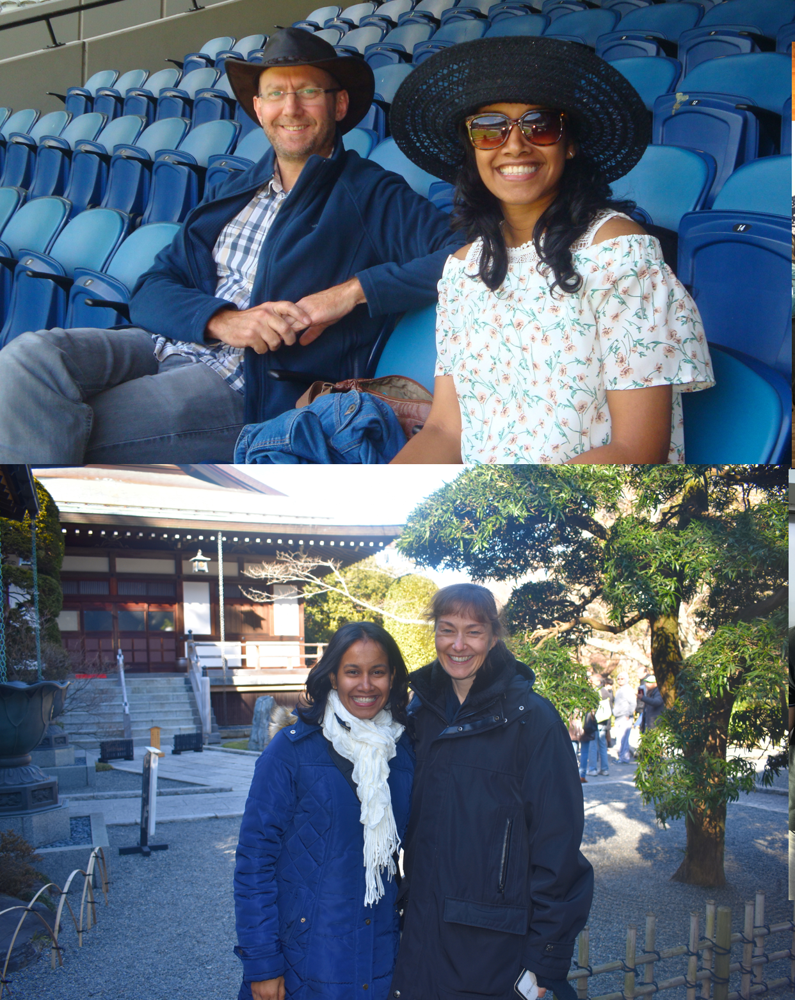
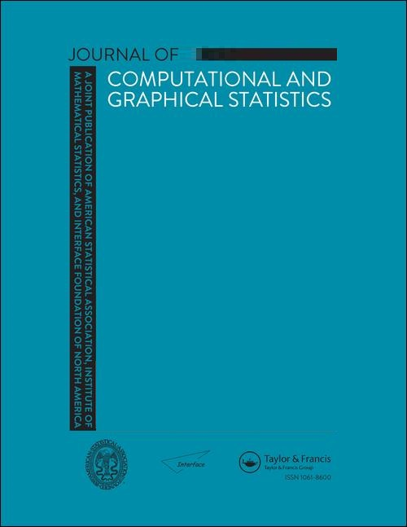
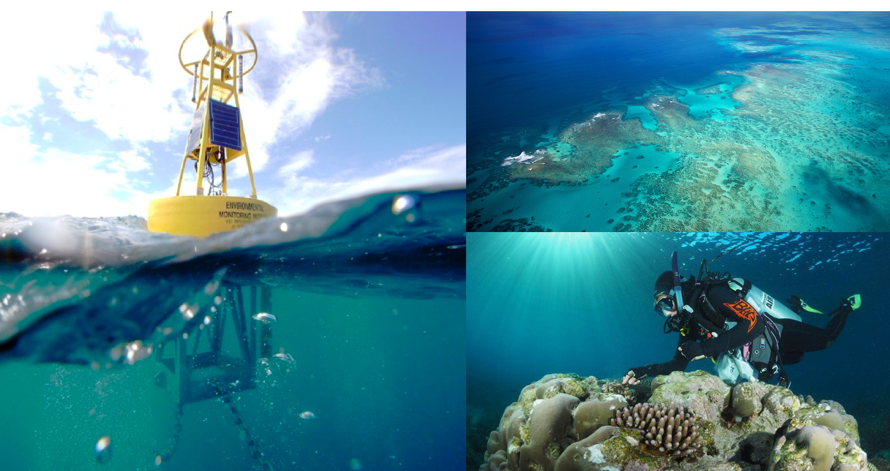

```{r setup, include=FALSE}
library(knitr)
options(htmltools.dir.version = FALSE)
opts_chunk$set(
  warning = FALSE,
  message = FALSE,
  echo = FALSE,
  fig.path = 'figure/',
  cache.path = 'cache/',
  fig.align = 'center',
  fig.show = 'hold',
  cache = TRUE,
  external = TRUE,
  dev = "pdf",
  fig.height = 6,
  fig.width = 10,
  out.width = "0.8\\textwidth"
)
read_chunk('src/main.R')
library(tidyverse)
library(gridExtra)
library(ggpubr)
# install.packages("devtools")
# devtools::install_github("pridiltal/oddstream")
library(oddstream)
library(animation)
```

class:  inverse
# PhD: Monash University, Australia
```{r  echo=FALSE, out.width = "60%"}

```
---

background-image: url('fig/tsp1.png')
background-position: 50% 50%
background-size: 100%
class: right, top
---
background-image: url('fig/tsp2.png')
background-position: 50% 50%
background-size: 100%
class: right, top
---

background-image: url('fig/tsp3.png')
background-position: 50% 50%
background-size: 100%
class: right, top
---

background-image: url('fig/tsp4.png')
background-position: 50% 50%
background-size: 100%
class: right, top
---

background-image: url('fig/tsp5.png')
background-position: 50% 50%
background-size: 100%
class: right, top
---


background-image: url('fig/tsp6.png')
background-position: 50% 50%
background-size: 100%
class: right, top
---
background-image: url('fig/tsp7.png')
background-position: 50% 50%
background-size: 100%
class: right, top
---
background-image: url('fig/tsp8.png')
background-position: 50% 50%
background-size: 100%
class: right, top
---
background-image: url('fig/tsp9.png')
background-position: 50% 50%
background-size: 100%
class: right, top
---
background-image: url('fig/tsp10.png')
background-position: 50% 50%
background-size: 100%
class: right, top
---
background-image: url('fig/tsp11.png')
background-position: 50% 50%
background-size: 100%
class: right, top
---


background-image: url('fig/tsp12.png')
background-position: 50% 50%
background-size: 100%
class: right, top
---

background-image: url('fig/tsp13.png')
background-position: 50% 50%
background-size: 100%
class: right, top
---

background-image: url('fig/tsp14.png')
background-position: 50% 50%
background-size: 100%
class: right, top
---

background-image: url('fig/tsp15.png')
background-position: 50% 50%
background-size: 100%
class: right, top, inverse

---


```{r  echo=FALSE, out.width = "60%"}
knitr::include_graphics("fig/John_Tukey.png")
```

---
# John W Tukey 

.pull-left[
- (1915 to 2000)
```{r  echo=FALSE, out.width = "100%"}
knitr::include_graphics("fig/John_Tukey.png")
```
]
 
.pull-right[
- Tukey coined the word **software** to describe the non-hardware components of the computer, in particular the programs that were needed to make the computers perform their intended tasks
 
]
---
- My family tree - the Mathematical Genealogy Project
- Each successive person is the doctoral student of the person before him.

```{r  echo=FALSE, out.width= "90%", fig.align='center'}
knitr::include_graphics("fig/mytree.png")
```
---
class: inverse
## Motivation

```{r  echo=FALSE, out.width= "120%", fig.align='center'}
knitr::include_graphics("fig/1_climb.png")
```
---

background-image: url('fig/sydney_full.jpeg')
background-position: 50% 50%
background-size: 100%
class: right, top, inverse
## Motivation
---

background-image: url('fig/robyahoo.jpeg')
background-position: 50% 50%
background-size: 100%
class: right, top, inverse
## Motivation
---

- Approaches to solving the problem of anomaly detection for temporal data :
--
.pull-left[
### Batch scenario 
- whole set of data is available
- complete events <br/><br/><br/>

```{r  echo=FALSE, out.width= "100%", fig.align='center'}
knitr::include_graphics("fig/2batch.png")
```
]

--
.pull-right[
### Data stream scenario
- continuous, unbounded, flow at high speed, high volume
- incomplete events
```{r  echo=FALSE, out.width = "100%", fig.align = 'up'}
knitr::include_graphics("fig/1_stream.gif")
```
]
---

class: center, top

`oddstream::find_odd_streams(train_data, test_stream)`
```{r   echo=FALSE, out.width = "50%"}
knitr::include_graphics("fig/18_oddstream_mvtsplot.gif")
```
.pull-left[
  ```{r  echo=FALSE, out.width = "100%", fig_align = 'top'}
  knitr::include_graphics("fig/16_oddstream_out_loc.gif")
  ```
  ]
.pull-right[
  ```{r  echo=FALSE, out.width = "100%", fig_align = 'top'}
  knitr::include_graphics("fig/17_oddstream_pcplot.gif")
  ```
  ]

---
  
#### Anomaly detection with non-stationarity
  
```{r  echo=FALSE, out.width = "70%", fig_align = 'top'}
knitr::include_graphics("fig/19_nonstationaritytypes.png")
```

---
### Anomaly detection with non-stationarity
  
  ```{r  echo=FALSE, out.width = "100%", fig_align = 'top'}
knitr::include_graphics("fig/20_suddenplot2.png")
```

```{r  echo=FALSE, out.width = "35%", fig_align = 'top'}
knitr::include_graphics("fig/21_noCD1.png")
```

---
### Anomaly detection with non-stationarity
  
```{r  echo=FALSE, out.width = "100%", fig_align = 'top'}
knitr::include_graphics("fig/20_suddenplot3.png")
```

```{r  echo=FALSE, out.width = "35%", fig_align = 'top'}
knitr::include_graphics("fig/21_noCD2.png")
```

---
  
### Anomaly detection with non-stationarity
  
```{r  echo=FALSE, out.width = "100%", fig_align = 'top'}
knitr::include_graphics("fig/20_suddenplot4.png")
```

```{r  echo=FALSE, out.width = "35%", fig_align = 'top'}
knitr::include_graphics("fig/21_noCD3.png")
```

---
### Anomaly detection with non-stationarity

  ```{r  echo=FALSE, out.width = "100%", fig_align = 'top'}
knitr::include_graphics("fig/20_suddenplot2.png")
```

```{r  echo=FALSE, out.width = "100%", fig_align = 'top'}
knitr::include_graphics("fig/22_conceptdrift_pval.png")
```

- $H_{0} : f_{t_{0}} = f_{t_{t}}$
  
  
  - squared discrepancy measure $T = \int[f_{t_{0}}(x) - f_{t_{t}}(x)]^{2}dx$ (Anderson et al., 1994)

---
  
  
  ### Anomalous threshold calculation 
  
  - Estimate the probability density function of the 2D PC space $\longrightarrow$ Kernel density estimation
--
  
  - Draw a large number N of extremes $(arg min_{x\in X}[f_{2}(x)])$ from the estimated probability density function
--
  
  - Define a $\Psi$-transform space, using the $\Psi$-transformation defined by (Clifton et al., 2011)

```{r   echo=FALSE, out.width = "50%"}
knitr::include_graphics("fig/10_psitrans.png")
```

- $\Psi$-transform maps the density values back into space into which a Gumbel distribution can be fitted.
--
  
- Anomalous threshold calculation $\longrightarrow$ extreme value theory

---
class:  center, middle, inverse


```{r  echo=FALSE, out.width = "40%", fig_align = 'top'}

```

Scientific Journal Rankings (SJR) Ranking: Q1

Excellence in Research Australia (ERA) Ranking: A*
  
Priyanga Dilini Talagala, Rob J Hyndman, Kate Smith-Miles (2019) [Anomaly detection in streaming nonstationary temporal data](https://www.researchgate.net/publication/323694683_Anomaly_Detection_in_Streaming_Nonstationary_Temporal_Data). <span style="color:blue"> **Journal of Computational and Graphical Statistics.**</span>

---

background-image: url('fig/oddstreamlogo.png')
background-position: 50% 50%
background-size: 100%
class: right, top, inverse

---
background-image: url('fig/App5.png')
background-position: 50% 50%
background-size: 100%
class: right, top, inverse

---

background-image: url('fig/AusiPedestrian2019Jan.png')
background-position: 50% 50%
background-size: 100%
class: right, top, inverse

---
### Advantages of the Proposed Algorithm

- Detect micro clusters
--

- Applied to both uni- and multi- dimensional data
--

- Handle large datasets due to the use of a one-pass algorithm
--

- Does not require a training set to build the decision model
--

- Deal with multimodal typical classes
--

- Outlier threshold has a probabilistic interpretation

---
class:  center, middle, inverse

```{r  echo=FALSE, out.width = "40%", fig_align = 'top'}

```

Scientific Journal Rankings (SJR) Ranking: Q1

Excellence in Research Australia (ERA) Ranking: A*
  
Priyanga Dilini Talagala, Rob J Hyndman, Kate Smith-Miles (2020) [Anomaly Detection in High Dimensional Data](https://prital.netlify.com/publication/stray/). <span style="color:blue"> **Journal of Computational and Graphical Statistics, under review**</span>
---

background-image: url('fig/straylogo.png')
background-position: 50% 50%
background-size: 100%
class: right, top, inverse

---

class: clear

The work is based on the collaborative research project carried out with the **Queensland University of Technology** and the **Queensland Department of Environment and Science**, Great Barrier Reef Catchment Loads Monitoring Program, Australia.

```{r echo=FALSE, out.width = "100%", fig.align = 'center'}

```


---
# Motivation

- Water quality sensors are exposed to changing environments and extreme weather conditions
--

- Two types of anomalies:
--

  1. Water quality breaches associated  with real events 
--

  2. Technical issues in the sensor equipment (low battery power, biofouling of the probes, errors in calibration, rust, sensor maintenance activities etc.)

```{r echo=FALSE, out.width = "100%", fig.align = 'center'}
knitr::include_graphics("fig/sensor_issues.png")
```


---

# What is an anomaly

- Water-quality observations that were affected by <span style="color:red">technical errors </span>  in the sensor equipment

```{r  out.width = "100%", echo=FALSE}
knitr::include_graphics("fig/water_original.png")
```


---
# What is an anomaly

- Water-quality observations that were affected by <span style="color:red">technical errors </span>  in the sensor equipment

```{r  out.width = "100%", echo=FALSE}
knitr::include_graphics("fig/water_out.png")
```

---

# Limitations of existing work

- Semisupervised approach: requires a representative sample from the typical behaviour
--

- Influenced strongly by the training data used to build the models (Nonstationarity, concept drift)
--

- Require additional time for training for prediction and to perform optimization to estimate the model parameters
--

- Complex relationship between water-quality variables
--

- Irregular time series with lots of missing values (increase the frequency of measurements during high-flow events to capture greater resolution in water-quality dynamics)

---

class:  center, middle


```{r  echo=FALSE, out.width = "20%", fig_align = 'top'}

```


Priyanga Dilini Talagala, Rob J. Hyndman, Catherine Leigh, Kerrie Mengersen, and Kate Smith-Miles. (2019) [A feature-based procedure for detecting technical outliers in water-quality data from in situ sensors.](https://arxiv.org/abs/1902.06351)  <span style="color:blue">Water Resources Research </span>

ERA Ranking: A*

SJR Ranking: Q1

Catherine Leigh, Omar Alsibai, Rob J Hyndman, Sevvandi Kandanaarachchi, Olivia C King, James M McGree, Catherine Neelamraju, Jennifer Strauss, Priyanga Dilini Talagala, Ryan S Turner, Kerrie Mengersen, Erin E Peterson (2019) [A framework for automated anomaly detection in high frequency water-quality data from in situ sensors](https://www.sciencedirect.com/science/article/pii/S0048969719305662). <span style="color:blue">Science of the Total Environment, 664, 885-898.</span>

ERA Ranking: A

SJR Ranking: Q1

---

# oddwater R package

- Introduced an R package, `oddwater` ( <span style="color:red">O</span>utlier  <span style="color:red">D</span>etection in  <span style="color:red">D</span>ata from  <span style="color:red">WATER</span>-quality sensors) that implements the proposed framework
and related functions.

```{r  out.width = "25%", echo=FALSE}
knitr::include_graphics("fig/oddwater_logo.png")
```

`devtools::install_github("pridiltal/oddwater")`
---
## 2019 Australian Museum Eureka Prizes 

- Finalist in the 2019 Australian Museum Eureka Prizes for innovation in Citizen Science! 
- The Eureka Prizes are Australia's leading science awards, and are considered the 'Oscars' of Australian Science.
---

background-image: url('fig/ACEMSAI.png')
background-position: 50% 50%
background-size: 100%
class: right, top
---

background-image: url('fig/microsoft.png')
background-position: 50% 50%
background-size: 100%
class: right, top, inverse

## New collaboration
- Network Behavior Anomaly Detection
- Cybersecurity analytics
- Cloud Usage Forecasting
- Functional data analysis, 

---
background-image: url('fig/App1.png')
background-position: 50% 50%
background-size: 100%
class: right, top
---
class: right, inverse

# Second Prize

**Vegetation Detection Challenge organized by the Victorian Government, Department of Environment, Land, Water and Planning, Australia**

Team Members: Priyanga Dilini Talagala, Mario A. Munoz (University of Melbourne, Australia)

---
# Hadley Wickham

.pull-left[
```{r  out.width = "100%", echo=FALSE}
knitr::include_graphics("fig/Hadley-Wickham.png")
```
 ]
.pull-right[
- New Zealand statisticians
- Chief Scientist at RStudio (RStudio is an IDE for R)
- He is best known for his development of open-source statistical software packages: ggplot2, tidyverse
- Wickham was awarded the international COPSS Presidents' Award in 2019 for "influential work in statistical computing, visualisation, graphics, and data analysis"
]

---
background-image: url('fig/ggplot.png')
background-position: 50% 50%
background-size: 100%
class: right, top
---
background-image: url('fig/staplr.png')
background-position: 50% 50%
background-size: 100%
class: right, top
---
background-image: url('fig/ctv.png')
background-position: 50% 50%
background-size: 100%
class: right, top
---

# R-Ladies Global

```{r  echo=FALSE, out.width= "40%", fig.align='center'}
knitr::include_graphics("fig/RLadiesGlobal.png")
```

- San Francisco, CA
- An organization that promotes diversity in the R community worldwid
- This community is designed to develop  R skills & knowledge through social, collaborative learning & sharing. 
---
background-image: url('fig/rladiescol.png')
background-position: 30% 30%
background-size: 100%
class: right, bottom

- We meetup in person or virtually to learn about the R programming language, algorithms and advanced tools. 
---

background-image: url('fig/monash.png')
background-position: 50% 50%
background-size: 50%
class: inverse, center, middle


---


---
---
background-image: url('fig/GDPR.jpg')
background-position: 50% 50%
background-size: 100%
class: right, top
---
# GDPR rule

- The EU General Data Protection Regulation (GDPR) went into effect on May 25, 2018.
--

- GDPR Articles 13-15 and 21-22 outline requirements related to automated data processing and decision making. 
--

- The basic concept is that when a decision is generated solely from automated processing (no human intervention), including profiling, the data subject has the right to receive an explanation of how the decision was rendered.
--

- Automated data processing and decision systems typically use machine learning
--

- The problem with many state-of-the-art models is a lack of transparency and interpretability (Hard to explain internal logic and inner workings) 

---

- When it comes to AI, "explanation" could mean several things:

1) How an algorithm works or how the system functions.
      
2) The factors or data that resulted in a decision by the algorithm or system that impacted an individual (a data subject).
--

- But there are projects that aim to produce explainable AI such as the DARPA Explainable AI (XAI) program and Local Interpretable Model-agnostic Explanations (LIME).

---
# Why is this important?

- **Data managers**: for quality control and assurance and to increase confidence in the data by reporting the presence of such anomalies; automated correction
- **Sensor maintenance technicians**: to ensure timely and correct calibration and maintenance of equipment
- **Policy and decision makers**: to limit use of incorrect data and for reporting purposes
- **Public**: to avoid false warning of water quality breaches
- **Sensor manufacturers**: to improve performance, e.g. extend battery life, improve wiper quality to further minimize biofouling
- **Statisticians**: for AD methods to better detect other non-trivial anomaly types and/or for methods requiring regular and frequent observations.

---